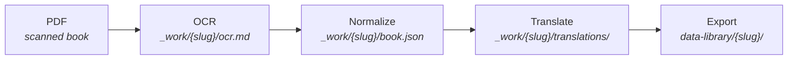
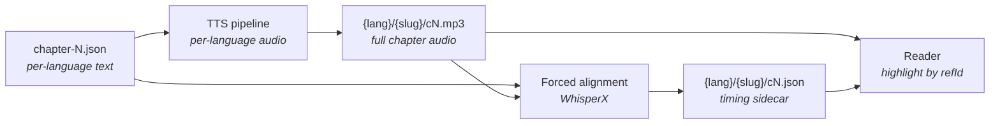

+++
title = "data-library as Source of Truth"
description = "Why post-export edits to library books live in data-library/ rather than going back through the ingest pipeline — and how cross-language paragraph IDs feed downstream features."
template = "page.html"
weight = 40
+++

[`data-library`](https://github.com/wheelofheaven/data-library) is the
canonical home for published library books. Once a book has been
exported there and hand-edited, the upstream ingest pipeline becomes a
historical artifact, not a replayable source. This page explains why
that's the case, the cross-language paragraph ID alignment principle
the format relies on, and how those IDs are about to feed the
audiobook pipeline.

## The pipeline that gets a book here

The [`ingest`](https://github.com/wheelofheaven/ingest) Elixir app
("curator") runs a four-stage pipeline:



Each stage writes to `ingest/_work/{slug}/`. The final stage,
`mix curator.export --slug {slug}`, reads the normalized + translated
state and writes the split-chapter JSON layout described in
[Library Book Format](@/reference/library-book-format.md) into
`data-library/{slug}/`.

That's the one-way fork. From the moment the export lands, the
canonical source of truth is **`data-library/`**, not the upstream
`_work/` state.

## Why data-library becomes the source of truth

Two reasons.

### 1. Hand edits accumulate post-export

Library books receive editorial work after the pipeline drops them
into `data-library/`:

- **Paragraph splits** — long paragraphs broken into smaller pieces at
  natural sentence boundaries
  (see [Paragraph Split Tooling](@/contributing/dev/paragraph-split-tooling.md)).
- **Speaker attribution fixes** — incorrect `speaker` fields corrected.
- **OCR error cleanup** — typos, misread characters, mis-attached
  citations.
- **Footnote restructuring** — stray footnote markers pulled into
  their right place, references reformatted.
- **Translation refinements** — per-paragraph translation edits when a
  reader catches a slip.

These edits live only in `data-library/`. The pipeline doesn't know
they happened.

### 2. Re-running export silently destroys edits

`mix curator.export` reads from `_work/{slug}/book.json` and writes to
`data-library/{slug}/`. There's no merge step — the export is a
**replace**.

Confirmed case from 2026-05: TBWTT's `_work/book.json` was 1 flat
"chapter" with 1965 paragraphs, last touched 2026-02-14. The
`data-library/` version had 7 chapters with 744 paragraphs (and 759
after the split editorial pass) with different content lengths. The
two had been out of sync since around February.

If `mix curator.export --slug the-book-which-tells-the-truth` had been
run between February and May, it would have silently replaced the
7-chapter hand-curated version with a 1-chapter blob built from a
months-stale `_work/book.json`. Hours of editorial work, gone.

This is the **footgun**. The pipeline doesn't refuse to clobber edits.
It doesn't even know there are edits.

## The operational rule

> Treat `ingest/_work/{slug}/` as one-shot historical state, not a
> replayable source. After a book has been hand-edited post-export,
> `data-library/{slug}/` is the only canonical source.

What this means in practice:

| Operation | Safe? | Notes |
|---|---|---|
| `mix curator.ocr --slug new-book` | ✅ | New books only. |
| `mix curator.normalize --slug new-book` | ✅ | New books only. |
| `mix curator.translate --slug new-book` | ✅ | New books only. |
| `mix curator.export --slug new-book` | ✅ | First-time export only. |
| `mix curator.export --slug edited-book` | ⚠️ **clobbers hand edits** | Don't. Use `data-library/` edits directly. |
| Hand-edit `data-library/{slug}/chapter-N.json` | ✅ | The canonical workflow for published books. |
| Use the paragraph split tooling | ✅ | See [Paragraph Split Tooling](@/contributing/dev/paragraph-split-tooling.md). |

If `ingest/_work/{slug}/` exists for a book that's already been
hand-edited, it's a stale footgun. Two recovery paths:

- **Delete it** — accept that the book is no longer pipeline-replayable
  and lives in `data-library/` as the source.
- **Sync `_work/book.json` back from `data-library/`** — substantial
  work; only worth it if you genuinely need to re-run translate (e.g.
  to switch translation models or add a new language).

The first is almost always the right call.

## Cross-language paragraph ID alignment

Every paragraph in a library book has an `n` (paragraph number) and a
derived `refId` (e.g. `TBWTT-3:42`). These IDs are **shared across
all 9 languages** for a given book.

```json
// TBWTT chapter-3.json — same p42 exists in every language
{
  "n": 42,
  "speaker": "Yahweh",
  "refId": "TBWTT-3:42",
  "text": "...",                    // FR primary
  "i18n": {
    "en": "...",
    "de": "...",
    "es": "...",
    "ru": "...",
    "ja": "...",
    "ko": "...",
    "zh": "...",
    "zh-Hant": "..."
  }
}
```

The IDs are the **stable handle** for the same logical paragraph across
languages. Several downstream features assume this:

- **Interlinear reader** — switching from FR to JA on a paragraph
  stays on the same `cN/pN` anchor.
- **Deep links** — `/library/{slug}/?p=TBWTT-3:42` resolves in any
  language.
- **Search results** — a hit in EN points at the corresponding `p42`
  in the user's preferred reading language.
- **Audiobook timing sidecars** (planned — see below) — per-paragraph
  timestamps key off `refId`.

### Implication for paragraph splits

When a paragraph is split, **all 9 languages must be split into the
same number of pieces**, even if some languages have empty
translations.

Empty languages get N empty pieces, not skipped paragraph numbers. This
keeps the ID set aligned: if FR `p42` becomes `p42`/`p43`/`p44`, every
language has a `p42`/`p43`/`p44` — even when some of them are empty
strings.

The paragraph split tooling enforces this automatically. See
[Paragraph Split Tooling — empty-language behavior](@/contributing/dev/paragraph-split-tooling.md#empty-language-behavior).

### Implication for translation drift

Translations rarely preserve FR's sentence boundaries exactly. A 3-piece
split of an FR paragraph might land the FR boundary at exactly the end
of the "creators speech intro" beat, while the JA boundary lands one
sentence later because JA compressed two FR sentences into one.

That drift is acceptable. The **paragraph IDs stay aligned** even when
the **content boundary at each ID drifts by a sentence or two between
languages**. Each language reads its own chapter file; the user
listening in JA hears coherent JA paragraphs at JA pacing. The audiobook
timing sidecar is per-language anyway, so the sentence-level drift
doesn't break timing alignment within a language.

## How this feeds the audiobook pipeline

The eventual library audiobook surface (planned, design pending) keys
off paragraph IDs. The high-level shape:



The **timing sidecar** JSON is the bridge: it maps each `refId` (e.g.
`TBWTT-3:42`) to a `[start_seconds, end_seconds]` range in the audio
file. The reader uses the sidecar to highlight paragraphs as audio
plays.

For this to work, two preconditions must hold:

1. **Paragraph IDs must be stable** across edits — once a paragraph has
   a `refId`, that ID should map to the same logical content forever.
   This is why the splitter renumbers everything in one pass when it
   splits, rather than introducing fragmentary letter-suffix IDs.
2. **Pieces must be small enough for usable per-paragraph highlight** —
   too-long paragraphs make the highlight feel sluggish. This is why
   the paragraph split tooling exists and why the 2026-05 editorial
   pass invested in it: the audiobook pipeline needs reasonable
   paragraph granularity to work as a reading aid, not just background
   audio.

The audiobook pipeline itself is still being designed. Open design
questions include the TTS engine (Coqui XTTS-v2 vs. cloud APIs vs.
local Piper), where audio is hosted (likely `assets.wheelofheaven.world`
under `/audio/`), and the alignment confidence threshold for accepting
WhisperX output. The paragraph-split editorial work is the *prerequisite*
that makes the design tractable.

## Related

- [Library Book Format](@/reference/library-book-format.md) — the
  paragraph-level JSON schema.
- [Paragraph Split Tooling](@/contributing/dev/paragraph-split-tooling.md)
  — the scripts that keep cross-language alignment intact during edits.
- [Editorial Passes](@/contributing/content/editorial-passes.md) — the
  broader editorial discipline these conventions sit inside.
- [Architecture Overview](@/architecture/overview.md) — how
  `data-library` fits into the multi-repo ecosystem.
