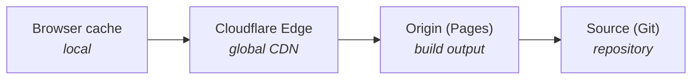

+++
title = "Hosting and Caching"
description = "How Cloudflare Pages serves the sites, what gets cached where, and how cache invalidation works."
weight = 20
+++

How content moves from origin to browser, and what gets cached at each
layer.

## Cache layers



## Cache configuration by site

### www.wheelofheaven.world

| Asset type | Browser TTL | Edge TTL | Strategy |
|------------|-------------|----------|----------|
| HTML pages | 0 | Deploy purge | Always fresh |
| CSS/JS | 1 year | 1 year | Hashed filenames |
| Fonts | 1 year | 1 year | Immutable |
| Images | 1 month | 1 year | Long-lived |

### api.wheelofheaven.world

| Endpoint | Browser TTL | Edge TTL | Header |
|----------|-------------|----------|--------|
| `/v1/*` | 1 hour | 1 hour | `max-age=3600` |

```
# static/_headers
/v1/*
  Cache-Control: public, max-age=3600
```

### assets.wheelofheaven.world

| Asset type | Browser TTL | Edge TTL | Header |
|------------|-------------|----------|--------|
| All images | 1 year | 1 year | `max-age=31536000, immutable` |

Images are immutable — updates get new filenames.

## Cloudflare cache settings

### Page rules (if needed)

```
URL: assets.wheelofheaven.world/*
Setting: Cache Level = Cache Everything
Edge TTL: 1 month
Browser TTL: 1 year
```

### Cache purge

On Cloudflare Pages deployment, cache for changed files is purged
automatically and the edge cache is invalidated globally.

Manual purge via API:

```sh
curl -X POST "https://api.cloudflare.com/client/v4/zones/{zone_id}/purge_cache" \
  -H "Authorization: Bearer {token}" \
  -H "Content-Type: application/json" \
  --data '{"purge_everything":true}'
```

## Browser caching

### HTML documents

No caching, to ensure fresh content:

```
Cache-Control: no-cache
```

Cloudflare serves from edge but validates on each request.

### Static assets

Long cache with hashed filenames:

```
Cache-Control: public, max-age=31536000, immutable
```

Zola generates hashed asset URLs, so new versions get new URLs and bypass
the cache automatically.

### Service worker (PWA)

The service worker manages its own cache:

- Cache-first for static assets
- Network-first for HTML
- Fallback to offline page

## Cache debugging

### Check cache status

```sh
curl -I https://www.wheelofheaven.world/ | grep -i cf-cache
```

Response header values:

- `cf-cache-status: HIT` — served from edge
- `cf-cache-status: MISS` — fetched from origin
- `cf-cache-status: DYNAMIC` — not cached

### Force bypass

Add a query string to bypass cache:

```
https://www.wheelofheaven.world/?nocache=1
```

Or use browser dev tools: "Disable cache" checkbox.

## Cache optimization

1. **CDN for images** — all images served from `assets.wheelofheaven.world`
   with aggressive caching.
2. **Minimize HTML** — keep pages focused; lazy-load images; defer
   non-critical JS.
3. **Long browser TTLs** — consistent URLs for unchanged assets,
   fingerprinted filenames for CSS/JS.
4. **Edge-first architecture** — static generation only; no server-side
   rendering; everything cacheable.

## Known platform quirks

External-platform bugs and edge cases we've hit in production and the
working patterns that get around them.

### CF Pages content-hash blob poisoning

**Symptom:** A specific page URL returns `HTTP 500` from Cloudflare
Pages with **bare headers** — no `cache-control`, no Content Security
Policy, no `content-type`, empty body. The server header is just
`cloudflare`. Other pages on the same site serve fine. The
deployment-specific URL (`{deploy-hash}.{project}.pages.dev/{path}`)
500s identically, so it is not a DNS or apex-routing issue. Fresh
deploys (including empty-commit forced rebuilds) reproduce the 500
identically.

**Confirming you're hit:**

1. Hit the URL directly: `curl -sI https://www.wheelofheaven.world/path/`
   — note `cf-cache-status: DYNAMIC` and the missing transform headers
   on the 500.
2. Hit the per-deploy URL from the Pages dashboard
   (`{hash}.www-wheelofheaven-io.pages.dev/path/`) — if **that** also
   500s, the file is bad in the deployment artifact itself, not in the
   serving layer.
3. Hit the file via raw GitHub on the `gh-pages` branch — if it
   returns 200 with valid HTML there, the file is correct at the
   source and the issue is on the CF Pages side.

**Cause:** CF Pages content-addresses uploaded assets. When a specific
file's first upload silently fails (corrupts in transit, hits an
upload race, or some internal Pages bug), the broken blob is keyed by
the file's content hash. Every subsequent rebuild produces a build
with the same hash for the unchanged file → CF Pages reuses the
poisoned blob → every fresh deploy reproduces the 500 identically.

**Fix:** Make a **tiny, semantically-neutral content change** to the
file's source — a word, a punctuation mark, anything that changes the
rendered output. Commit and push. The new content has a new hash,
which is not in CF Pages's poisoned-blob index, so the upload works
cleanly and the URL flips to 200.

Example, from the 2026-05-22 incident on Release 02:

```diff
-*— Filed May 22, 2026, Wheel of Heaven editorial desk.*
+*— Filed May 22, 2026, by the Wheel of Heaven editorial desk.*
```

A 7-character addition to the markdown — invisible to the reader,
sufficient to bypass the poisoned blob.

**Don't bother first:**

- **Retry deployment from the dashboard.** Same content hash → same
  poisoned blob.
- **Empty-commit forced rebuilds.** Likewise — the unchanged file
  hashes the same.
- **Cache purge on the URL.** The 500 isn't cached; CF is passing
  through to the broken blob on every request.

**Don't bother second:**

- **Renaming the slug.** This works but leaves the original URL
  500'd forever (a 301 won't help because the 500 happens before any
  application layer can issue a redirect). The tiny-edit fix preserves
  the URL.

**File a CF support ticket alongside:** Bare-500 on a Pages deploy
that has the index entry is server-side; their team can purge the
poisoned blob and prevent recurrence. Include the deployment ID
(`{hash}.{project}.pages.dev`) and the specific URL.

**Hit on:** 2026-05-22, `/news/pursue-release-02-spheres-and-transmedium/`.
Two independent fresh builds (`0eaf4e14` and `361f583f`) both 500'd
identically; a one-line content change on the source resolved it on
the next deploy.
