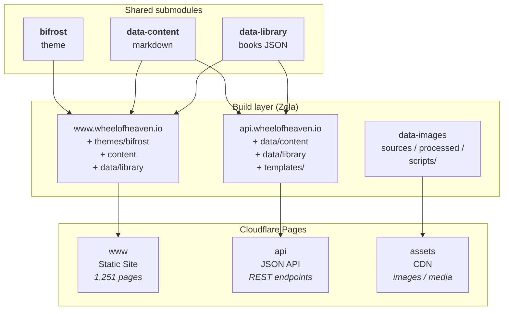
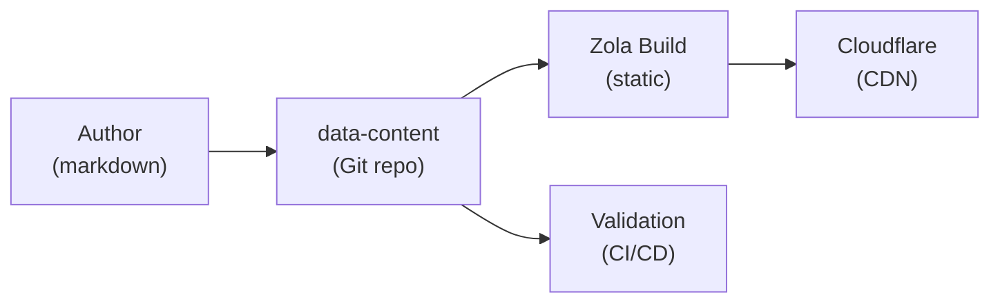
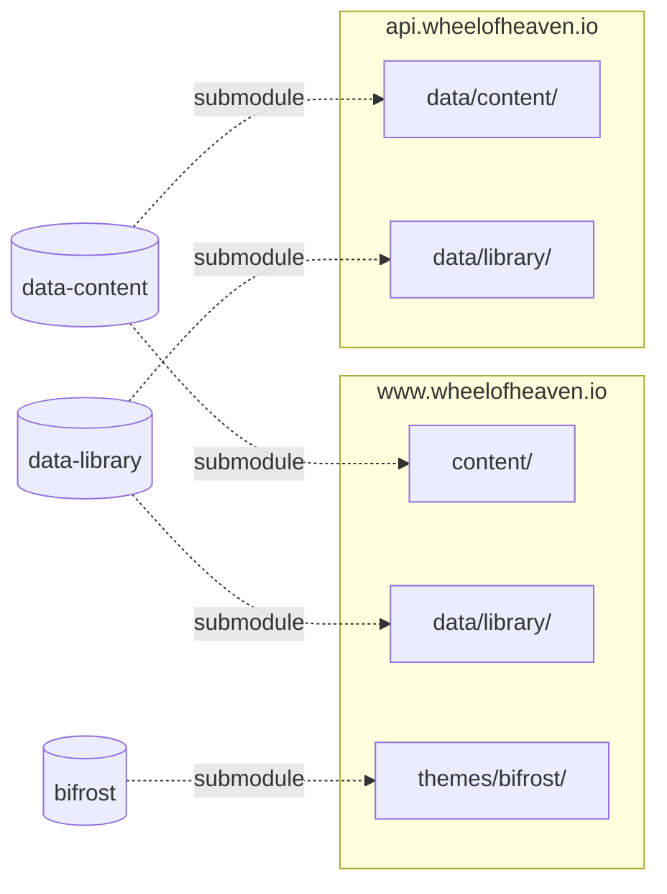

+++
title = "Architecture Overview"
description = "How the Wheel of Heaven sites, themes, content repos, and build pipeline fit together."
weight = 10
+++

The Wheel of Heaven ecosystem uses a modular architecture with Git submodules
to share content and themes across multiple sites.

## High-level architecture

## Data flow

## Submodule relationships

## Key design decisions

The shape of the project follows from a small number of upstream
choices. Each section here is one of them, with the rationale that
should hold up as the system grows.

### Content as submodules

**Decision:** all canonical content lives in `data-content` (markdown)
and `data-library` (book JSON), pulled into the consumer repos
(`www`, `api`) as git submodules.

**Why:**

- Single source of truth — a content edit propagates to both surfaces
  by bumping a pointer. No risk of www and api diverging on what
  exists or what it says.
- Independent versioning — content can move forward on its own
  schedule; consumer sites bump pointers when they're ready to
  redeploy with new content.
- Authors edit one repo with one validation pipeline. They never need
  to touch site code to publish.

**Trade-off:** submodules are awkward (forgetting `--recurse-submodules`
is the most common new-contributor stumble). Mitigated by good
[Quickstart](@/getting-started/quickstart.md) docs and CI that catches
missing pointers.

### Theme extraction (Bifrost)

**Decision:** the Zola theme is its own repo (`bifrost`), submoduled
into the consumer sites.

**Why:** even though only www currently uses it as a full theme, the
theme is also imported (just SCSS tokens) by this docs site, and could
be reused elsewhere. Decoupling templates + styles from content makes
visual changes a one-repo operation that lights up everywhere.

### Split book format

**Decision:** library books are stored as per-chapter JSON in
`data-library`, with stable paragraph refIds like `TBWTT-1:5`.

**Why:**

- Paragraph-level granularity enables deep linking (every paragraph
  is addressable) and stable citations across translations
- Multiple translations live in one source — each paragraph carries
  an `i18n` object keyed by language code
- Per-chapter files keep each load small and let translators work in
  smaller chunks

See [Library Book Format](@/reference/library-book-format.md) for the
full schema.

### Static-first

**Decision:** no server-side processing anywhere. Everything is built
statically at deploy time; Cloudflare Pages serves the build output
from edge caches.

**Why:**

- The whole corpus is essentially read-only at runtime — there's
  nothing to compute per request
- Edge caching makes the site fast globally without a paid CDN tier
- The "API" is just JSON files; same hosting, same cache behavior,
  same uptime as the reading site
- No servers to patch, no application code paths to monitor

**Trade-off:** anything that legitimately needs dynamic behavior
(search, theme toggle, library reader) has to live in client-side JS.
That's been fine so far.

## Component responsibilities

| Component | Responsibility |
|-----------|----------------|
| www | User-facing knowledge base |
| api | Machine-readable JSON endpoints |
| assets | Image CDN with format optimization |
| bifrost | Templates, styles, JavaScript |
| data-content | Markdown content (1,330+ files) |
| data-library | Book data (catalog + chapters) |
| data-images | Image processing pipeline |

## Build process

1. **Content authored** in `data-content` (Markdown)
2. **Submodules updated** in www/api repos
3. **Zola builds** static HTML/JSON
4. **Cloudflare deploys** on git push
5. **CDN caches** at edge locations

See [Pipelines](@/contributing/dev/pipelines.md) for the full build,
content, and image pipeline details.
