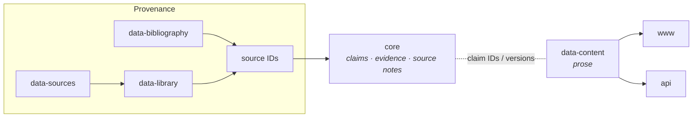

+++
title = "Research Core"
description = "The core repository — how Wheel of Heaven records what the framework claims, how those claims are reasoned, and how they change, separately from the reading site."
weight = 15
+++

`core` is the durable research corpus behind Wheel of Heaven. It records
*what the framework claims, where those claims come from, how the project
reasons from sources, which alternatives and objections matter, and how
meanings change over time* — deliberately separate from the reading site,
the translations, the source-text library, the bibliography, and the
software that publishes them.

The reading site (`data-content` → www/api) presents the framework in prose.
The core is the layer underneath the prose: the versioned record a page is an
expression *of*. It exists so a framework claim can be inspected, challenged,
and revised without silently rewriting the public pages that render it.

For the repo's directory layout and GitHub URL, see the
[Repository Inventory → core](@/reference/repository-inventory.md).
Repo: <https://github.com/wheelofheaven/core>.

## Why a separate repo

Wheel already separates raw sources, digitized texts, bibliography, content,
web presentation, and APIs. What had no home was the *conceptual* layer — the
hypothesis, methodology, evidence status, source interpretation, and the
decisions behind them — which lived scattered across public pages and
tool-specific operational files. That produced drift: a three-value claim
decision became a four-value public badge taxonomy; badges mixed source
explicitness, mainstream acceptance, project stance, inference, and evidence;
source metadata could carry project interpretation; framework claims had no
independent lifecycle, evidence status, or revision history.

The core fixes this by making the research representation authoritative and
inspectable, while changing no public URLs, content, or badges. It is
Markdown- and JSON-first; the only tooling is a dependency-free validator.

## The five orthogonal axes

The heart of the core is that it refuses to collapse five different questions
into one badge. Every claim carries all five independently:

| Axis | Answers | Values |
|---|---|---|
| **Claim kind** | What is this statement *doing* epistemically? | `source_report`, `empirical_observation`, `model`, `hypothesis`, `interpretation`, `normative_recommendation` |
| **Framework relation** | How does it function within Wheel of Heaven? | `foundational`, `derived`, `comparative`, `contextual`, `critical` |
| **Lifecycle** | What is the repository's *use* of the record? | `draft`, `proposed`, `accepted`, `deprecated`, `superseded` |
| **Evidence status** | How mature is the evidence map? (a *list* — a claim can be both) | `unmapped`, `scoped`, `reviewed`, `replicated`, `contested`, `unsupported` |
| **Public label** | The reader-facing badge on www | `direct`, `framework`, `inferred`, `speculative` |

The rules that keep them apart:

- **Framework relation is not evidence strength.** A claim can be
  `foundational` to the project *and* `contested`/`unsupported` in evidence.
- **Lifecycle is not truth.** `accepted` means "current project
  specification," not "established."
- **A public badge is not an evidence status.** The public taxonomy blends
  axes, so the core records the badge for compatibility but never derives it
  mechanically — a human editorial decision remains required.
- **Adoption is not validation.** An internally adopted premise may remain
  externally contested; an established observation does not join the framework
  merely because it is well-supported.

### Invalid transitions

The claim model names the shortcuts the core forbids — e.g. source report →
historical occurrence without independent evidence; morphological form → full
syntactic meaning; lexical possibility → intended referent; resemblance →
historical dependence or identity; scientific possibility → actual terrestrial
history; framework acceptance → empirical validation; citation quantity →
independent confirmation.

## Anatomy of a claim

Each claim is a human-readable **specification** (`docs/framework/<slug>.md`)
that controls meaning, paired with a machine-readable **record**
(`model/claims/woh-claim-NNNN.json`) that controls interchange. They must
change together; the validator flags divergence. A record declares its exact
proposition, the five axes, scope (includes/excludes), source references with
locators and roles, dependencies on other claims, the strongest alternatives,
revision triggers, the controlling document, and its public derivatives.

Supporting layers:

- **Evidence maps** (`docs/evidence/`) — passage-level matrices: for each
  locator, the source-language observation, the canonical reading, the
  strongest mainstream alternative, the critical/source-history account, and
  a source-independence note. A map is `scoped`, not a systematic review; a
  row's existence is not evidence *for* the claim.
- **Source notes** (`source-notes/`) — keyed to existing Wheel source IDs,
  each declaring an **access level** that bounds what it may assert:
  `full_text`, `project_digitization`, `excerpt`, `abstract`,
  `metadata_only`, `secondary_citation`.
- **RFCs** (`rfcs/`) and **ADRs** (`decisions/`) — major changes begin as an
  RFC; an ADR is added only after a decision is made.

Claim IDs are stable and never reused for a different proposition. Splits and
merges retain a mapping; supersession keeps forward/backward links and the
earlier representation.

## The pilot claims (0.1.0)

The current release is a foundation and pilot with three deliberately
different draft claims:

| ID | Claim | Kind | Relation | Why it's a pilot |
|---|---|---|---|---|
| `woh-claim-0001` | Elohim-civilization hypothesis | `hypothesis` | `foundational` | The load-bearing premise; tests compound-claim decomposition |
| `woh-claim-0002` | Anunnaki–Elohim identity | `interpretation` | `comparative` | Tests the comparative method and referential-identity discipline |
| `woh-claim-0003` | Precessional world-age chronology | `model` | `foundational` | Tests a five-layer claim: observed precession, the contested ancient-knowledge thesis, an equal-twelve model, a convention anchor, and derived event placement |

All three are `draft` and `scoped`/`contested`. They document existing
positions; they do not newly validate them.

## Publication integration (pilot)

Stage 5 of the roadmap requires that public outputs identify the exact core
version they render, so drift is visible before publication. The mechanism is
an **opt-in frontmatter contract** (proposed in RFC 0002): a `data-content`
page declares, in `[extra]`, which core claim(s) it renders and at what
version.

```toml
[extra]
core_claim_ids = ["woh-claim-0001"]
core_versions = { woh-claim-0001 = "0.1.0" }
```

When the sibling repositories are checked out together, the core validator
reads these declarations and reports a **disagreement** when a page's declared
version no longer matches the controlling claim record — the page renders a
stale claim. The fields are inert at render time; no template consumes them
yet. The pilot binds a single page (`wiki/elohim.md`); the other framework
pages are intentionally *not* backfilled until the contract is accepted.

See the field reference under
[Frontmatter → Core claim binding](@/reference/frontmatter.md).

## Validation

`python3 scripts/validate.py` (or `mise run check`) runs with no required
third-party dependencies and checks:

- document metadata and claim-record structure against the JSON Schemas;
- catalog ↔ record ↔ controlling-document agreement (IDs, versions,
  lifecycle);
- source-note IDs, access levels, and cross-links;
- every claim `source_id` against the aggregated public source registry
  (`www.wheelofheaven.world/data/sources.json`), when present;
- publication-integration bindings on derivative pages, when `data-content`
  is present;
- local Markdown links.

Checks that need a sibling repo skip cleanly (with a warning) when the core is
checked out alone, so the validator is always runnable.

## How this fits the wider architecture



Arrows show provenance and derivation, not causal proof. The core cites
source IDs and passage locators; it does not own the underlying texts, and it
is a peer of `data-content`, not a build input to the sites.
