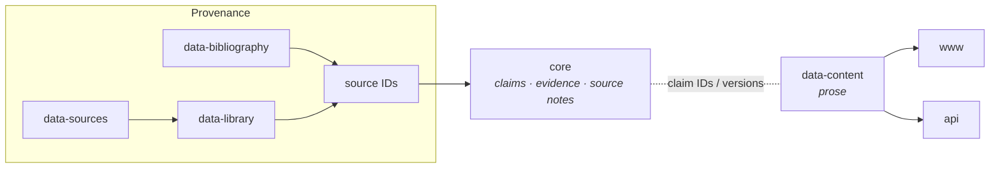

+++
title = "Research Core"
description = "The core repository — how Wheel of Heaven records what the framework claims, how those claims are reasoned, and how they change, separately from the reading site."
weight = 15
+++

`core` is the durable research corpus behind Wheel of Heaven. It records
*what the framework claims, where those claims come from, how the project
reasons from sources, which alternatives and objections matter, and how
meanings change over time* — deliberately separate from the reading site,
the translations, the source-text library, the bibliography, and the
software that publishes them.

The reading site (`data-content` → www/api) presents the framework in prose.
The core is the layer underneath the prose: the versioned record a page is an
expression *of*. It exists so a framework claim can be inspected, challenged,
and revised without silently rewriting the public pages that render it.

For the repo's directory layout and GitHub URL, see the
[Repository Inventory → core](@/reference/repository-inventory.md).
Repo: <https://github.com/wheelofheaven/core>.

## Why a separate repo

Wheel already separates raw sources, digitized texts, bibliography, content,
web presentation, and APIs. What had no home was the *conceptual* layer — the
hypothesis, methodology, evidence status, source interpretation, and the
decisions behind them — which lived scattered across public pages and
tool-specific operational files. That produced drift: a three-value claim
decision became a four-value public badge taxonomy; badges mixed source
explicitness, mainstream acceptance, project stance, inference, and evidence;
source metadata could carry project interpretation; framework claims had no
independent lifecycle, evidence status, or revision history.

The core fixes this by making the research representation authoritative and
inspectable, while changing no public URLs, content, or badges. It is
Markdown- and JSON-first; the only tooling is a dependency-free validator.

## The five orthogonal axes

The heart of the core is that it refuses to collapse five different questions
into one badge. Every claim carries all five independently:

| Axis | Answers | Values |
|---|---|---|
| **Claim kind** | What is this statement *doing* epistemically? | `source_report`, `empirical_observation`, `model`, `hypothesis`, `interpretation`, `normative_recommendation` |
| **Framework relation** | How does it function within Wheel of Heaven? | `foundational`, `derived`, `comparative`, `contextual`, `critical` |
| **Lifecycle** | What is the repository's *use* of the record? | `draft`, `proposed`, `accepted`, `deprecated`, `superseded` |
| **Evidence status** | How mature is the evidence map? (a *list* — a claim can be both) | `unmapped`, `scoped`, `reviewed`, `replicated`, `contested`, `unsupported` |
| **Public label** | The reader-facing badge on www | `direct`, `framework`, `inferred`, `speculative` |

The rules that keep them apart:

- **Framework relation is not evidence strength.** A claim can be
  `foundational` to the project *and* `contested`/`unsupported` in evidence.
- **Lifecycle is not truth.** `accepted` means "current project
  specification," not "established."
- **A public badge is not an evidence status.** The public taxonomy blends
  axes, so the core records the badge for compatibility but never derives it
  mechanically — a human editorial decision remains required.
- **Adoption is not validation.** An internally adopted premise may remain
  externally contested; an established observation does not join the framework
  merely because it is well-supported.

### Invalid transitions

The claim model names the shortcuts the core forbids — e.g. source report →
historical occurrence without independent evidence; morphological form → full
syntactic meaning; lexical possibility → intended referent; resemblance →
historical dependence or identity; scientific possibility → actual terrestrial
history; framework acceptance → empirical validation; citation quantity →
independent confirmation.

## Anatomy of a claim

Each claim is a human-readable **specification** (`docs/framework/<slug>.md`)
that controls meaning, paired with a machine-readable **record**
(`model/claims/woh-claim-NNNN.json`) that controls interchange. They must
change together; the validator flags divergence. A record declares its exact
proposition, the five axes, scope (includes/excludes), source references with
locators and roles, dependencies on other claims, the strongest alternatives,
revision triggers, the controlling document, and its public derivatives.

Supporting layers:

- **Evidence maps** (`docs/evidence/`) — passage-level matrices: for each
  locator, the source-language observation, the canonical reading, the
  strongest mainstream alternative, the critical/source-history account, and
  a source-independence note. A map is `scoped`, not a systematic review; a
  row's existence is not evidence *for* the claim.
- **Source notes** (`source-notes/`) — keyed to existing Wheel source IDs,
  each declaring an **access level** that bounds what it may assert:
  `full_text`, `project_digitization`, `excerpt`, `abstract`,
  `metadata_only`, `secondary_citation`. See
  [Access levels and holdings](#access-levels-and-holdings) below.
- **RFCs** (`rfcs/`) and **ADRs** (`decisions/`) — major changes begin as an
  RFC; an ADR is added only after a decision is made.

Claim IDs are stable and never reused for a different proposition. Splits and
merges retain a mapping; supersession keeps forward/backward links and the
earlier representation.

## The claims (0.1.0)

The current release is a foundation and pilot with four deliberately different
draft claims:

| ID | Claim | Kind | Relation | Why it's a pilot |
|---|---|---|---|---|
| `woh-claim-0001` | Elohim-civilization hypothesis | `hypothesis` | `foundational` | The load-bearing premise; tests compound-claim decomposition |
| `woh-claim-0002` | Anunnaki–Elohim identity | `interpretation` | `comparative` | Tests the comparative method and referential-identity discipline |
| `woh-claim-0003` | Precessional world-age chronology | `model` | `foundational` | Tests a five-layer claim: observed precession, the contested ancient-knowledge thesis, an equal-twelve model, a convention anchor, and derived event placement |
| `woh-claim-0004` | Greek theomachy as Council–Serpentine conflict memory | `interpretation` | `comparative` | The reverse pilot for the derivation contract — extracted *from* a published article rather than written before one |

All four are `draft` and `scoped`/`contested`. They document existing
positions; they do not newly validate them.

Claim 0004 is also the worked example of what a record adds over prose: it
carries the falsifiability terms that previously lived only in one article's
closing section, and it records — as an explicit gap with a revision trigger —
that its own foundation, the Council–Serpentine conflict account, is still
corpus prose rather than a claim record.

## Publication integration (RFC 0002, accepted)

Stage 5 of the roadmap requires that public outputs identify the exact core
version they render, so drift is visible before publication. The mechanism is
a **frontmatter contract** (RFC 0002): a `data-content` page declares, in
`[extra]`, which core claim(s) it renders and at what version.

```toml
[extra]
core_claim_ids = ["woh-claim-0001"]
core_versions = { woh-claim-0001 = "0.1.0" }
```

The binding is **reciprocal**: each claim record's `public_derivatives` list
names the pages that render it, and the declaring page's frontmatter names the
claim. When the sibling repositories are checked out together, the core
validator reads both sides and reports a **disagreement** when a page's
declared version no longer matches the controlling claim record — the page
renders a stale claim — or a warning when a page declares a claim it is not
listed under. The fields are inert at render time; no template consumes them
yet.

As of 2026-08 the contract is **fully rolled out** beyond the original
`wiki/elohim` pilot. Every page that renders one of the three claims is bound
and reciprocated:

| Claim | Bound pages |
|---|---:|
| `woh-claim-0001` — Elohim-civilization hypothesis | 7 |
| `woh-claim-0002` — Anunnaki–Elohim identity | 2 |
| `woh-claim-0003` — Precessional world-age chronology | 20 |

The validator reports `publication_integration=checked` with zero errors. As
the claim model grows, this reciprocation (record `public_derivatives` +
page frontmatter) is the routine per-claim follow-on.

RFC 0002 was **closed by adoption** on 2026-08-15: RFC 0003 incorporates the
contract unchanged and lifts its single-page pilot restriction, so accepting
the derivation contract accepted this one with it (ADR 0002).

See the field reference under
[Frontmatter → Core claim binding](@/reference/frontmatter.md).

## The derivation contract (RFC 0003, accepted)

RFC 0002 made the binding an *integrity check* — it catches a page that has
drifted from its record. RFC 0003 turns it into a **production contract**: new
artifacts begin from claim records rather than ending at them.

A "Ground" stage sits at the front of every production pipeline. The topic is
resolved against the catalog; existing records are read in full; missing
records are drafted as `draft` claims — and the pipeline **pauses for founder
review before prose is written on top of them**. The finished artifact then
declares what it renders.

The contract binds new artifacts and fundamental rewrites; the existing corpus
is grandfathered, translations inherit their source page's binding, and
Dispatches may bind but need not. It changes no template, badge, URL, or
schema, and the core stays inert at render time.

The founder gates are unchanged and are the point: agents draft records,
only the founder promotes them. Review moves from "is this article's argument
sound" to "is this claim record sound" — once, reusable across every artifact
and language that later cites it.

The editorial-facing guide, with the stage-by-stage walkthrough and the role
charters, is at
[Grounded Production](@/contributing/content/grounded-production.md).

## Depiction notes (RFC 0004, accepted)

Text artifacts bind to claim records. Visual and scenic ones — hero images,
illustrations, gallery renders, audio-play staging — had no core-side
grounding at all: every image quietly made claims, and unlike prose, **an
image cannot hedge**.

`depictions/{slug}.md` is the fourth core document class, one file per
depicted entity, place, or recurring scene, with a fixed four-layer body:

| Layer | Records |
|---|---|
| **Reported** | What a named source explicitly says about appearance, setting, sound, or staging — with locators. Contested particulars are listed per source, never harmonised. |
| **Interpolated** | Bounded project inference where sources are silent, each with its rationale and revision trigger. |
| **Free** | Dimensions explicitly released to art direction, so "free" is a recorded decision rather than an absence. |
| **Must not show** | Hard negative constraints — particulars that would contradict a reported layer or a bound claim. |

Briefs bind notes the way pages bind claims
(`core_depiction_ids` + `core_depiction_versions`); rendered assets inherit
their brief's binding and are never bound directly.

The class is accepted (ADR 0003). Its pilot notes — `elohim-individual` and
`typhoeus-combat` — and the validator extension are implementation steps still
to come, so the binding is normative-only for now.

## Access levels and holdings

The access level on a source reference is not bookkeeping — it is the ceiling
on what a claim may assert from that source. And it is where the research
programme is currently bottlenecked: across the four claims, **10 of 18 source
references sit at `metadata_only`**, meaning they are load-bearing and have
never actually been opened.

An evidence map cannot honestly move from `scoped` to `reviewed` while its
scholarly context is uninspected. The one source that *was* properly
consulted — Black & Green, upgraded `metadata_only` → `excerpt` — turned out to
**constrain** the claim depending on it rather than support it, by documenting
that the Anunnaki referent shifts across periods and so offers no fixed roster
to identify. That is the argument for inspection in one example: it changes
conclusions, and leaving it undone hides that it hasn't happened.

Core RFC 0005 (accepted, ADR 0004) adds a **holdings registry** in the private
`data-sources` repo to close this: one record per copy the project holds or has
consulted, keyed to the same source IDs, recording edition, pagination basis,
and a per-locator verification log — with payloads deliberately *not* committed
for in-copyright works. A derived wantlist ranks what to read next and what to
acquire next by which claims it would unblock. See
[Repository Inventory → data-sources](@/reference/repository-inventory.md).

## Governance record

| RFC | Status | Question | ADR |
|---|---|---|---|
| 0001 | Accepted | Establish a durable research core | 0001 |
| 0002 | Accepted | Let a page declare which core claims and versions it renders | 0002 (by adoption) |
| 0003 | Accepted | Require new artifacts to derive load-bearing assertions from records | 0002 |
| 0004 | Accepted | Add depiction notes for visual and scenic artifacts | 0003 |
| 0005 | Accepted | Register the source copies the project holds, with an ingest pipeline that indexes without reproducing | 0004 |

Acceptance records a project decision, not empirical truth. Accepting RFC 0003
adopted the *process*; it did not promote any claim — all four claim records
remain `draft` and advance only on their own review.

## Validation

`python3 scripts/validate.py` (or `mise run check`) runs with no required
third-party dependencies and checks:

- document metadata and claim-record structure against the JSON Schemas;
- catalog ↔ record ↔ controlling-document agreement (IDs, versions,
  lifecycle);
- source-note IDs, access levels, and cross-links;
- every claim `source_id` against the aggregated public source registry
  (`www.wheelofheaven.world/data/sources.json`), when present;
- publication-integration bindings on derivative pages, when `data-content`
  is present;
- local Markdown links.

Checks that need a sibling repo skip cleanly (with a warning) when the core is
checked out alone, so the validator is always runnable.

## How this fits the wider architecture



Arrows show provenance and derivation, not causal proof. The core cites
source IDs and passage locators; it does not own the underlying texts, and it
is a peer of `data-content`, not a build input to the sites.
