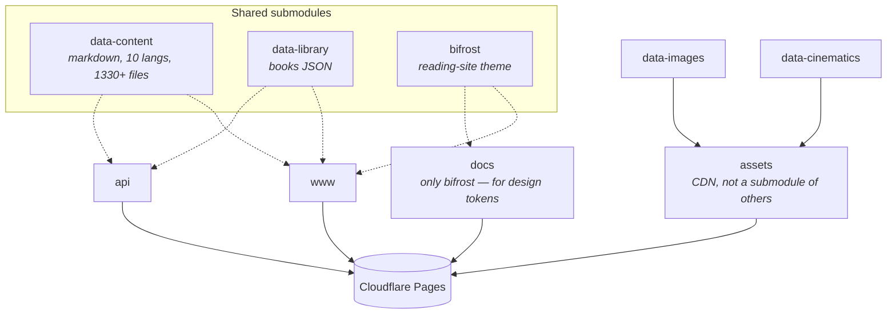

+++
title = "Sites"
description = "The four Cloudflare Pages projects — www, api, assets, docs — and how each is built, hosted, and used."
sort_by = "weight"
weight = 20
template = "section.html"
+++

Four production sites, each its own Cloudflare Pages project on the
`wheelofheaven.world` zone. All four are static — Zola for three, plain
file serving for the asset CDN.

## At a glance

| Site | URL | Purpose | Stack |
|---|---|---|---|
| **www** | <https://www.wheelofheaven.world> | The reading site — wiki, articles, library, timeline, news, sources | Zola + Bifrost theme, 10 languages |
| **api** | <https://api.wheelofheaven.world> | JSON endpoints (same content as www, machine-readable) | Zola + Python prebuild script |
| **assets** | <https://assets.wheelofheaven.world> | Image CDN — AVIF/WebP/JPG + OG cards | Static file serving |
| **docs** | <https://docs.wheelofheaven.world> | This site — author, contributor, dev docs | Zola + custom `docs-theme` (English-only) |

Per-site detail on the pages below.

## What shares what

The `data-content` submodule being shared between **www** and **api**
is what guarantees both surfaces see the same content. Bump the
pointer in one repo, then the other, and a content change goes live on
both.

## Build cost (typical)

- **www**: ~30s (largest — 1,200+ pages, 10 langs)
- **api**: ~15s (smaller per-page output, plus a prebuild step)
- **docs**: ~20s
- **assets**: zero (no build, just file serving)

## Why four separate Pages projects instead of subpaths on one

- Independent build/deploy lifecycles. Content can ship to www
  without rebuilding the docs site, etc.
- Cleaner cache scoping — CDN behavior tuned per site
- Smaller blast radius on a bad deploy
- Each site can pin its own Zola version, npm tools, etc.

The cost is a bit of duplication in deploy config, which CI absorbs.

## See also

- [Hosting and Caching](@/architecture/hosting-and-caching.md) — TTLs,
  cache invalidation, debugging stale content
- [CI & Deploy](@/contributing/dev/ci-deploy.md) — build commands,
  custom domains, GitHub app, redirects
