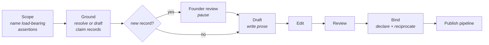

+++
title = "Grounded Production"
description = "The artifact derivation contract: how new articles, wiki entries, and briefs ground their load-bearing claims in core claim records before the prose is written."
template = "page.html"
weight = 7
+++

Every new Wheel of Heaven artifact — an Article, a wiki entry, a timeline
chapter, an illustration brief, an audio-play scene — derives its
load-bearing assertions from claim records in the
[research core](@/architecture/research-core.md) **before** the prose or the
brief is written. The artifact is a bounded public projection of a versioned
record, not the place where the insight is first invented.

This is the **artifact derivation contract**, proposed in core RFC 0003 and
accepted on 2026-08-15 as ADR 0002. It binds new artifacts and fundamental
rewrites. The existing corpus was grandfathered at adoption — and has since
been backfilled: ten distillation batches (2026-08-15/16) extracted the
corpus's claim layer into a 69-record catalog (accepted by core ADR 0005 and
ADR 0006), and every claim-bearing page now declares its binding.
Grandfathering remains relevant only for pages that carry no claim (direct
reference, list, and biographical entries).

## Why the contract exists

The project used to run on two constitutions that did not talk to each other.

The **publication side** — the editorial standards in this section — governs
*how things are said*: voice, terminology, structure, the sourcing floor. The
**core** governs *what may be claimed and on what basis*: the five orthogonal
axes, evidence maps, alternatives, revision triggers.

Before the contract, only one page in the entire corpus was bound to a claim
record. In practice that meant an Explainer's central insight was invented at
writing time, disciplined by voice rules alone, and its `claim_type` badge was
a per-page, per-author judgment call with no controlling record behind it.

The contract closes that gap by inverting the order of work. The insight lives
in the record; the artifact renders it. The practical payoff is that **founder
review becomes reusable**: instead of reviewing the argument of every article
and each of its nine translations, you review the claim record once, and every
artifact that later cites it inherits that review.

## The test

> An artifact's insight must be quotable from a claim record, not only from
> the artifact.

If a load-bearing sentence cannot be traced to a record's proposition, scope,
and public label, either the record is missing (go ground it) or the prose has
drifted beyond what the project has actually committed to.

## The pipeline



### 1. Scope

Name the artifact's **load-bearing assertions**: the claims the artifact would
be wrong about if they were wrong. Three to seven, each phrased as a
proposition. Incidental background does not count — an Explainer that mentions
the Bronze Age collapse in passing is not making a claim about it.

### 2. Ground

Resolve each assertion against `model/catalog.json` in the core.

**Hit** — read the claim record, its controlling specification in
`docs/framework/`, and its evidence map in `docs/evidence/`. Note the version.
The artifact must stay inside the record's `scope` and honour its
`public_label`.

**Miss** — draft the record before writing prose: the claim record, its
controlling specification, a scoped evidence map, source notes for any newly
referenced project-held sources, and the catalog entry. Everything is
`lifecycle: draft`. Then **stop**.

> **The founder pause.** A newly drafted claim record pauses the pipeline. No
> prose is written against an unreviewed record. This is not a formality — it
> is where the contract earns its value, because reviewing the record once is
> what saves reviewing the same argument in every artifact and language that
> later expresses it.
>
> Agents draft. Only the founder promotes a lifecycle, adds a foundational
> claim, or identifies referents across traditions.

Ground closes with a **grounding report**: claims matched (with versions),
claims drafted (awaiting review), and assertions demoted to incidental.

### 3. Draft

Write under the editorial rules for the target content type — the per-type
guides in this section, plus [Editorial Passes](@/contributing/content/editorial-passes.md)
for `claim_type` and `editorial_pass`.

What the contract adds: hedging is set by the record, not by instinct. Canon
claims are stated directly; comparative, scientific, and critical layers stay
hedged **as the bound record specifies**. Where a record's `scope.excludes`
rules out territory — transmission routes, one-to-one identifications,
historicity — the prose must not gesture at it either. Where the form has a
counter-case slot, the record's `alternatives` belong in it.

### 4. Edit

Adjudicate the artifact against each bound record clause by clause (scope
respected, label honoured, alternatives represented, excluded territory
untouched), then against the editorial standards.

When artifact and record disagree, **the record controls**. Either fix the
prose or propose a record revision back at stage 2 — never silently
reinterpret the claim in prose.

### 5. Review

Fresh eyes, working from the artifact and the records only — not from the
writer's or editor's reasoning. Re-derive the binding: would a reader
reconstruct this claim, at its label and scope, from the artifact alone?
Verify citations at their recorded access levels. Attempt the strongest
refutation. Return a verdict: pass, mechanical fixes, or substantive issues
for human judgment.

### 6. Bind

Declare the binding in the artifact's `[extra]`:

```toml
core_claim_ids = ["woh-claim-0004"]
core_versions = { woh-claim-0004 = "0.1.0" }
```

Then reciprocate: add the artifact to each record's `public_derivatives`, and
set `claim_type` to match the record's `public_label`. Re-run the core
validator with the sibling repos present; it must report
`publication_integration=checked` with no errors.

Field details: [Frontmatter → Core claim binding](@/reference/frontmatter.md).

### 7. Publish

Hand off to the normal publish path for the content type — Articles to the
article publish pipeline, timeline chapters to fan-out, everything else to its
section flow. Translations inherit their source page's binding and need no
grounding of their own.

## Who does what

The role charters live in the core at `docs/methodology/production-roles.md`
(accepted, version 0.1.0) and are deliberately **harness-agnostic**: Claude
Code, Codex, and human contributors all follow the same charter, and the
orchestration wiring points back at it rather than restating it.

| Role | Owns | Must not |
|---|---|---|
| **Researcher** | The Ground stage: resolving and drafting records, evidence maps, source notes | Promote lifecycles; upgrade a source's access level without inspecting it; tune a record's scope so a desired sentence becomes expressible |
| **Writer** | The artifact's prose or brief, within the bound records' scope and label | Mint, widen, or re-label claims inline; convert a source report into an event |
| **Editor** | Clause-by-clause adjudication against records, then editorial standards | Weaken recorded dissent for flow; resolve a founder-gated question by fiat |
| **Reviewer** | Independent verification from artifact + records alone | Rewrite beyond mechanical fixes; pass an artifact whose record still awaits review |
| **Art Director** | Visual and scenic briefs, grounded in depiction notes | Render identifications no note or claim records; launder a rejected textual claim into imagery |

Two rules cut across all five. **Stage boundaries are real** — a writer who
discovers a missing claim does not mint one inline; the work returns to the
Researcher. And **founder gates are not pipeline stages** — no downstream
stage starts against unreviewed output.

## Running it

In Claude Code, the `woh-produce` skill wires the charters to the harness and
runs the stages in order, including the founder pause. It fronts the
type-specific publish pipelines rather than replacing them.

Other agent harnesses perform the same stages manually, reading the charters
directly from the core. The stage outputs — grounding report, editorial
report, verdict — are plain markdown handoffs; preserve them and the founder
gates exactly. The contract is satisfiable entirely by hand.

## Scope of adoption

| Situation | Contract applies? |
|---|---|
| New artifact | **Yes** |
| Fundamental rewrite (the `editorial_pass` threshold) | **Yes** |
| Existing corpus, untouched | No — grandfathered (in practice backfilled 2026-08; only claim-free reference, list, and biographical pages remain unbound) |
| Translation of a bound page | Inherits the source page's binding |
| Newsroom Dispatch | Optional (the mandatory `canon_links` already anchors it) |
| Typo fix, reference addition, mechanical edit | No |

The backfill of grandfathered pages completed in 2026-08: ten distillation
batches applied the reverse-pilot pattern below at corpus scale — extract the
record from the artifact, then bind — leaving unbound only pages with no
claim to carry.

## Worked example: the reverse pilot

The contract was validated backwards before it was adopted forwards.

The Explainer *The World Behind the Odyssey* was written the old way —
prose-first — and its central reading was then extracted into
`woh-claim-0004`, "Greek theomachy as Council–Serpentine conflict memory"
(`interpretation` / `comparative` / `speculative`, depending on claims 0001
and 0003). The extraction produced the full apparatus: a claim record, a
controlling specification, an evidence map whose matrix names the relationship
each comparison actually supports, and a source note for the in-house
*Theogony* translation. The article now declares the binding.

The exercise was worth running for what it exposed — all of which
grounding-first would have caught at stage 2:

- **An unrecorded dependency.** The reading's real foundation — the
  Council–Serpentine conflict account — turned out to exist only as corpus
  prose, not as a claim record. It is now a documented gap with a revision
  trigger.
- **A label with no controlling record.** The article's `speculative` badge
  was a sound editorial call, but nothing outside the article backed it.
- **Falsifiability terms trapped in prose.** The conditions under which the
  reading should be surrendered lived in one article's closing section; they
  are now `revision_triggers` on the record, where every future artifact
  inherits them.

## The visual layer

Illustrations, hero images, and audio-play scenery ground the same way, but
against **depiction notes** rather than claim records — a separate document
class accepted as ADR 0003. An image cannot hedge, so the record hedges for
it: each note separates what sources visually *report* from what the project
*interpolates*, what is *free* for art direction, and what must *not* be
shown.

The class is accepted; its pilot notes and validator support are still being
implemented. See
[Research Core → Depiction notes](@/architecture/research-core.md).
