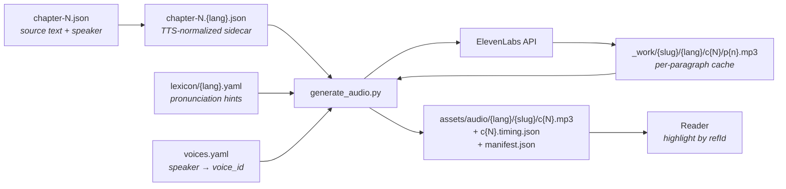
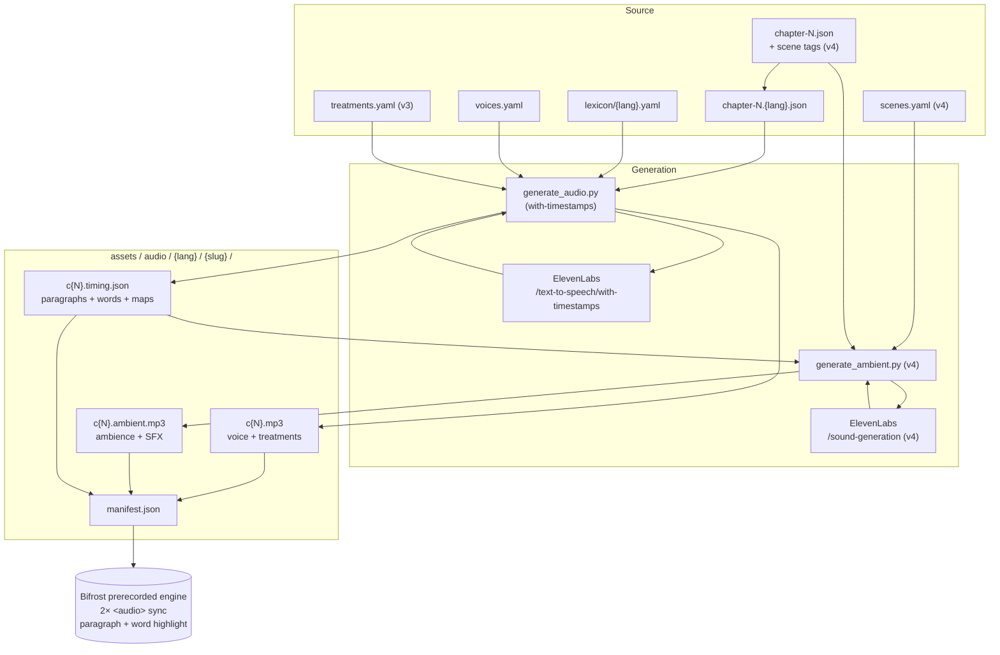

+++
title = "Audiobook Pipeline"
description = "ElevenLabs-driven audiobook generation: from TTS sidecars + lexicon + voice config to per-chapter MP3s on the assets CDN."
template = "page.html"
weight = 45
+++

How library books become audiobooks: the editorial prep, the generation
pipeline, the storage layout, the costs, and the operational loop.

The pipeline turns the per-paragraph TTS-normalized text in
`data-library/{slug}/tts/chapter-N.{lang}.json` into per-chapter MP3
files at `assets.wheelofheaven.world/audio/{lang}/{slug}/c{N}.mp3`,
each paired with a `c{N}.timing.json` sidecar that maps each paragraph
to its `[start, end]` seconds in the audio.

## End-to-end picture



Three repos hold pieces of the pipeline:

| Repo | Role |
|---|---|
| [`data-library`](https://github.com/wheelofheaven/data-library) | Source text + TTS sidecars + pronunciation lexicon + voice config + the generation script |
| [`assets.wheelofheaven.world`](https://github.com/wheelofheaven/assets.wheelofheaven.world) | Final per-chapter MP3s + per-chapter timing sidecars + per-book manifest — served at `https://assets.wheelofheaven.world/audio/…` |
| [`bifrost`](https://github.com/wheelofheaven/bifrost) | Listen button's **prerecorded engine** in `static/js/listen-button.js` — fetches the manifest, streams the MP3, drives paragraph highlight from the timing sidecar |
| [`www.wheelofheaven.world`](https://github.com/wheelofheaven/www.wheelofheaven.world) | Consumes the bifrost bundle via submodule; the service-worker `CACHE_VERSION` in `static/sw.js` must be bumped whenever the bundle changes |

## What's already in place

Before the first ElevenLabs call, the data side is done:

1. **Paragraph splits.** Long paragraphs broken at natural sentence
   boundaries so each piece is a manageable audio chunk. See
   [Paragraph Split Tooling](@/contributing/dev/paragraph-split-tooling.md).
2. **Speaker attribution.** Every paragraph in TBWTT and ETTMTTP has
   a `speaker` field (`Narrator`, `Raël`, or `Yahweh`). This is what
   the generation script reads to pick the right voice. See the
   `Re-attribute 49 paragraphs in ETTMTTP ch2` commit for the
   curation pass. LWTE is out of scope for the audiobook MVP — all
   its paragraphs are labeled `Narrator` pending its own curation.
3. **TTS text normalization.** Each paragraph has a `tts_text` in
   `{slug}/tts/chapter-N.{lang}.json` with citations stripped, quote
   marks removed, footnote noise gone, etc. 98 sidecars total
   covering TBWTT + ETTMTTP + LWTE × 9 languages (LWTE has FR + EN
   only since other languages are empty in source). See
   [Library Book Format](@/reference/library-book-format.md) for the
   chapter JSON schema; the normalization rules are documented inline
   in `data-library/scripts/normalize_tts.py`.
4. **Pronunciation lexicon.** Per-language YAML at
   `data-library/lexicon/{lang}.yaml` with IPA + fallback respelling
   for the ~15-20 names ElevenLabs reliably mispronounces (Raël,
   Elohim, Yahvé/Yahweh, MADECH, Ezéchiel, Périgord, etc.). FR + EN
   filled in; other languages stubbed for later. See
   `data-library/lexicon/_README.md` for the format.

## Voice casting

Before any audio gets generated, voice IDs must be set in
`data-library/audio/voices.yaml`. The user picks them from the
[ElevenLabs voice library](https://elevenlabs.io/app/voice-library).

The vocabulary is small:

| Speaker | Who | Voice characteristics that work |
|---|---|---|
| `Narrator` | Raël as post-hoc author, scene-setting | Natural reading voice; some warmth/expressiveness |
| `Raël` | Raël as in-scene character, asking Yahweh questions | Can share the Narrator voice with different prosody settings, or a slightly more conversational voice |
| `Yahweh` | The Elohim speaker, long instructional monologues | Distinct, weightier voice; consistency across long passages matters |

### Picking voices

1. Browse <https://elevenlabs.io/app/voice-library> and sample voices
   in the target language.
2. For each `(speaker, lang)` pair, save the voice ID (the UUID in
   the URL after the voice name).
3. Open `data-library/audio/voices.yaml` and fill in `voice_id` values:

```yaml
voices:
  en:
    Narrator:
      voice_id: "I1T6PEfqPxl45yKRN4aS"   # Marcel — warm, expressive
    Raël:
      voice_id: "I1T6PEfqPxl45yKRN4aS"   # share Marcel; different prosody via defaults
    Yahweh:
      voice_id: "sB7vwSCyX0tQmU24cW2C"   # Jon — relaxed, deep, weightier
```

### Voice library: "Add to my voices" gotcha

Voices from the ElevenLabs **voice library** (not the premade voices)
must be added to your collection before they're accessible via the API.
A library voice ID in `voices.yaml` will cause `402 Payment Required`
errors at generation time even on paid plans, until you click
**Add to my voices** on the voice's library page. Confirm with:

```sh
curl -s -H "xi-api-key: $ELEVENLABS_API_KEY" \
    https://api.elevenlabs.io/v1/voices | jq '.voices[].voice_id'
```

The voice IDs in `voices.yaml` must appear in that list.

### Cross-language voice reuse

`eleven_multilingual_v2` (the default model) supports the same voice
across 29 languages. For the rollout we deliberately reuse the English
voices (Marcel + Jon) for all 9 i18n languages — same voice characters,
different language output. This keeps the character identity consistent
across translations and skips per-language voice casting entirely.

Override per language only if a specific voice sounds wrong for that
language; in practice the multilingual model handles French, German,
Spanish, Russian, Japanese, Korean, and Chinese (both scripts) without
recasting.

### Voice settings

Defaults are in `voices.yaml` `defaults:`:

| Speaker | stability | similarity_boost | Reasoning |
|---|---|---|---|
| `Narrator` | 0.55 | 0.75 | Natural narration; some variation paragraph to paragraph |
| `Raël` | 0.60 | 0.75 | In-scene dialogue, slightly more grounded |
| `Yahweh` | 0.70 | 0.80 | Consistent gravitas across long monologues |

You can override per-(speaker, lang) by adding `stability:` /
`similarity_boost:` / `style:` under the specific entry.

## The first run — MVP

Always start with **TBWTT chapter 1 EN**. It's the cheapest meaningful
test (~$3) and it surfaces the most issues per dollar.

### Prereqs

```sh
# Python deps (system Python 3.9+ works; pyenv/venv preferred for clean env)
pip install pyyaml requests

# ffmpeg + ffprobe for concatenation and duration measurement
brew install ffmpeg
```

### API key

```sh
export ELEVENLABS_API_KEY="sk_..."
```

Get the key from the ElevenLabs dashboard. Treat as a secret — never
commit, never log. The generation script reads it from the env var.

### Dry run first

Before paying for anything:

```sh
python3 data-library/scripts/generate_audio.py \
    --slug the-book-which-tells-the-truth \
    --lang en \
    --chapter 1 \
    --dry-run
```

This walks every paragraph, sums character counts, reports estimated
cost based on the `--price-per-1k` value (default $0.30 for creator
tier). No voice_id required for dry-runs; no API calls made.

Compare against current ElevenLabs pricing
(<https://elevenlabs.io/pricing>) and confirm before proceeding.

### MVP run

```sh
python3 data-library/scripts/generate_audio.py \
    --slug the-book-which-tells-the-truth \
    --lang en \
    --chapter 1
```

What happens:

1. Loads sidecar, lexicon, voice config.
2. For each paragraph in the sidecar (skipping `skip:true` entries):
   - Wraps lexicon entries in `<phoneme alphabet="ipa" ph="…">` SSML
   - Hashes (text, voice_id, settings, model) into a cache key
   - If a cached MP3 with that key exists at
     `data-library/audio/_work/{slug}/{lang}/c{N}/p{n}.mp3`, reuses it
   - Otherwise: POSTs to `https://api.elevenlabs.io/v1/text-to-speech/{voice_id}`,
     saves the MP3 to the cache, saves meta (`p{n}.meta.json`)
3. After all paragraphs: concatenates via `ffmpeg -f concat -c copy`
   with silence clips between paragraphs (600ms default, 900ms when
   speaker changes), writes the per-chapter MP3 to
   `assets.wheelofheaven.world/audio/{lang}/{slug}/c{N}.mp3`
4. Writes timing sidecar `c{N}.timing.json` mapping each paragraph
   number to its `[start, end]` seconds within the chapter MP3
5. Updates the per-book manifest at
   `audio/{lang}/{slug}/manifest.json` listing all chapters with
   durations and URLs

### Listen + iterate

Open the generated `c1.mp3` and listen. Things to check:

- **Pronunciation of named entities.** If `Raël`, `Elohim`,
  `Yahweh`, etc. come out wrong, add or refine entries in
  `data-library/lexicon/{lang}.yaml`. Re-running re-generates only
  the paragraphs whose text/voice/settings changed.
- **Voice fit per speaker.** If `Yahweh` sounds too breathy or
  `Narrator` too monotone, adjust `stability` / `similarity_boost`
  in `voices.yaml` and re-run.
- **Pause cadence.** If paragraphs run together too tightly, bump
  `pause_ms_between_paragraphs` in `voices.yaml` (currently 600ms).
- **Mid-paragraph emphasis.** If the voice mis-reads a phrase, you
  can update the source `tts_text` in the sidecar (e.g. rephrase a
  long sentence) and re-run; the affected paragraph re-generates.

### Commit the audio

The per-chapter MP3s and timing sidecars land in
`assets.wheelofheaven.world/audio/`. After listening and iterating:

```sh
cd assets.wheelofheaven.world
git add audio/
git commit -m "Add TBWTT ch1 EN audiobook"
git push origin main
```

The Cloudflare Pages deploy on `assets.wheelofheaven.world` will
pick up the new files and serve them at
`https://assets.wheelofheaven.world/audio/en/the-book-which-tells-the-truth/c1.mp3`
with 1-year immutable caching (see `_headers` in that repo).

## Full-corpus rollout

After the MVP sounds right, the rollout target is **TBWTT + ETTMTTP
across all 9 i18n languages** (en, fr, de, es, ru, ja, ko, zh, zh-Hant).
LWTE is intentionally excluded — its translations don't exist in source,
only FR + EN do.

### Step 1 — pick a plan tier

Generation cost is the dominant variable. Dry-run totals (all
2,358,966 chars at $0.30/1k credit price):

| Tier | Monthly cost | Char allowance | Effective $/1M chars | Months to cover corpus |
|---|---|---|---|---|
| Starter | $5 | 30k | $166.67 | unusable for batch |
| Creator | $22 | 100k | $220.00 | 24 months ≈ **$528 total** |
| Pro | $99 | 500k | $198.00 | 5 months ≈ **$495 total** |
| Scale | $330 | 2M | $165.00 | 2 months ≈ **$660 total** |

**Recommendation:** **Scale ($330)** for two months. The corpus fits in
the second month with overhead for re-runs after lexicon tweaks; cancel
after the work is done. Pro is the alternative if you want to pace the
work across 5 months.

A naïve creator-tier dry-run estimate (no plan factored in) reports
**$707.69** at $0.30/1k credit price — that's the published per-credit
rate, not the plan-adjusted cost. The plan-tier table above reflects the
real out-of-pocket cost.

### Step 2 — cast voices

For the pragmatic shortcut, leave `voices.yaml` with Marcel + Jon (the
English MVP voices) and just **copy the English mapping into every
language's stanza**. `eleven_multilingual_v2` will speak French,
German, etc. in those voices. Per-language MVP listening (next step)
will confirm.

### Step 3 — per-language MVP

Before generating the whole book in a new language, generate **just
chapter 1** and listen end-to-end. Cost is ~$1.50/chapter; the goal is
to catch pronunciation regressions before paying for the whole book.

```sh
python3 data-library/scripts/generate_audio.py \
    --slug the-book-which-tells-the-truth --lang fr --chapter 1
```

If anything sounds wrong, refine `data-library/lexicon/fr.yaml` and
re-run — only affected paragraphs re-bill.

### Step 4 — generate the full corpus

```sh
for slug in the-book-which-tells-the-truth extraterrestrials-took-me-to-their-planet; do
  for lang in en fr de es ru ja ko zh zh-Hant; do
    python3 data-library/scripts/generate_audio.py --slug "$slug" --lang "$lang"
  done
done
```

Runs sequentially across all chapters per (slug, lang). The cache
means re-running is cheap — only new or changed paragraphs hit the API.

### Step 5 — publish

```sh
cd assets.wheelofheaven.world
git add audio/
git commit -m "Add TBWTT + ETTMTTP audiobooks across 9 languages"
git push origin main
```

Cloudflare Pages picks up the new files; `_headers` already serves
`/audio/*` with 1-year immutable + `Access-Control-Allow-Origin: *`.

### Step 6 — bump the service-worker cache

The Listen button's prerecorded engine is already wired into bifrost,
but visitors with a registered service worker will hold the prior
bundle until `CACHE_VERSION` increments. After any bifrost change
that touches `listen-button.js`:

```sh
cd www.wheelofheaven.world
# edit static/sw.js — bump CACHE_VERSION (e.g. 'v5' → 'v6')
git add static/sw.js
git commit -m "Bump SW cache for prerecorded engine update"
git push origin main
```

Without this bump, existing visitors will continue to fall back to the
client-side MMS/Piper engine even though the manifest exists.

## Cost reference

### Per-chapter (English MVP measurements)

| Chapter | Chars | API cost (creator-tier credit) |
|---|---|---|
| TBWTT ch1 | ~9.6k | **$2.87** (measured) |
| TBWTT ch2 | ~22.5k | $6.75 |
| TBWTT ch3 | ~53.9k | $16.17 (largest chapter) |

### Whole-book dry runs

| Book | Chars | Credit cost @ $0.30/1k |
|---|---|---|
| TBWTT (EN) | 168k | $50.44 |
| TBWTT (FR) | 174k | $52.31 |
| ETTMTTP (EN) | 194k | $58.33 |
| ETTMTTP (FR) | 203k | $60.90 |

### Full corpus (2 books × 9 languages)

- **2,358,966 characters total**
- **$707.69 at $0.30/1k credit price**
- **~$660 actual** on the Scale plan (2 months × $330)
- **~$495 actual** on the Pro plan (5 months × $99)

See the [full-corpus rollout](#full-corpus-rollout) section above for
the plan-tier strategy.

## Storage layout

After generation lands in `assets.wheelofheaven.world`:

```
audio/
├── en/
│   └── the-book-which-tells-the-truth/
│       ├── manifest.json         # which chapters available
│       ├── c1.mp3                # ~20 min audio
│       ├── c1.timing.json        # paragraph timings
│       ├── c2.mp3
│       ├── c2.timing.json
│       └── …
└── fr/
    └── the-book-which-tells-the-truth/
        └── …
```

URLs follow the layout:

- Chapter MP3: `https://assets.wheelofheaven.world/audio/en/the-book-which-tells-the-truth/c1.mp3`
- Timing sidecar: `https://assets.wheelofheaven.world/audio/en/the-book-which-tells-the-truth/c1.timing.json`
- Per-book manifest: `https://assets.wheelofheaven.world/audio/en/the-book-which-tells-the-truth/manifest.json`

### Timing sidecar format

```json
{
  "book": "the-book-which-tells-the-truth",
  "lang": "en",
  "chapter": 1,
  "duration_seconds": 1245.6,
  "paragraphs": [
    {"n": 1, "speaker": "Narrator", "start": 0.0, "end": 12.34},
    {"n": 2, "speaker": "Narrator", "start": 12.94, "end": 25.6},
    ...
  ]
}
```

The player uses the sidecar to highlight paragraphs as audio plays:
when `audio.currentTime` crosses a paragraph's `start`, highlight that
paragraph; remove the highlight at `end`.

### Per-book manifest format

```json
{
  "book": "the-book-which-tells-the-truth",
  "lang": "en",
  "model": "eleven_multilingual_v2",
  "chapters": [
    {
      "n": 1,
      "audio_url": "audio/en/the-book-which-tells-the-truth/c1.mp3",
      "timing_url": "audio/en/the-book-which-tells-the-truth/c1.timing.json",
      "duration_seconds": 1245.6,
      "paragraph_count": 64
    },
    …
  ]
}
```

The bifrost prerecorded engine checks the manifest on page load: does
pre-recorded audio exist for this book and language? If yes, use it +
the timing sidecar for paragraph highlight. If no, fall back to the
client-side TTS engine in `listen-button.js`. See
[Player integration (live)](#player-integration-live) below for the
full handoff.

## Caching mechanics — what gets regenerated when

The cache key for each paragraph is
`sha256(text + voice_id + settings + model)`. So:

| You edit… | What re-generates |
|---|---|
| `lexicon/{lang}.yaml` (SSML changes for a name) | Every paragraph containing that name |
| `voices.yaml` `voice_id` for a speaker | Every paragraph spoken by that speaker |
| `voices.yaml` voice settings | Every paragraph using those settings |
| `voices.yaml` `model` | Everything |
| A paragraph's `tts_text` in a sidecar | Just that paragraph |
| A paragraph's `speaker` in source JSON | Just that paragraph (different voice → different cache key) |
| `voices.yaml` `pause_ms_*` | No re-render; just re-concatenation on next run |

The chapter MP3 + timing sidecar always get regenerated on each run
(concatenation is fast and deterministic). The expensive part — API
calls — only happens for cache-miss paragraphs.

## Player integration (live)

The Listen button in
[`bifrost/static/js/listen-button.js`](https://github.com/wheelofheaven/bifrost/blob/main/static/js/listen-button.js)
has a **prerecorded engine** that runs ahead of the client-side TTS
engines. Engine priority on the library reader:

1. **Prerecorded** — `<audio>` element streams the chapter MP3 from
   `https://assets.wheelofheaven.world/audio/{lang}/{slug}/c{N}.mp3`;
   paragraph highlight driven by the timing sidecar.
2. **Studio** — MMS-TTS via transformers.js (Piper for Chinese).
3. **System** — `window.speechSynthesis` fallback.

The engine selects automatically. On Listen click:

1. `detectBookContext(unitList)` reads `data-book-slug` from the
   enclosing `.library-book` element and extracts the chapter number
   from the `c{ch}p{n}` unit IDs.
2. `fetchManifest(slug, lang)` (module-scope cached) probes
   `https://assets.wheelofheaven.world/audio/{lang}/{slug}/manifest.json`.
   The language code is derived via `audioLangCode({family, tag})` so
   `zh-Hant` keeps its full tag and other variants fall back to family.
3. If the manifest exists **and** includes the current chapter,
   `createPrerecordedEngine()` fetches the timing sidecar and
   constructs an HTML5 `<audio>` element pointing at the MP3.
4. A `timeupdate` listener crosses `audio.currentTime` against each
   paragraph's `[start, end]` and toggles
   `.library-book__paragraph--reading` on the matching element —
   the same class the studio engine uses.
5. If the probe fails (no manifest, no chapter, network error), the
   engine falls through to studio/system silently.

The CDN base is configurable: `window.WOH_ASSETS_BASE` overrides the
default `https://assets.wheelofheaven.world` for staging/local testing.

### Bundle + cache invalidation

The reader does **not** load `static/js/listen-button.js` directly —
it loads `/js/dist/core.bundle.js`, an esbuild-minified bundle that
concatenates `listen-button.js` together with `navbar.js`,
`reader-fab.js`, `pwa.js`, etc. (see `bundles['core.bundle.js']` in
`bifrost/scripts/bundle.js`). Editing `listen-button.js` alone is not
enough — the bundle must be rebuilt and the bundle bytes must reach
the live CDN. Two parallel deploy paths matter here, and they handle
the bundle rebuild differently:

- **GitHub Actions** (`.github/workflows/deploy.yml`) runs
  `npm run bundle` before `zola build` and pushes the result to
  `gh-pages`. So `gh-pages` always has a freshly-built bundle from
  the current source.
- **Cloudflare Pages** (the project that actually fronts
  `www.wheelofheaven.world`) runs only `./zola build` — **no
  bundle step**. So CF Pages serves whatever `dist/core.bundle.js`
  is checked into the bifrost submodule at the time of build.

Until CF Pages' build command is updated to include the bundle step,
**the rebuilt `dist/core.bundle.js` must be committed to bifrost**
or CF Pages will silently ship the previous build's bundle even when
the source files (`listen-button.js`, etc.) reach the submodule.

Symptom of this gotcha (observed 2026-06-07): `gh-pages` branch ships
the new bundle (verified with `git show origin/gh-pages:js/dist/core.bundle.js | wc -c`),
but `curl -sI https://www.wheelofheaven.world/js/dist/core.bundle.js`
returns the old `content-length` and no amount of `?v=N`
cache-busting helps — because CF Pages' origin **is** the old
bundle, not gh-pages.

The full update flow that actually ships changes to production:

The four steps that actually ship a bundle change to production:

```sh
# 1. bifrost — source changes + REBUILT bundle + URL bump
cd bifrost
# edit static/js/listen-button.js (and any other source files)
# edit templates/partials/scripts.html — bump core.bundle.js?v=N → ?v=N+1
npm ci && npm run bundle                             # CRITICAL — rebuild dist/
git add static/js/listen-button.js \
        static/js/dist/core.bundle.js \
        templates/partials/scripts.html
git commit -m "listen-button: <change> + rebuilt bundle + ?v=N+1"
git push origin main

# 2. www — bifrost pointer + SW cache version bump
cd ../www.wheelofheaven.world
git add themes/bifrost                               # follows bifrost HEAD
# edit static/sw.js — bump CACHE_VERSION (e.g. 'v7' → 'v8')
git add static/sw.js
git commit -m "Bump bifrost + SW cache for <feature>"
git push origin main

# 3. assets — only if audio/timing changed
cd ../assets.wheelofheaven.world
git add audio/
git commit -m "<feature>: new audio + sidecars"
git push origin main

# 4. Cloudflare cache purge (if visitors might have stale entries)
# Manual: CF dashboard → www zone → Caching → Purge → Purge Everything
# (or surgical purge of /js/dist/core.bundle.js + the affected /audio/...)
```

The first three steps are git-only; the fourth is a Cloudflare
dashboard action. None of `?v=N` bumps, SW `CACHE_VERSION` bumps, or
submodule pointer bumps will help if `dist/core.bundle.js` wasn't
also rebuilt in step 1 — CF Pages serves from the checked-in dist/.

> **Permanent fix**: update the CF Pages build command for the www
> project to include the bundle step:
> `cd themes/bifrost && npm ci && npm run bundle && cd ../.. && ./zola build`
> (prepend the existing zola download). After that, step 1's
> `npm run bundle` and the `git add static/js/dist/core.bundle.js`
> become unnecessary — CF Pages will rebuild on every push, matching
> the GitHub Actions deploy path.

After the four-step push above, in most cases you also need a
**manual Cloudflare cache purge** on the www and assets zones — CF
edge cache doesn't auto-invalidate for stable-URL assets when their
bytes change. See [CI & Deploy → Manual cache purge after deploy](@/contributing/dev/ci-deploy.md#manual-cache-purge-after-deploy)
for the full checklist (which URLs need purging, when it's
unnecessary, and the rough shape of the future automation).

#### Why each bump matters

| Layer | Without the bump… |
|---|---|
| `core.bundle.js?v=N` querystring | Cloudflare's edge cache (`max-age=604800`, 7 days) keeps serving the old bundle bytes under the unchanged URL. CF Pages caches each `?v=N` value as a **distinct** entry, so bumping the number forces a MISS on the new URL and an origin fetch. (Caveat — the origin chain matters; see below.) |
| `sw.js` `CACHE_VERSION` | The service worker uses `cacheFirst` for everything on `assets.wheelofheaven.world` (manifest, timing JSON, MP3). On `cacheFirst` the SW returns cached bytes **without revalidating** — so any CDN content the visitor fetched before the change is sticky forever, until cache namespaces change. Bumping `CACHE_VERSION` renames the cache (`woh-images-v6` → `woh-images-v7`) and the old one gets deleted on SW activation; new fetches then hit the network. |
| Bifrost submodule pointer in www | `www` pins a specific bifrost SHA. Without bumping the pointer, the next www build still pulls the old bifrost commit and the source change never reaches production. |

#### The origin-chain caveat

The www site is **two CDN layers deep**: the gh-pages branch is the
git origin → GitHub Pages serves it (with Fastly in front, ~10-minute
asset cache) → Cloudflare proxies the custom domain (7-day edge
cache, configured via `static/_headers`).

When the bundle URL changes via `?v=N`:

1. Cloudflare gets the request, sees a new cache key, MISSes.
2. CF fetches from origin (GitHub Pages via Fastly).
3. **If Fastly is still serving the old bundle bytes** (gh-pages
   branch was updated < 10 min ago), CF caches those old bytes
   under the new URL for 7 days.
4. The cache-bust **didn't actually bust** — it just renamed the
   cache key for the stale content.

Practical implication: bump `?v=N` **after** the gh-pages deploy
has had time to propagate through Fastly (or do the bump in a
follow-up commit ~15 min after the initial deploy).

Verify before declaring victory:

```sh
# What gh-pages serves:
git show origin/gh-pages:js/dist/core.bundle.js | wc -c
# What CF edge serves to a fresh URL (forces MISS):
curl -sI "https://www.wheelofheaven.world/js/dist/core.bundle.js?bust=$(uuidgen)" | grep -i content-length
```

If these don't match, Fastly hasn't refreshed yet — wait, then bump
the `?v=N` again so CF caches the fresh response under the new key.

For an emergency override (e.g. shipping a critical fix), use a
Cloudflare cache purge via the dashboard or API instead of waiting
on Fastly + a `?v=N` bump.

#### Things that don't need a bump

- **Audio MP3 URLs.** They live at the same `c{N}.mp3` path forever.
  Re-pushed bytes won't propagate through CF because of
  `immutable, max-age=31536000` on `_headers`, **but** the SW
  `CACHE_VERSION` bump above clears the SW's stale copy on the
  client side, and CF will eventually pull fresh bytes from origin
  when its edge entry expires. (For an emergency cache-bust on the
  CDN side, the path would be a manual Cloudflare cache-purge.)
- **`main.css`.** Already cache-busted automatically by the
  `inline-critical` step using `BUILD_VERSION = github.sha`. No
  manual bump needed.
- **`dist/core.bundle.js` itself in git.** It's checked in but CI
  always rebuilds it during deploy. Committing only the source
  files is enough — the rebuilt bundle ends up on `gh-pages`.

#### Symptoms when one of the bumps is missed

These are the symptoms observed in the 2026-06-07 v2 deploy, recorded
so future-you recognises them:

- **"Button does nothing" in a logged-in browser; works in
  Incognito.** SW is serving a stale `core.bundle.js` from
  `woh-static-v6` while Incognito has no SW and gets the new bundle
  from the network. Fix: bump `sw.js CACHE_VERSION`.
- **"Audio works in Incognito but words don't highlight."** The
  bundle on CDN is still the old bytes despite a fresh deploy
  because the bundle URL `?v=N` wasn't bumped. Fix: bump
  `templates/partials/scripts.html`.
- **`curl -s https://www.wheelofheaven.world/js/dist/core.bundle.js
  | wc -c` returns the pre-deploy size, even after deploy success.**
  Same root cause: CF edge cached the previous bytes against the
  unchanged URL. Verify with `git show origin/gh-pages:js/dist/core.bundle.js
  | wc -c` — if that's the new size but the live URL is still the
  old size, it's the `?v=N` problem.

## Layered roadmap — v1 → v4

The audiobook is delivered in additive layers. Each layer is purely
optional and falls back gracefully if absent: a missing word array
falls back to paragraph highlight, a missing ambient track falls back
to voice-only, and so on. All shipped layers share the same per-chapter
MP3 + sidecar + manifest model on the CDN; designed layers extend that
model without breaking compatibility.

| Layer | What | Status |
|---|---|---|
| **v1** | Voice-only MP3 + paragraph-level highlight | **shipped** |
| **v2** | Word-level highlight via `with-timestamps` | **shipped** (2026-06-07, TBWTT EN) |
| **v2.5** | Opus re-encode for ~70% bandwidth/storage savings | **shipped** (2026-06-07, TBWTT EN) |
| **v3** | Per-speaker audio treatment (EQ + reverb) | **shipped** (2026-06-07, TBWTT EN) |
| **v4** | Ambient beds + generated SFX on a second track | **shipped** (2026-06-07, TBWTT EN, ambient-only) |

The end-to-end picture once all four layers are built:



## v2 — Word-level highlighting (shipped 2026-06-07)

The prerecorded engine highlights at both paragraph and word granularity.
Word timings come from ElevenLabs' built-in character-level alignment,
emitted as `words[]` arrays inside the existing chapter timing sidecar.

Shipped state:

- **TBWTT EN** all 7 chapters (752 paragraphs, 29 725 words, 3h 1min,
  cost: $50.44).
- Other languages and books still on v1 — they will pick up v2 on
  their next regeneration with the updated generator.

### Generation change

`generate_audio.py` switched from
`POST /v1/text-to-speech/{voice_id}` to
`POST /v1/text-to-speech/{voice_id}/with-timestamps`. Response shape:

```json
{
  "audio_base64": "...",
  "alignment": {
    "characters": ["T", "h", "e", " ", "E", "l", "o", "h", "i", "m", "..."],
    "character_start_times_seconds": [0.000, 0.045, 0.082, ...],
    "character_end_times_seconds":   [0.045, 0.082, 0.118, ...]
  }
}
```

Same per-character billing — no extra cost. Audio is acoustically
equivalent to the regular endpoint (it's a new take with the same
voice and settings — not bit-identical, because TTS is non-deterministic).

The script:

1. Decodes `audio_base64` to MP3 bytes (same path as before).
2. Saves the raw per-paragraph alignment to
   `_work/{slug}/{lang}/c{N}/p{n}.alignment.json`.
3. At chapter-concat time, walks `characters[]` and groups them into
   words: characters inside `<…>` SSML tags are skipped (so `<phoneme
   alphabet="ipa" ph="rɑːɛl">Raël</phoneme>` becomes a single `"Raël"`
   token), whitespace delimits words, punctuation stays attached
   (`"nine,"` is one word).
4. Offsets each word's start/end by the running chapter time
   (paragraphs are separated by 600-/900-ms silences in the concat —
   the offset accounts for both prior audio and prior silences).
5. Emits the enriched chapter sidecar (shape below) and bumps
   `manifest.json`'s `timing_version` to `2`.

### Cache invalidation

The per-paragraph cache check now requires:

```python
meta.endpoint == "with-timestamps"
```

in addition to the existing `(text, voice_id, settings, model)` key.
v1 paragraphs (no `alignment.json`, no `endpoint` field in meta) are
treated as cache misses and re-call the API. **Full regeneration cost
applies** — see the TBWTT EN measurement above (~$50 for a 168k-char
book).

### Sidecar v2 format

```json
{
  "book": "the-book-which-tells-the-truth",
  "lang": "en",
  "chapter": 1,
  "duration_seconds": 687.551,
  "paragraphs": [
    {
      "n": 1,
      "speaker": "Narrator",
      "start": 0.0,
      "end": 36.827,
      "words": [
        {"w": "Since", "start": 0.0,   "end": 0.348},
        {"w": "the",   "start": 0.383, "end": 0.522},
        {"w": "age",   "start": 0.604, "end": 0.848},
        {"w": "of",    "start": 0.882, "end": 0.975},
        {"w": "nine,", "start": 1.068, "end": 1.521}
      ]
    }
  ]
}
```

Backward-compat:

- A v1 player (no `words` handling) reads only paragraph timings and
  ignores the array — paragraph-level highlight still works.
- A v2 player on v1 timing (no `words` field) falls back to
  paragraph-only highlight silently. The shape is additive in both
  directions.

The `manifest.json` gains a `timing_version: 2` field for downstream
tools that want to know which shape to expect; the player itself
sniffs `words` per paragraph and degrades gracefully.

### Display ↔ audio alignment

Originally the design called for a longest-common-subsequence pass
between display text and `tts_text` (with a `display_word_map`
emitted per paragraph) to handle citation strips, contractions, etc.
**In practice this wasn't needed** for TBWTT EN — after stripping
SSML tags and collapsing whitespace, display word count matched audio
word count in 100% of the 64 paragraphs of chapter 1, and in every
spot-checked paragraph of chapters 2–7.

The shipped player therefore uses simple **position-based mapping**:
audio word `i` highlights display word `i`. If the counts mismatch
on any paragraph, the player logs once to the console and falls back
to paragraph-only highlight for that paragraph. The LCS layer remains
designed but unbuilt — it can land later if a real divergence shows
up (e.g. a book where `tts_text` paraphrases for pronunciation).

### Player change

In `bifrost/static/js/listen-button.js`:

- New `wrapParagraphWords(unitId)` helper (above
  `createPrerecordedEngine`). Lazily wraps the active paragraph's
  `.library-book__para-translation` text nodes into
  `<span class="library-book__word">word</span>` the first time the
  paragraph becomes current. Idempotent. Skips text inside the
  `.library-book__commentary-link` button.
- Inside the prerecorded engine's `ontimeupdate`, when the active
  paragraph changes, it wraps the new paragraph's words and caches
  the resulting `NodeList`. On each tick it binary-locates the
  current audio word within the paragraph's `words[]` array and
  toggles `.library-book__word--reading` on the matching span.
- `stop()` clears the highlight, the span cache, and the word array.

The wrapping happens **on-demand per paragraph**, not at page load
— so library pages stay light for visitors who never hit Listen.

### CSS

`bifrost/sass/pages/_library.scss` adds:

```scss
.library-book {
    &__word {
        transition: color 0.1s ease;

        &--reading {
            color: var(--color-accent-primary);
            font-weight: 600;
        }
    }
}
```

Subtle by design — colour shift only, no layout shift, no background.
The word band sits inside the existing paragraph-level reading band
so both highlights compose cleanly.

### Storage impact

Per-chapter sidecar grew from ~10 KB to ~180–385 KB on TBWTT EN
(c1: 180 KB, c3: 3.4 MB on disk uncompressed because c3 is 299
paragraphs × ~30 words avg). Gzips well; negligible on the CDN.

### Rollout sequence (record for future books)

This is the sequence that shipped TBWTT EN:

1. **Update `generate_audio.py`** to call `/with-timestamps` and emit
   the v2 sidecar shape.
2. **Re-run the book** — paragraphs from the old endpoint don't have
   `alignment.json`, so they re-bill at full character cost (~$50 for
   TBWTT EN).
3. **Update `bifrost/static/js/listen-button.js`** with the
   `wrapParagraphWords` helper + word-highlight in the prerecorded
   engine, and `_library.scss` with the new `__word` style.
4. **Rebuild the bundle.** This is the step that's easy to forget —
   see the deploy gotchas below. The `listen-button.js` source is
   compiled into `static/js/dist/core.bundle.js` by
   `bifrost/scripts/bundle.js`. **CI rebuilds the bundle on every
   push**, so committing only the source file is enough — but the
   bundle URL also needs busting (next step).
5. **Bump the bundle cache-bust** in
   `bifrost/templates/partials/scripts.html`:
   `core.bundle.js?v=N` → `?v=N+1`. Without this, Cloudflare's edge
   cache keeps serving the previous bundle's bytes under the
   unchanged URL.
6. **Bump the SW** `CACHE_VERSION` in `www/static/sw.js`. The SW
   uses `cacheFirst` for everything on the assets CDN — without a
   version bump, visitors with a registered SW will keep serving
   the v1 timing sidecar from cache forever.
7. **Commit + push** the three repos: `bifrost`, `assets`,
   `www`. Three deploys fire in parallel.

## v2.5 — Opus re-encode (shipped 2026-06-07)

Shipped state: TBWTT EN ships both `.opus` (Opus 40 kbps mono VBR,
voip mode) and `.mp3` (legacy fallback) alongside each chapter. The
prerecorded engine prefers Opus via `<source>` selection. Storage
dropped **70%** — 166.7 MB → 50.0 MB for the 7-chapter book. c3's
GitHub 50 MB warning is gone (52 MB → 16 MB).

Other books and languages still ship MP3-only — they'll pick up
Opus on a single pass with `transcode_audio.py` (no API spend).

### Original design notes

The rest of this section captures the design and rollout sketch
that landed essentially unchanged. The single empirical correction
worth flagging: in practice the Opus encode hit **70% savings, not
the 50–65% projected** — speech at 40 kbps is very compressible
once silences are squeezed.

Chapter MP3s are currently delivered at 128 kbps mono. Voice content
fits comfortably into Opus at **32–48 kbps mono** with quality at or
above MP3 128 — Opus was literally designed for low-bitrate speech.
The shift halves storage and bandwidth across the corpus without
any quality loss perceptible on a voice-only stream, removes the
GitHub 50 MB warning on large chapters (TBWTT c3 is currently
52 MB), and improves mobile playback on data-constrained connections.

This is a pure encoding-layer change — no API spend, no shape
changes to the timing sidecars or manifest, and the player only
needs a tiny adjustment to prefer `.opus` when present.

### Why we ship MP3 today (path dependence)

`generate_audio.py` posts to ElevenLabs with `Accept: audio/mpeg`
and receives MP3 bytes. The script never explicitly picked MP3 —
it's the API default. `ffmpeg -c copy` then concatenates per-chapter
MP3s without re-encode, which is fast and bit-exact. We've shipped
v1 and v2 on that pipeline.

ElevenLabs **does not return Opus or AAC natively** — its supported
output formats are MP3 (several bitrates), uncompressed PCM, and
µ-law. So the codec change happens locally, not at the API.

### Two transcoding paths

| Path | Trade-off |
|---|---|
| **A. PCM from API → Opus locally** | No transcoding quality loss (Opus encodes from lossless PCM). Costs ~10× more API bandwidth (PCM is uncompressed) but **no extra credit billing** — character cost is independent of output format. Requires a fresh corpus regeneration. |
| **B. Existing MP3 → Opus locally** | Tiny double-compression quality loss (imperceptible for voice at the target bitrates). No re-billing, no fresh generation — re-encodes whatever's already in `assets.wheelofheaven.world/audio/`. Best path for the already-shipped TBWTT EN. |

Both produce the same player-facing artifact. Recommend **path B**
for any already-generated content (TBWTT EN today, more languages
later) and **path A** going forward for new books generated after
v2.5 lands — switches the API call to PCM, encodes once, no
generation loss.

### Container choice

Three reasonable options:

| Container | Extension | Notes |
|---|---|---|
| Raw Opus | `.opus` | Simplest. Smallest header overhead. Native browser playback in Chrome/Firefox/Edge/Safari 14.1+ via `<audio>`. |
| Opus in WebM | `.webm` | Better seekability for very long files. Same browser support. |
| Opus in OGG | `.ogg` | Pre-2020 spec; works but `.opus` is the modern preferred form. |

Recommend `.opus` — simplest, smallest, current.

### Pipeline change

A new script, `data-library/scripts/transcode_audio.py`:

```python
# Walks assets.wheelofheaven.world/audio/**/*.mp3 and emits
# c{N}.opus alongside each c{N}.mp3 (idempotent: skips if .opus
# is newer than .mp3).
subprocess.run([
    'ffmpeg', '-y', '-i', str(mp3_path),
    '-c:a', 'libopus',
    '-b:a', '40k',          # 40 kbps mono — voice sweet spot
    '-application', 'voip', # speech-tuned mode (better quality at low bitrate)
    '-ac', '1',             # force mono
    '-vbr', 'on',           # variable bitrate for natural speech rhythm
    str(opus_path),
])
```

Decision points to verify on first run:

- **Bitrate**: 32 kbps is the floor for clean speech; 40–48 kbps
  has more head-room for the mild reverbs in v3. Listen-test before
  committing the corpus.
- **`-application voip` vs `audio`**: `voip` is optimised for
  speech at low bitrates; `audio` is general-purpose. For our
  voice-only content, `voip` wins; once v4 layers ambient beds
  underneath, `audio` may be needed there (but the voice track
  stays `voip`).
- **VBR on**: matches Opus's design intent. CBR is wasteful for
  speech (silences encode to nearly nothing).

### Manifest + player changes

Manifest gains an optional `formats` array per chapter, listing
the available codecs in preference order:

```json
{
  "chapters": [
    {
      "n": 1,
      "audio_url": "audio/en/the-book-which-tells-the-truth/c1.mp3",
      "timing_url": "audio/en/the-book-which-tells-the-truth/c1.timing.json",
      "duration_seconds": 687.551,
      "paragraph_count": 64,
      "formats": [
        {"type": "audio/ogg; codecs=opus",
         "url": "audio/en/the-book-which-tells-the-truth/c1.opus"},
        {"type": "audio/mpeg",
         "url": "audio/en/the-book-which-tells-the-truth/c1.mp3"}
      ]
    }
  ]
}
```

The bifrost prerecorded engine, instead of `new Audio(audioUrl)`,
emits a `<source>` element per format and lets the browser pick:

```js
const audioEl = document.createElement('audio');
audioEl.preload = 'auto';
if (chapEntry.formats) {
  for (const f of chapEntry.formats) {
    const s = document.createElement('source');
    s.src = `${ASSETS_BASE}/${f.url}`;
    s.type = f.type;
    audioEl.appendChild(s);
  }
} else {
  audioEl.src = `${ASSETS_BASE}/${chapEntry.audio_url}`;
}
```

Old manifests (no `formats`) keep using the single `audio_url` field —
fully backward-compatible. Old players (no `formats` handling) read
`audio_url` and get MP3 as today.

### Word-timing alignment

The `start`/`end` times in `c{N}.timing.json` reference seconds in the
audio timeline. Re-encoding (MP3 → Opus) preserves the timeline
exactly — same content, same duration, same paragraph and word
boundaries. The sidecars don't need regeneration. Validate on the
first chapter by spot-checking that word highlights still land
correctly on the Opus track.

### Storage impact

| Asset | MP3 128 kbps | Opus 40 kbps |
|---|---|---|
| TBWTT EN c3 (the big one) | 52 MB | ~18 MB |
| TBWTT EN whole book | 167 MB | ~55 MB |
| Full corpus (2 books × 9 langs, projected) | ~660 MB | ~220 MB |

Plus the GitHub 50 MB warning on c3 goes away.

### Rollout

1. Write `transcode_audio.py` (~30 lines).
2. Run it against `assets.wheelofheaven.world/audio/en/the-book-which-tells-the-truth/`
   — produces 7 `.opus` files alongside the existing MP3s.
3. Listen-check one chapter — verify quality and word-timing alignment.
4. Update `generate_audio.py` to emit both `mp3` and `opus` entries
   in `formats[]` when writing the manifest.
5. Update bifrost prerecorded engine to use `<source>` elements
   from `formats[]` (with `audio_url` fallback).
6. Commit + push the new sidecars + bundle update.
7. Cache-bust per the [Bundle + cache invalidation](#bundle-cache-invalidation)
   section. Opus files at new URLs — no purge needed for them.

MP3s stay alongside Opus as a fallback for any browser that doesn't
support Opus playback (effectively nobody on a modern browser, but
the cost of keeping them is just storage). If storage pressure
becomes real, MP3s can be deleted in a separate cleanup pass after
some weeks of telemetry confirms Opus is the universally-used path.

## v3 — Per-speaker audio treatment (shipped 2026-06-07)

Shipped state: TBWTT EN all 7 chapters re-concatenated through the
v3 pipeline. Narrator clean, Raël warm + close, Yahweh spacious with
a light hall. No API spend — pure ffmpeg post-processing on the
v2-cached paragraphs. ~50 MB Opus total (unchanged from v2.5),
chapter durations drift +10..+100 ms from `c{N}.timing.json` (below
word-highlight perceptual threshold so word arrays remain valid).

Other books and languages still ship voice-dry — they'll pick up
v3 on their next regeneration with `treatments.yaml` in place.

### Implementation notes worth recording

Two non-obvious things came up that the original design didn't call
out:

1. **Duration preservation** — the Yahweh `aecho` filter extends the
   audio with a decay tail. To keep `c{N}.timing.json` word arrays
   valid without regeneration, every treatment is wrapped with
   `apad,atrim,asetpts` to lock output duration to input duration
   within ~10 ms. EQ-only chains see no audible change; reverb
   chains get the tail trimmed (which is musically correct — the
   tail should bleed into the next paragraph's silence, not extend
   the paragraph's boundary).

2. **Concat re-encode required** — `ffmpeg -f concat -c copy` of
   libmp3lame-encoded files **preserves each file's encoder delay
   padding** (~100 ms of silence at every boundary). Across 64
   paragraphs that's 6+ seconds of drift between
   `sum(individual_durations)` and `concat_output_duration`. Fix:
   `ffmpeg_concat` takes a `reencode` flag that's auto-flipped on
   when any treated speaker is in the chapter; the chapter then
   re-encodes through libmp3lame as a single stream, re-stitching
   frames without honoring per-file padding. Adds a few seconds to
   chapter assembly, eliminates the drift.

The rest of this section is the original design, which landed
essentially unchanged.

### Original design notes

Subtle audio post-processing per speaker, applied in ffmpeg as a
filter chain. Gives each voice a sonic identity beyond just the voice
ID — Yahweh feels weighty, Raël close, Narrator neutral — without
relying on ElevenLabs voice variation.

### Treatment definitions

`data-library/audio/treatments.yaml`:

```yaml
treatments:
  Narrator:
    ffmpeg_filter: "equalizer=f=200:t=q:w=1:g=-2"
  Raël:
    ffmpeg_filter: "equalizer=f=180:t=q:w=1.5:g=2"
  Yahweh:
    ffmpeg_filter: "aecho=0.8:0.88:60:0.4,equalizer=f=120:t=q:w=1:g=3"
```

Suggested starting filters:

| Speaker | Treatment | Filter |
|---|---|---|
| Narrator | Light low-mid cut, neutral | `equalizer=f=200:t=q:w=1:g=-2` |
| Raël | Close-mic warmth | `equalizer=f=180:t=q:w=1.5:g=2` |
| Yahweh | Hall reverb + low-end weight | `aecho=0.8:0.88:60:0.4,equalizer=f=120:t=q:w=1:g=3` |

### Where the filter applies

The raw paragraph MP3 returned by ElevenLabs stays pristine in the
per-paragraph cache. Treatment is applied at the **concat** step:
ffmpeg loads each cached paragraph, runs the per-speaker filter, then
concatenates with silence clips into `c{N}.mp3`. A single
`-filter_complex` chain branches by paragraph index using `[0:a]`,
`[1:a]`, etc.

### Cache impact

Each speaker's filter string is hashed into the **chapter** cache key
(not the per-paragraph cache). Editing a filter forces a re-concat of
affected chapters — but does not re-call the API. Iteration is fast:
listen, tweak filter, re-run; cycle takes seconds per chapter, zero
API spend.

### Cost impact

Zero — pure ffmpeg post-processing.

## v4 — Ambient beds + generated SFX (shipped 2026-06-07)

Shipped state: **MVP** — TBWTT EN ships one scene (`elohim-vessel`)
playing under every Yahweh paragraph, sourced as a 30-second ambient
bed generated once via ElevenLabs `/v1/sound-generation` ($0.08, then
cached and tiled across the chapter). Player constructs a second
`<audio>` element and syncs it to the voice track via
play/pause/seek + 5-second drift correction. **Immersive Mode on by
default** (opt-out via `localStorage.setItem('woh:listen:immersive', '0')`)
— first-class UI toggle in the audio player bar is the obvious next
step but doesn't ship in this MVP.

Not yet shipped from the original v4 spec:
- **SFX at scene start** — `sfx_at_start` field in `scenes.yaml` is
  defined but the generator doesn't emit one-shot SFX clips yet.
  Adding it is a 30-line change to `generate_ambient.py`: same
  cache+API pattern as the bed, mixed into the per-span FLAC via
  `amix` at the span's `start` offset before concat.
- **More scenes** — only `elohim-vessel` is defined. Adding scenes
  (`eden-garden`, `council-chamber`, `desert-mountain`, …) is
  editorial work: pick the scene, write the prompt, define the gain,
  add the scene tag to relevant paragraphs in the chapter JSONs.
- **Immersive toggle UI** — currently localStorage-only.
- **Other books/languages** — TBWTT EN only.

### Implementation notes worth recording

Two non-obvious things came up that the original design didn't call
out:

1. **Sample-format pinning on intermediate FLACs.** The per-span FLAC
   pieces (silence gaps + tiled beds) must explicitly set
   `-sample_fmt s16`. Without it, ffmpeg's FLAC encoder picks
   different bit-depths per piece depending on its input source, and
   the final concat fails with `switching bps mid-stream is not
   supported` (FLAC frames in a single stream must share bit-depth).
   The bed comes from MP3 (24-bit float internally), the silence
   from `lavfi anullsrc` (different default), so without explicit
   `s16` they mismatch.

2. **Drift correction interval = 5 s, threshold = 150 ms.** The
   ambient track is a separate `<audio>` element with its own
   playback clock — over a 56-minute chapter (TBWTT c3) the clocks
   can drift 200–500 ms. Snapping every 5 s with a 150 ms threshold
   keeps sync without audible jumps (a small `currentTime` jump on
   a continuous low hum is inaudible; would be obvious on a clip
   with transients).

The rest of this section is the original design, which landed
essentially unchanged.

### Original design notes

The richest layer: ambient soundscapes under scenes and short SFX at
moments. Architectural choice: ambience plays from a **second
`<audio>` element**, synced to the voice track. This keeps the voice
MP3 as the canonical artifact, makes ambience user-toggleable, and
lets us regenerate ambient layers without re-billing TTS.

### Scene tagging

Each paragraph gains an optional `scene` field in the source chapter
JSON:

```json
{
  "n": 12,
  "speaker": "Yahweh",
  "scene": "council-chamber",
  "i18n": { "en": "…", "fr": "…" }
}
```

Scenes are sparse — a single paragraph sets the scene, which persists
until a different `scene` tag appears. No tag anywhere → no ambient
track is built for that chapter.

### Scene library

`data-library/audio/scenes.yaml` maps scene IDs to their assets:

```yaml
scenes:
  council-chamber:
    ambient_loop: "ambient/council-chamber.flac"
    gain_db: -12
    sfx_at_start:
      - prompt: "soft echoing footsteps on stone, distant low rumble"
        duration_seconds: 3
        gain_db: -6
  eden-garden:
    ambient_loop: "ambient/forest-birds-distant.flac"
    gain_db: -14
    sfx_at_start:
      - prompt: "gentle breeze through leaves, faint birdsong"
        duration_seconds: 2
        gain_db: -8
  spacecraft-interior:
    ambient_loop: "ambient/spacecraft-hum.flac"
    gain_db: -10
```

`ambient_loop` files are hand-sourced (CC0 from freesound.org or
similar) and committed under `data-library/audio/ambient/`. SFX clips
are generated on demand from ElevenLabs:

```
POST /v1/sound-generation
{
  "text": "soft echoing footsteps on stone, distant low rumble",
  "duration_seconds": 3
}
```

Returns an MP3. Results cached by `sha256(prompt + duration)` under
`data-library/audio/_work/_sfx/`. Cost per clip is ~$0.08 on the Pro
tier — corpus-wide SFX bill is in the single-dollar range.

### Generation script

```sh
python3 data-library/scripts/generate_ambient.py \
    --slug the-book-which-tells-the-truth --lang en --chapter 1
```

Algorithm:

1. Load the voice `c{N}.timing.json` to learn paragraph start/end
   times. (Ambient is generated **per language** because timings
   differ — but ambient files and SFX clips are language-shared.)
2. Walk paragraphs, tracking the current scene (latest `scene` tag
   wins; no tag means "no scene right now").
3. For each contiguous scene span, tile the scene's `ambient_loop`
   into a track of exactly that span's duration, at `gain_db`, with
   300 ms crossfades into adjacent spans.
4. For each scene's `sfx_at_start`, mix the SFX clip in at the scene's
   first paragraph onset.
5. Master with `ffmpeg amix` + a loudness normalization pass; output
   stereo MP3.

Output:
`assets.wheelofheaven.world/audio/{lang}/{slug}/c{N}.ambient.mp3` —
same duration as `c{N}.mp3`, sparse where no scene is set.

### Manifest v4 additions

```json
{
  "n": 1,
  "audio_url": "audio/en/the-book-which-tells-the-truth/c1.mp3",
  "ambient_url": "audio/en/the-book-which-tells-the-truth/c1.ambient.mp3",
  "timing_url": "audio/en/the-book-which-tells-the-truth/c1.timing.json",
  "duration_seconds": 687.13,
  "paragraph_count": 64
}
```

`ambient_url` is omitted when there's no ambient track for that
chapter. Player checks for its presence before constructing the second
`<audio>` element.

### Player change

Two `<audio>` elements; voice is authoritative:

```js
const voice   = new Audio(voiceUrl);
const ambient = ambientUrl ? new Audio(ambientUrl) : null;

voice.addEventListener('play',   () => { if (ambient) { ambient.currentTime = voice.currentTime; ambient.play(); } });
voice.addEventListener('pause',  () => { ambient?.pause(); });
voice.addEventListener('seeked', () => { if (ambient) ambient.currentTime = voice.currentTime; });

// Drift correction every 5s while playing
setInterval(() => {
  if (ambient && !voice.paused && Math.abs(ambient.currentTime - voice.currentTime) > 0.15) {
    ambient.currentTime = voice.currentTime;
  }
}, 5000);
```

A toggle in the Listen-button menu — **Immersive mode** — controls
whether `ambient.play()` ever fires. Off by default; the canonical
experience is voice-first.

### Storage impact

Per chapter: ~11 MB voice + ~9 MB ambient ≈ 2× storage. Full corpus
(2 books × 9 languages × ~12 chapters): ~4 GB voice + ~4 GB ambient =
~8 GB on the CDN. Cloudflare Pages serves all of it with 1-year
immutable caching.

### Cost impact

| Item | Cost |
|---|---|
| Ambient loops (CC0 sourcing) | $0 |
| SFX generation (~50 unique prompts, one-time) | ~$4 |
| Voice TTS | unchanged |

### Why a second `<audio>` and not a pre-mixed master

Three reasons:

1. **Toggleable.** Users who want focused listening can keep ambience
   off; users who want immersion turn it on. A pre-mixed master forces
   one experience.
2. **Independent regeneration.** Tweaking an ambient loop or adding a
   scene re-generates `c{N}.ambient.mp3` only — voice MP3 untouched,
   no TTS bill.
3. **CDN caching.** Voice MP3s are essentially permanent once a
   chapter ships. Ambient tracks may iterate. Separate URLs mean
   ambient cache-busts on its own.

## Troubleshooting

| Symptom | Fix |
|---|---|
| `ModuleNotFoundError: requests` | `pip install requests pyyaml` |
| `Symbol not found: _XML_SetAllocTrackerActivationThreshold` | Python 3.13/3.14 libexpat mismatch on macOS. Use system Python (`/usr/bin/python3`) or `pyenv` with an older version. |
| `ELEVENLABS_API_KEY env var not set` | `export ELEVENLABS_API_KEY="sk_..."` from the dashboard. Or use `--dry-run` to skip API calls. |
| `No voice_id set for ('Speaker', 'lang')` | Pick a voice from the library and set the `voice_id` in `data-library/audio/voices.yaml`. Dry-run works without this. |
| `ElevenLabs API 402 Payment Required` | Two causes: (a) you're on the free tier — upgrade to Starter or higher; (b) the voice is a library voice that isn't in **your** collection yet — open it at `https://elevenlabs.io/app/voice-library?voiceId=<id>` and click **Add to my voices**. Confirm with `curl -H "xi-api-key: $ELEVENLABS_API_KEY" https://api.elevenlabs.io/v1/voices`. |
| `ElevenLabs API 429` | Rate limited. The script auto-retries with exponential backoff. If repeated, throttle by running smaller batches (one chapter at a time). |
| `ffmpeg: command not found` | `brew install ffmpeg`. Required for paragraph concatenation and duration measurement. |
| Voice sounds wrong on a specific name | Add or refine the entry in `data-library/lexicon/{lang}.yaml`. Re-run — only affected paragraphs re-generate. |
| Audio cuts off mid-paragraph | Paragraph too long for the API. Split it via the paragraph split tooling (see [Paragraph Split Tooling](@/contributing/dev/paragraph-split-tooling.md)). |
| Per-paragraph cache grew huge | `_work/` is gitignored; safe to `rm -rf data-library/audio/_work/` to reclaim space. Next run will re-fetch what it needs. |
| Listen button says "Loading studio voice…" when a prerecorded chapter exists | Stale service worker is holding the old `core.bundle.js`. Bump `CACHE_VERSION` in `www.wheelofheaven.world/static/sw.js` and redeploy. For local dev, unregister the SW in DevTools → Application → Service Workers. |
| Prerecorded engine never activates even with manifest present | Check the browser console for the manifest fetch URL — must match `https://assets.wheelofheaven.world/audio/{lang}/{slug}/manifest.json`. Verify `data-book-slug` is set on the enclosing `.library-book` element and that paragraph IDs follow the `c{ch}p{n}` pattern. |

## Related

- [Audiobook Cue Sheets](@/contributing/dev/audiobook-cue-sheets.md)
  — the production scaffolding (scenes, SFX, pauses, voice tweaks)
  that sits on top of this rendering pipeline. Start here once you
  want to direct a book beyond default voice + ambient.
- [Paragraph Split Tooling](@/contributing/dev/paragraph-split-tooling.md)
  — the 35-paragraph editorial pass that made paragraphs the right
  size for audio
- [Library Book Format](@/reference/library-book-format.md) — the
  paragraph-level JSON schema this all reads from
- [data-library Source of Truth](@/architecture/data-library-source-of-truth.md)
  — why audio output lives outside data-library and how the cross-
  language paragraph IDs feed the timing sidecars
- [Editorial Passes](@/contributing/content/editorial-passes.md) —
  the broader editorial campaigns this work sits inside
