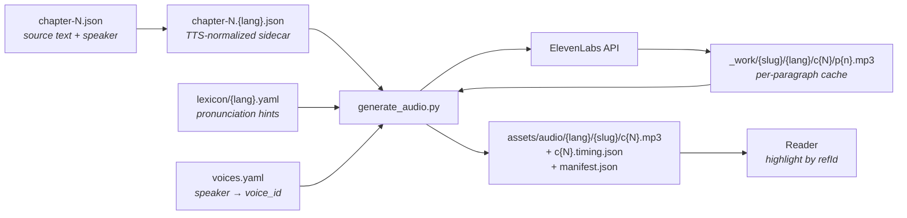
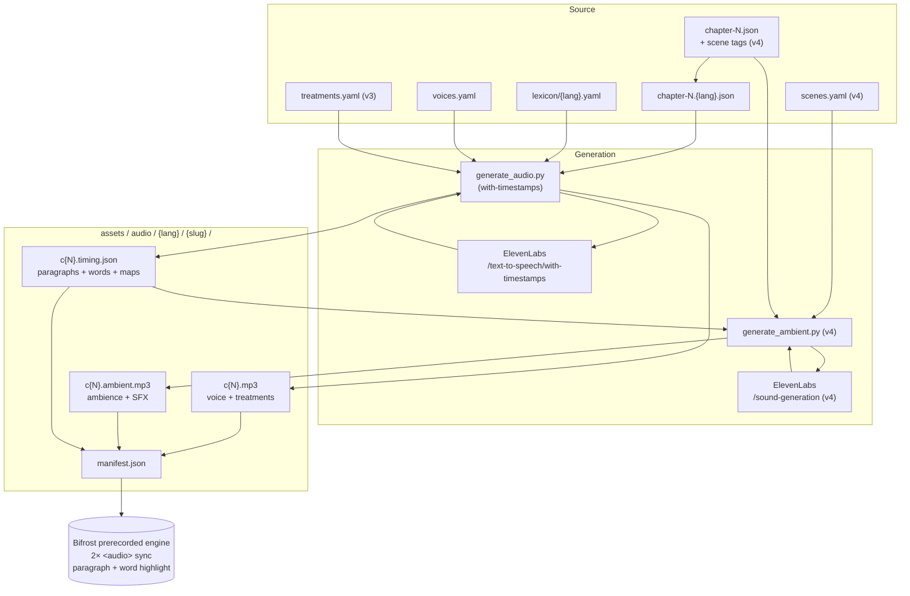

+++
title = "Audiobook Pipeline"
description = "ElevenLabs-driven audiobook generation: from TTS sidecars + lexicon + voice config to per-chapter MP3s on the assets CDN."
template = "page.html"
weight = 45
+++

How library books become audiobooks: the editorial prep, the generation
pipeline, the storage layout, the costs, and the operational loop.

The pipeline turns the per-paragraph TTS-normalized text in
`data-library/{slug}/tts/chapter-N.{lang}.json` into per-chapter MP3
files at `assets.wheelofheaven.world/audio/{lang}/{slug}/c{N}.mp3`,
each paired with a `c{N}.timing.json` sidecar that maps each paragraph
to its `[start, end]` seconds in the audio.

## End-to-end picture



Three repos hold pieces of the pipeline:

| Repo | Role |
|---|---|
| [`data-library`](https://github.com/wheelofheaven/data-library) | Source text + TTS sidecars + pronunciation lexicon + voice config + the generation script |
| [`assets.wheelofheaven.world`](https://github.com/wheelofheaven/assets.wheelofheaven.world) | Final per-chapter MP3s + per-chapter timing sidecars + per-book manifest — served at `https://assets.wheelofheaven.world/audio/…` |
| [`bifrost`](https://github.com/wheelofheaven/bifrost) | Listen button's **prerecorded engine** in `static/js/listen-button.js` — fetches the manifest, streams the MP3, drives paragraph highlight from the timing sidecar |
| [`www.wheelofheaven.world`](https://github.com/wheelofheaven/www.wheelofheaven.world) | Consumes the bifrost bundle via submodule; the service-worker `CACHE_VERSION` in `static/sw.js` must be bumped whenever the bundle changes |

## What's already in place

Before the first ElevenLabs call, the data side is done:

1. **Paragraph splits.** Long paragraphs broken at natural sentence
   boundaries so each piece is a manageable audio chunk. See
   [Paragraph Split Tooling](@/contributing/dev/paragraph-split-tooling.md).
2. **Speaker attribution.** Every paragraph in TBWTT and ETTMTTP has
   a `speaker` field (`Narrator`, `Raël`, or `Yahweh`). This is what
   the generation script reads to pick the right voice. See the
   `Re-attribute 49 paragraphs in ETTMTTP ch2` commit for the
   curation pass. LWTE is out of scope for the audiobook MVP — all
   its paragraphs are labeled `Narrator` pending its own curation.
3. **TTS text normalization.** Each paragraph has a `tts_text` in
   `{slug}/tts/chapter-N.{lang}.json` with citations stripped, quote
   marks removed, footnote noise gone, etc. 98 sidecars total
   covering TBWTT + ETTMTTP + LWTE × 9 languages (LWTE has FR + EN
   only since other languages are empty in source). See
   [Library Book Format](@/reference/library-book-format.md) for the
   chapter JSON schema; the normalization rules are documented inline
   in `data-library/scripts/normalize_tts.py`.
4. **Pronunciation lexicon.** Per-language YAML at
   `data-library/lexicon/{lang}.yaml` with IPA + fallback respelling
   for the ~15-20 names ElevenLabs reliably mispronounces (Raël,
   Elohim, Yahvé/Yahweh, MADECH, Ezéchiel, Périgord, etc.). FR + EN
   filled in; other languages stubbed for later. See
   `data-library/lexicon/_README.md` for the format.

## Voice casting

Before any audio gets generated, voice IDs must be set in
`data-library/audio/voices.yaml`. The user picks them from the
[ElevenLabs voice library](https://elevenlabs.io/app/voice-library).

The vocabulary is small:

| Speaker | Who | Voice characteristics that work |
|---|---|---|
| `Narrator` | Raël as post-hoc author, scene-setting | Natural reading voice; some warmth/expressiveness |
| `Raël` | Raël as in-scene character, asking Yahweh questions | Can share the Narrator voice with different prosody settings, or a slightly more conversational voice |
| `Yahweh` | The Elohim speaker, long instructional monologues | Distinct, weightier voice; consistency across long passages matters |

### Picking voices

1. Browse <https://elevenlabs.io/app/voice-library> and sample voices
   in the target language.
2. For each `(speaker, lang)` pair, save the voice ID (the UUID in
   the URL after the voice name).
3. Open `data-library/audio/voices.yaml` and fill in `voice_id` values:

```yaml
voices:
  en:
    Narrator:
      voice_id: "I1T6PEfqPxl45yKRN4aS"   # Marcel — warm, expressive
    Raël:
      voice_id: "I1T6PEfqPxl45yKRN4aS"   # share Marcel; different prosody via defaults
    Yahweh:
      voice_id: "sB7vwSCyX0tQmU24cW2C"   # Jon — relaxed, deep, weightier
```

### Voice library: "Add to my voices" gotcha

Voices from the ElevenLabs **voice library** (not the premade voices)
must be added to your collection before they're accessible via the API.
A library voice ID in `voices.yaml` will cause `402 Payment Required`
errors at generation time even on paid plans, until you click
**Add to my voices** on the voice's library page. Confirm with:

```sh
curl -s -H "xi-api-key: $ELEVENLABS_API_KEY" \
    https://api.elevenlabs.io/v1/voices | jq '.voices[].voice_id'
```

The voice IDs in `voices.yaml` must appear in that list.

### Cross-language voice reuse

`eleven_multilingual_v2` (the default model) supports the same voice
across 29 languages. For the rollout we deliberately reuse the English
voices (Marcel + Jon) for all 9 i18n languages — same voice characters,
different language output. This keeps the character identity consistent
across translations and skips per-language voice casting entirely.

Override per language only if a specific voice sounds wrong for that
language; in practice the multilingual model handles French, German,
Spanish, Russian, Japanese, Korean, and Chinese (both scripts) without
recasting.

### Voice settings

Defaults are in `voices.yaml` `defaults:`:

| Speaker | stability | similarity_boost | Reasoning |
|---|---|---|---|
| `Narrator` | 0.55 | 0.75 | Natural narration; some variation paragraph to paragraph |
| `Raël` | 0.60 | 0.75 | In-scene dialogue, slightly more grounded |
| `Yahweh` | 0.70 | 0.80 | Consistent gravitas across long monologues |

You can override per-(speaker, lang) by adding `stability:` /
`similarity_boost:` / `style:` under the specific entry.

## The first run — MVP

Always start with **TBWTT chapter 1 EN**. It's the cheapest meaningful
test (~$3) and it surfaces the most issues per dollar.

### Prereqs

```sh
# Python deps (system Python 3.9+ works; pyenv/venv preferred for clean env)
pip install pyyaml requests

# ffmpeg + ffprobe for concatenation and duration measurement
brew install ffmpeg
```

### API key

```sh
export ELEVENLABS_API_KEY="sk_..."
```

Get the key from the ElevenLabs dashboard. Treat as a secret — never
commit, never log. The generation script reads it from the env var.

### Dry run first

Before paying for anything:

```sh
python3 data-library/scripts/generate_audio.py \
    --slug the-book-which-tells-the-truth \
    --lang en \
    --chapter 1 \
    --dry-run
```

This walks every paragraph, sums character counts, reports estimated
cost based on the `--price-per-1k` value (default $0.30 for creator
tier). No voice_id required for dry-runs; no API calls made.

Compare against current ElevenLabs pricing
(<https://elevenlabs.io/pricing>) and confirm before proceeding.

### MVP run

```sh
python3 data-library/scripts/generate_audio.py \
    --slug the-book-which-tells-the-truth \
    --lang en \
    --chapter 1
```

What happens:

1. Loads sidecar, lexicon, voice config.
2. For each paragraph in the sidecar (skipping `skip:true` entries):
   - Wraps lexicon entries in `<phoneme alphabet="ipa" ph="…">` SSML
   - Hashes (text, voice_id, settings, model) into a cache key
   - If a cached MP3 with that key exists at
     `data-library/audio/_work/{slug}/{lang}/c{N}/p{n}.mp3`, reuses it
   - Otherwise: POSTs to `https://api.elevenlabs.io/v1/text-to-speech/{voice_id}`,
     saves the MP3 to the cache, saves meta (`p{n}.meta.json`)
3. After all paragraphs: concatenates via `ffmpeg -f concat -c copy`
   with silence clips between paragraphs (600ms default, 900ms when
   speaker changes), writes the per-chapter MP3 to
   `assets.wheelofheaven.world/audio/{lang}/{slug}/c{N}.mp3`
4. Writes timing sidecar `c{N}.timing.json` mapping each paragraph
   number to its `[start, end]` seconds within the chapter MP3
5. Updates the per-book manifest at
   `audio/{lang}/{slug}/manifest.json` listing all chapters with
   durations and URLs

### Listen + iterate

Open the generated `c1.mp3` and listen. Things to check:

- **Pronunciation of named entities.** If `Raël`, `Elohim`,
  `Yahweh`, etc. come out wrong, add or refine entries in
  `data-library/lexicon/{lang}.yaml`. Re-running re-generates only
  the paragraphs whose text/voice/settings changed.
- **Voice fit per speaker.** If `Yahweh` sounds too breathy or
  `Narrator` too monotone, adjust `stability` / `similarity_boost`
  in `voices.yaml` and re-run.
- **Pause cadence.** If paragraphs run together too tightly, bump
  `pause_ms_between_paragraphs` in `voices.yaml` (currently 600ms).
- **Mid-paragraph emphasis.** If the voice mis-reads a phrase, you
  can update the source `tts_text` in the sidecar (e.g. rephrase a
  long sentence) and re-run; the affected paragraph re-generates.

### Commit the audio

The per-chapter MP3s and timing sidecars land in
`assets.wheelofheaven.world/audio/`. After listening and iterating:

```sh
cd assets.wheelofheaven.world
git add audio/
git commit -m "Add TBWTT ch1 EN audiobook"
git push origin main
```

The Cloudflare Pages deploy on `assets.wheelofheaven.world` will
pick up the new files and serve them at
`https://assets.wheelofheaven.world/audio/en/the-book-which-tells-the-truth/c1.mp3`
with 1-year immutable caching (see `_headers` in that repo).

## Full-corpus rollout

After the MVP sounds right, the rollout target is **TBWTT + ETTMTTP
across all 9 i18n languages** (en, fr, de, es, ru, ja, ko, zh, zh-Hant).
LWTE is intentionally excluded — its translations don't exist in source,
only FR + EN do.

### Step 1 — pick a plan tier

Generation cost is the dominant variable. Dry-run totals (all
2,358,966 chars at $0.30/1k credit price):

| Tier | Monthly cost | Char allowance | Effective $/1M chars | Months to cover corpus |
|---|---|---|---|---|
| Starter | $5 | 30k | $166.67 | unusable for batch |
| Creator | $22 | 100k | $220.00 | 24 months ≈ **$528 total** |
| Pro | $99 | 500k | $198.00 | 5 months ≈ **$495 total** |
| Scale | $330 | 2M | $165.00 | 2 months ≈ **$660 total** |

**Recommendation:** **Scale ($330)** for two months. The corpus fits in
the second month with overhead for re-runs after lexicon tweaks; cancel
after the work is done. Pro is the alternative if you want to pace the
work across 5 months.

A naïve creator-tier dry-run estimate (no plan factored in) reports
**$707.69** at $0.30/1k credit price — that's the published per-credit
rate, not the plan-adjusted cost. The plan-tier table above reflects the
real out-of-pocket cost.

### Step 2 — cast voices

For the pragmatic shortcut, leave `voices.yaml` with Marcel + Jon (the
English MVP voices) and just **copy the English mapping into every
language's stanza**. `eleven_multilingual_v2` will speak French,
German, etc. in those voices. Per-language MVP listening (next step)
will confirm.

### Step 3 — per-language MVP

Before generating the whole book in a new language, generate **just
chapter 1** and listen end-to-end. Cost is ~$1.50/chapter; the goal is
to catch pronunciation regressions before paying for the whole book.

```sh
python3 data-library/scripts/generate_audio.py \
    --slug the-book-which-tells-the-truth --lang fr --chapter 1
```

If anything sounds wrong, refine `data-library/lexicon/fr.yaml` and
re-run — only affected paragraphs re-bill.

### Step 4 — generate the full corpus

```sh
for slug in the-book-which-tells-the-truth extraterrestrials-took-me-to-their-planet; do
  for lang in en fr de es ru ja ko zh zh-Hant; do
    python3 data-library/scripts/generate_audio.py --slug "$slug" --lang "$lang"
  done
done
```

Runs sequentially across all chapters per (slug, lang). The cache
means re-running is cheap — only new or changed paragraphs hit the API.

### Step 5 — publish

```sh
cd assets.wheelofheaven.world
git add audio/
git commit -m "Add TBWTT + ETTMTTP audiobooks across 9 languages"
git push origin main
```

Cloudflare Pages picks up the new files; `_headers` already serves
`/audio/*` with 1-year immutable + `Access-Control-Allow-Origin: *`.

### Step 6 — bump the service-worker cache

The Listen button's prerecorded engine is already wired into bifrost,
but visitors with a registered service worker will hold the prior
bundle until `CACHE_VERSION` increments. After any bifrost change
that touches `listen-button.js`:

```sh
cd www.wheelofheaven.world
# edit static/sw.js — bump CACHE_VERSION (e.g. 'v5' → 'v6')
git add static/sw.js
git commit -m "Bump SW cache for prerecorded engine update"
git push origin main
```

Without this bump, existing visitors will continue to fall back to the
client-side MMS/Piper engine even though the manifest exists.

## Cost reference

### Per-chapter (English MVP measurements)

| Chapter | Chars | API cost (creator-tier credit) |
|---|---|---|
| TBWTT ch1 | ~9.6k | **$2.87** (measured) |
| TBWTT ch2 | ~22.5k | $6.75 |
| TBWTT ch3 | ~53.9k | $16.17 (largest chapter) |

### Whole-book dry runs

| Book | Chars | Credit cost @ $0.30/1k |
|---|---|---|
| TBWTT (EN) | 168k | $50.44 |
| TBWTT (FR) | 174k | $52.31 |
| ETTMTTP (EN) | 194k | $58.33 |
| ETTMTTP (FR) | 203k | $60.90 |

### Full corpus (2 books × 9 languages)

- **2,358,966 characters total**
- **$707.69 at $0.30/1k credit price**
- **~$660 actual** on the Scale plan (2 months × $330)
- **~$495 actual** on the Pro plan (5 months × $99)

See the [full-corpus rollout](#full-corpus-rollout) section above for
the plan-tier strategy.

## Storage layout

After generation lands in `assets.wheelofheaven.world`:

```
audio/
├── en/
│   └── the-book-which-tells-the-truth/
│       ├── manifest.json         # which chapters available
│       ├── c1.mp3                # ~20 min audio
│       ├── c1.timing.json        # paragraph timings
│       ├── c2.mp3
│       ├── c2.timing.json
│       └── …
└── fr/
    └── the-book-which-tells-the-truth/
        └── …
```

URLs follow the layout:

- Chapter MP3: `https://assets.wheelofheaven.world/audio/en/the-book-which-tells-the-truth/c1.mp3`
- Timing sidecar: `https://assets.wheelofheaven.world/audio/en/the-book-which-tells-the-truth/c1.timing.json`
- Per-book manifest: `https://assets.wheelofheaven.world/audio/en/the-book-which-tells-the-truth/manifest.json`

### Timing sidecar format

```json
{
  "book": "the-book-which-tells-the-truth",
  "lang": "en",
  "chapter": 1,
  "duration_seconds": 1245.6,
  "paragraphs": [
    {"n": 1, "speaker": "Narrator", "start": 0.0, "end": 12.34},
    {"n": 2, "speaker": "Narrator", "start": 12.94, "end": 25.6},
    ...
  ]
}
```

The player uses the sidecar to highlight paragraphs as audio plays:
when `audio.currentTime` crosses a paragraph's `start`, highlight that
paragraph; remove the highlight at `end`.

### Per-book manifest format

```json
{
  "book": "the-book-which-tells-the-truth",
  "lang": "en",
  "model": "eleven_multilingual_v2",
  "chapters": [
    {
      "n": 1,
      "audio_url": "audio/en/the-book-which-tells-the-truth/c1.mp3",
      "timing_url": "audio/en/the-book-which-tells-the-truth/c1.timing.json",
      "duration_seconds": 1245.6,
      "paragraph_count": 64
    },
    …
  ]
}
```

The bifrost prerecorded engine checks the manifest on page load: does
pre-recorded audio exist for this book and language? If yes, use it +
the timing sidecar for paragraph highlight. If no, fall back to the
client-side TTS engine in `listen-button.js`. See
[Player integration (live)](#player-integration-live) below for the
full handoff.

## Caching mechanics — what gets regenerated when

The cache key for each paragraph is
`sha256(text + voice_id + settings + model)`. So:

| You edit… | What re-generates |
|---|---|
| `lexicon/{lang}.yaml` (SSML changes for a name) | Every paragraph containing that name |
| `voices.yaml` `voice_id` for a speaker | Every paragraph spoken by that speaker |
| `voices.yaml` voice settings | Every paragraph using those settings |
| `voices.yaml` `model` | Everything |
| A paragraph's `tts_text` in a sidecar | Just that paragraph |
| A paragraph's `speaker` in source JSON | Just that paragraph (different voice → different cache key) |
| `voices.yaml` `pause_ms_*` | No re-render; just re-concatenation on next run |

The chapter MP3 + timing sidecar always get regenerated on each run
(concatenation is fast and deterministic). The expensive part — API
calls — only happens for cache-miss paragraphs.

## Player integration (live)

The Listen button in
[`bifrost/static/js/listen-button.js`](https://github.com/wheelofheaven/bifrost/blob/main/static/js/listen-button.js)
has a **prerecorded engine** that runs ahead of the client-side TTS
engines. Engine priority on the library reader:

1. **Prerecorded** — `<audio>` element streams the chapter MP3 from
   `https://assets.wheelofheaven.world/audio/{lang}/{slug}/c{N}.mp3`;
   paragraph highlight driven by the timing sidecar.
2. **Studio** — MMS-TTS via transformers.js (Piper for Chinese).
3. **System** — `window.speechSynthesis` fallback.

The engine selects automatically. On Listen click:

1. `detectBookContext(unitList)` reads `data-book-slug` from the
   enclosing `.library-book` element and extracts the chapter number
   from the `c{ch}p{n}` unit IDs.
2. `fetchManifest(slug, lang)` (module-scope cached) probes
   `https://assets.wheelofheaven.world/audio/{lang}/{slug}/manifest.json`.
   The language code is derived via `audioLangCode({family, tag})` so
   `zh-Hant` keeps its full tag and other variants fall back to family.
3. If the manifest exists **and** includes the current chapter,
   `createPrerecordedEngine()` fetches the timing sidecar and
   constructs an HTML5 `<audio>` element pointing at the MP3.
4. A `timeupdate` listener crosses `audio.currentTime` against each
   paragraph's `[start, end]` and toggles
   `.library-book__paragraph--reading` on the matching element —
   the same class the studio engine uses.
5. If the probe fails (no manifest, no chapter, network error), the
   engine falls through to studio/system silently.

The CDN base is configurable: `window.WOH_ASSETS_BASE` overrides the
default `https://assets.wheelofheaven.world` for staging/local testing.

### Bundle + cache invalidation

The reader loads `/js/dist/core.bundle.js`, built by
`bifrost/scripts/bundle.js` from the `listen-button.js` source. After
any change to the prerecorded engine:

```sh
cd bifrost
node scripts/bundle.js                                  # rebuilds the bundle
git add static/js/dist/core.bundle.js static/js/listen-button.js
git commit -m "Update prerecorded engine"
git push origin main

cd ../www.wheelofheaven.world
git submodule update --remote themes/bifrost            # bump submodule SHA
# also edit static/sw.js — bump CACHE_VERSION
git add themes/bifrost static/sw.js
git commit -m "Bump bifrost + SW cache for prerecorded engine"
git push origin main
```

The service worker uses stale-while-revalidate for the bundle. Without
the `CACHE_VERSION` bump, existing visitors will hold the stale bundle
for one extra load before picking up the new one.

## Layered roadmap — v1 → v4

The audiobook is delivered in additive layers. Each layer is purely
optional and falls back gracefully if absent: a missing word array
falls back to paragraph highlight, a missing ambient track falls back
to voice-only, and so on. All four layers share the same per-chapter
MP3 + sidecar + manifest model on the CDN.

| Layer | What | Status |
|---|---|---|
| **v1** | Voice-only MP3 + paragraph-level highlight | **shipped** |
| **v2** | Word-level highlight via `with-timestamps` | designed |
| **v3** | Per-speaker audio treatment (EQ + reverb) | designed |
| **v4** | Ambient beds + generated SFX on a second track | designed |

The end-to-end picture once all four layers are built:



## v2 — Word-level highlighting (designed)

The prerecorded engine currently highlights at paragraph granularity.
v2 adds word-by-word highlight using ElevenLabs' built-in
character-level alignment.

### Generation change

Switch the API call from `POST /v1/text-to-speech/{voice_id}` to
`POST /v1/text-to-speech/{voice_id}/with-timestamps`. Response shape:

```json
{
  "audio_base64": "...",
  "alignment": {
    "characters": ["T", "h", "e", " ", "E", "l", "o", "h", "i", "m", "..."],
    "character_start_times_seconds": [0.000, 0.045, 0.082, ...],
    "character_end_times_seconds":   [0.045, 0.082, 0.118, ...]
  },
  "normalized_alignment": { "...": "post-SSML character mapping" }
}
```

Same per-character billing — no extra cost. Audio is bit-identical to
the regular endpoint.

`generate_audio.py` decodes `audio_base64` into the MP3 (same as
today), then walks `characters[]` to build a word array per paragraph:
a word ends at the first whitespace after a non-whitespace run; its
`start` is the first non-space char's `start`, its `end` is the last
non-space char's `end`.

### Sidecar v2 format

```json
{
  "paragraphs": [
    {
      "n": 1,
      "speaker": "Narrator",
      "start": 0.00,
      "end": 12.34,
      "words": [
        {"t": "The",    "s": 0.00, "e": 0.18},
        {"t": "Elohim", "s": 0.20, "e": 0.74},
        {"t": "are",    "s": 0.78, "e": 0.96}
      ]
    }
  ]
}
```

### Display ↔ audio alignment

Critical detail: the displayed paragraph text and the spoken `tts_text`
may differ (citations stripped, footnote markers removed, contractions
expanded for clearer TTS, etc.). Word indices into the two strings
won't always match 1:1.

The generator runs a longest-common-subsequence alignment between the
display-text word stream and the tts_text word stream and emits a
`display_word_map` per paragraph:

```json
{
  "display_word_map": [
    {"d": 0, "a": [0]},
    {"d": 1, "a": [1]},
    {"d": 2, "a": []},
    {"d": 3, "a": [2]},
    {"d": 4, "a": [3, 4]}
  ]
}
```

`d` = display word index, `a` = list of audio word indices that the
display word maps to. Empty `a` means the display word isn't spoken
(e.g. a citation marker). Multiple entries in `a` means one display
word was expanded into multiple spoken words (e.g. "Yahweh's" →
"Yahweh is").

When the map is absent (most paragraphs have no normalization
difference), the player assumes identity mapping (`d == a`).

### Player change

On engine activation, the prerecorded engine walks each
`.library-book__paragraph` once and wraps each word in
`<span class="library-book__word" data-w="N">…</span>`. Wrapping uses
a whitespace split; the original text and inline markup are preserved.

The existing `timeupdate` listener picks the active audio word
(`time ≥ word.s && time < word.e`) within the current paragraph,
resolves the matching display word(s) via `display_word_map`, and
toggles `.library-book__word--reading` on those spans.

Performance: 60 paragraphs × ~50 words = 3,000 spans per chapter. The
active paragraph's word array (~50 entries) is scanned per
`timeupdate` fire (~4 fires/sec) — well within budget.

### Storage impact

Sidecar grows from ~10 KB to ~80–120 KB per chapter (paragraph timings
plus word arrays plus the occasional display map). Negligible on the
CDN; gzips well.

### Rollout

This is additive: the existing player keeps working when `words` is
absent. Sequence:

1. Update `generate_audio.py` to call the `with-timestamps` endpoint
   and emit the v2 sidecar shape.
2. Wipe `_work/` once (cache keys change because the response shape is
   now richer; cleanest to re-run from scratch).
3. Regenerate the corpus. **Same billing**, just new sidecars.
4. Ship the bifrost player update + bump SW `CACHE_VERSION`.

No URL changes; no manifest schema bump.

## v3 — Per-speaker audio treatment (designed)

Subtle audio post-processing per speaker, applied in ffmpeg as a
filter chain. Gives each voice a sonic identity beyond just the voice
ID — Yahweh feels weighty, Raël close, Narrator neutral — without
relying on ElevenLabs voice variation.

### Treatment definitions

`data-library/audio/treatments.yaml`:

```yaml
treatments:
  Narrator:
    ffmpeg_filter: "equalizer=f=200:t=q:w=1:g=-2"
  Raël:
    ffmpeg_filter: "equalizer=f=180:t=q:w=1.5:g=2"
  Yahweh:
    ffmpeg_filter: "aecho=0.8:0.88:60:0.4,equalizer=f=120:t=q:w=1:g=3"
```

Suggested starting filters:

| Speaker | Treatment | Filter |
|---|---|---|
| Narrator | Light low-mid cut, neutral | `equalizer=f=200:t=q:w=1:g=-2` |
| Raël | Close-mic warmth | `equalizer=f=180:t=q:w=1.5:g=2` |
| Yahweh | Hall reverb + low-end weight | `aecho=0.8:0.88:60:0.4,equalizer=f=120:t=q:w=1:g=3` |

### Where the filter applies

The raw paragraph MP3 returned by ElevenLabs stays pristine in the
per-paragraph cache. Treatment is applied at the **concat** step:
ffmpeg loads each cached paragraph, runs the per-speaker filter, then
concatenates with silence clips into `c{N}.mp3`. A single
`-filter_complex` chain branches by paragraph index using `[0:a]`,
`[1:a]`, etc.

### Cache impact

Each speaker's filter string is hashed into the **chapter** cache key
(not the per-paragraph cache). Editing a filter forces a re-concat of
affected chapters — but does not re-call the API. Iteration is fast:
listen, tweak filter, re-run; cycle takes seconds per chapter, zero
API spend.

### Cost impact

Zero — pure ffmpeg post-processing.

## v4 — Ambient beds + generated SFX (designed)

The richest layer: ambient soundscapes under scenes and short SFX at
moments. Architectural choice: ambience plays from a **second
`<audio>` element**, synced to the voice track. This keeps the voice
MP3 as the canonical artifact, makes ambience user-toggleable, and
lets us regenerate ambient layers without re-billing TTS.

### Scene tagging

Each paragraph gains an optional `scene` field in the source chapter
JSON:

```json
{
  "n": 12,
  "speaker": "Yahweh",
  "scene": "council-chamber",
  "i18n": { "en": "…", "fr": "…" }
}
```

Scenes are sparse — a single paragraph sets the scene, which persists
until a different `scene` tag appears. No tag anywhere → no ambient
track is built for that chapter.

### Scene library

`data-library/audio/scenes.yaml` maps scene IDs to their assets:

```yaml
scenes:
  council-chamber:
    ambient_loop: "ambient/council-chamber.flac"
    gain_db: -12
    sfx_at_start:
      - prompt: "soft echoing footsteps on stone, distant low rumble"
        duration_seconds: 3
        gain_db: -6
  eden-garden:
    ambient_loop: "ambient/forest-birds-distant.flac"
    gain_db: -14
    sfx_at_start:
      - prompt: "gentle breeze through leaves, faint birdsong"
        duration_seconds: 2
        gain_db: -8
  spacecraft-interior:
    ambient_loop: "ambient/spacecraft-hum.flac"
    gain_db: -10
```

`ambient_loop` files are hand-sourced (CC0 from freesound.org or
similar) and committed under `data-library/audio/ambient/`. SFX clips
are generated on demand from ElevenLabs:

```
POST /v1/sound-generation
{
  "text": "soft echoing footsteps on stone, distant low rumble",
  "duration_seconds": 3
}
```

Returns an MP3. Results cached by `sha256(prompt + duration)` under
`data-library/audio/_work/_sfx/`. Cost per clip is ~$0.08 on the Pro
tier — corpus-wide SFX bill is in the single-dollar range.

### Generation script

```sh
python3 data-library/scripts/generate_ambient.py \
    --slug the-book-which-tells-the-truth --lang en --chapter 1
```

Algorithm:

1. Load the voice `c{N}.timing.json` to learn paragraph start/end
   times. (Ambient is generated **per language** because timings
   differ — but ambient files and SFX clips are language-shared.)
2. Walk paragraphs, tracking the current scene (latest `scene` tag
   wins; no tag means "no scene right now").
3. For each contiguous scene span, tile the scene's `ambient_loop`
   into a track of exactly that span's duration, at `gain_db`, with
   300 ms crossfades into adjacent spans.
4. For each scene's `sfx_at_start`, mix the SFX clip in at the scene's
   first paragraph onset.
5. Master with `ffmpeg amix` + a loudness normalization pass; output
   stereo MP3.

Output:
`assets.wheelofheaven.world/audio/{lang}/{slug}/c{N}.ambient.mp3` —
same duration as `c{N}.mp3`, sparse where no scene is set.

### Manifest v4 additions

```json
{
  "n": 1,
  "audio_url": "audio/en/the-book-which-tells-the-truth/c1.mp3",
  "ambient_url": "audio/en/the-book-which-tells-the-truth/c1.ambient.mp3",
  "timing_url": "audio/en/the-book-which-tells-the-truth/c1.timing.json",
  "duration_seconds": 687.13,
  "paragraph_count": 64
}
```

`ambient_url` is omitted when there's no ambient track for that
chapter. Player checks for its presence before constructing the second
`<audio>` element.

### Player change

Two `<audio>` elements; voice is authoritative:

```js
const voice   = new Audio(voiceUrl);
const ambient = ambientUrl ? new Audio(ambientUrl) : null;

voice.addEventListener('play',   () => { if (ambient) { ambient.currentTime = voice.currentTime; ambient.play(); } });
voice.addEventListener('pause',  () => { ambient?.pause(); });
voice.addEventListener('seeked', () => { if (ambient) ambient.currentTime = voice.currentTime; });

// Drift correction every 5s while playing
setInterval(() => {
  if (ambient && !voice.paused && Math.abs(ambient.currentTime - voice.currentTime) > 0.15) {
    ambient.currentTime = voice.currentTime;
  }
}, 5000);
```

A toggle in the Listen-button menu — **Immersive mode** — controls
whether `ambient.play()` ever fires. Off by default; the canonical
experience is voice-first.

### Storage impact

Per chapter: ~11 MB voice + ~9 MB ambient ≈ 2× storage. Full corpus
(2 books × 9 languages × ~12 chapters): ~4 GB voice + ~4 GB ambient =
~8 GB on the CDN. Cloudflare Pages serves all of it with 1-year
immutable caching.

### Cost impact

| Item | Cost |
|---|---|
| Ambient loops (CC0 sourcing) | $0 |
| SFX generation (~50 unique prompts, one-time) | ~$4 |
| Voice TTS | unchanged |

### Why a second `<audio>` and not a pre-mixed master

Three reasons:

1. **Toggleable.** Users who want focused listening can keep ambience
   off; users who want immersion turn it on. A pre-mixed master forces
   one experience.
2. **Independent regeneration.** Tweaking an ambient loop or adding a
   scene re-generates `c{N}.ambient.mp3` only — voice MP3 untouched,
   no TTS bill.
3. **CDN caching.** Voice MP3s are essentially permanent once a
   chapter ships. Ambient tracks may iterate. Separate URLs mean
   ambient cache-busts on its own.

## Troubleshooting

| Symptom | Fix |
|---|---|
| `ModuleNotFoundError: requests` | `pip install requests pyyaml` |
| `Symbol not found: _XML_SetAllocTrackerActivationThreshold` | Python 3.13/3.14 libexpat mismatch on macOS. Use system Python (`/usr/bin/python3`) or `pyenv` with an older version. |
| `ELEVENLABS_API_KEY env var not set` | `export ELEVENLABS_API_KEY="sk_..."` from the dashboard. Or use `--dry-run` to skip API calls. |
| `No voice_id set for ('Speaker', 'lang')` | Pick a voice from the library and set the `voice_id` in `data-library/audio/voices.yaml`. Dry-run works without this. |
| `ElevenLabs API 402 Payment Required` | Two causes: (a) you're on the free tier — upgrade to Starter or higher; (b) the voice is a library voice that isn't in **your** collection yet — open it at `https://elevenlabs.io/app/voice-library?voiceId=<id>` and click **Add to my voices**. Confirm with `curl -H "xi-api-key: $ELEVENLABS_API_KEY" https://api.elevenlabs.io/v1/voices`. |
| `ElevenLabs API 429` | Rate limited. The script auto-retries with exponential backoff. If repeated, throttle by running smaller batches (one chapter at a time). |
| `ffmpeg: command not found` | `brew install ffmpeg`. Required for paragraph concatenation and duration measurement. |
| Voice sounds wrong on a specific name | Add or refine the entry in `data-library/lexicon/{lang}.yaml`. Re-run — only affected paragraphs re-generate. |
| Audio cuts off mid-paragraph | Paragraph too long for the API. Split it via the paragraph split tooling (see [Paragraph Split Tooling](@/contributing/dev/paragraph-split-tooling.md)). |
| Per-paragraph cache grew huge | `_work/` is gitignored; safe to `rm -rf data-library/audio/_work/` to reclaim space. Next run will re-fetch what it needs. |
| Listen button says "Loading studio voice…" when a prerecorded chapter exists | Stale service worker is holding the old `core.bundle.js`. Bump `CACHE_VERSION` in `www.wheelofheaven.world/static/sw.js` and redeploy. For local dev, unregister the SW in DevTools → Application → Service Workers. |
| Prerecorded engine never activates even with manifest present | Check the browser console for the manifest fetch URL — must match `https://assets.wheelofheaven.world/audio/{lang}/{slug}/manifest.json`. Verify `data-book-slug` is set on the enclosing `.library-book` element and that paragraph IDs follow the `c{ch}p{n}` pattern. |

## Related

- [Paragraph Split Tooling](@/contributing/dev/paragraph-split-tooling.md)
  — the 35-paragraph editorial pass that made paragraphs the right
  size for audio
- [Library Book Format](@/reference/library-book-format.md) — the
  paragraph-level JSON schema this all reads from
- [data-library Source of Truth](@/architecture/data-library-source-of-truth.md)
  — why audio output lives outside data-library and how the cross-
  language paragraph IDs feed the timing sidecars
- [Editorial Passes](@/contributing/content/editorial-passes.md) —
  the broader editorial campaigns this work sits inside
