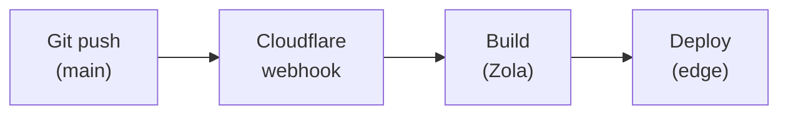

+++
title = "CI & Deploy"
description = "Cloudflare Pages projects, custom domains, headers, redirects, and the build webhook chain."
weight = 40
+++

How a git push becomes a deployed site. The "pipeline" view of the same
chain — content → build → CDN — lives in
[Pipelines](@/contributing/dev/pipelines.md); this page is the
Cloudflare-side view: projects, domains, headers.

## Sites configuration

| Site | Project name | Custom domain | Build command |
|------|--------------|---------------|---------------|
| www | wheelofheaven | www.wheelofheaven.world | See below |
| api | api-wheelofheaven | api.wheelofheaven.world | See below |
| assets | assets-wheelofheaven | assets.wheelofheaven.world | N/A (static) |
| docs | docs-wheelofheaven-world | docs.wheelofheaven.world | See below |

## Build configuration

### www.wheelofheaven.world

Since Cloudflare doesn't ship Zola pre-installed, we download it at
build time. We also need to rebuild the Bifrost JS bundle here —
without it, CF Pages serves a stale `dist/core.bundle.js` from
whatever was last committed to the bifrost submodule (see
[Bundle gotcha](#bundle-rebuild-on-cf-pages) below).

**Build command:**

```sh
curl -sL https://github.com/getzola/zola/releases/download/v0.22.0/zola-v0.22.0-x86_64-unknown-linux-gnu.tar.gz -o zola.tar.gz && tar xzf zola.tar.gz && cd themes/bifrost && npm ci && npm run bundle && cd ../.. && ./zola build
```

**Build output directory:** `public`

**Environment variables:** none required (Zola reads `config.toml`).

#### Bundle rebuild on CF Pages

There are two parallel deploy paths for `www`:

| Path | Origin | Bundle step |
|---|---|---|
| GitHub Actions (`gh-pages` branch) | Repo, with submodules | Runs `npm run bundle` before `zola build` |
| Cloudflare Pages (production fronting `www.wheelofheaven.world`) | Repo, with submodules | Historically: **no bundle step** |

The "no bundle step" history caused a real production bug on
2026-06-07: the audiobook v2 word-highlight code shipped to
`bifrost/static/js/listen-button.js`, GitHub Actions rebuilt the
bundle and pushed it to `gh-pages` correctly — but Cloudflare Pages
(which actually serves `www.wheelofheaven.world`) ran only
`zola build`, served the previous `dist/core.bundle.js` from the
bifrost submodule, and visitors got no word highlight. The fix:
either commit the rebuilt `dist/core.bundle.js` to bifrost in every
bundle-source change, **or** update the CF Pages build command above
to include the bundle step. The build command shown above is the
"fixed" form — once configured, CF Pages rebuilds on every push.

### api.wheelofheaven.world

```sh
python3 scripts/prebuild.py && curl -sL https://github.com/getzola/zola/releases/download/v0.22.0/zola-v0.22.0-x86_64-unknown-linux-gnu.tar.gz -o zola.tar.gz && tar xzf zola.tar.gz && ./zola build && bash scripts/postbuild.sh
```

**Build output directory:** `public`

The prebuild step extracts wiki / timeline / articles / news / tradition hubs from `data/content`, mirrors the bibliography from `data/bibliography`, and writes one Zola content page per entry under `content/v1/` plus a per-section index data file under `data/extracted/`. The postbuild step mirrors each generated `index.html` as `index.json`, writes `_headers` (Content-Type, CORS, cache TTLs, `X-License`, `X-Citable`, `X-API-Version`), and writes `_redirects` so directory URLs are canonical. Both files are committed to the repo and required for the API to serve correctly.

### docs.wheelofheaven.world

Same pattern, pinned to a more recent Zola:

```sh
curl -sL https://github.com/getzola/zola/releases/download/v0.22.1/zola-v0.22.1-x86_64-unknown-linux-gnu.tar.gz -o zola.tar.gz && tar xzf zola.tar.gz && ./zola build
```

**Build output directory:** `public`

### assets.wheelofheaven.world

**Build command:** none (static files only).
**Build output directory:** `/` (root).

## Deployment workflow



1. Push to `main` triggers a CF Pages webhook
2. Cloudflare clones the repository (with submodules)
3. Build command executes
4. Output deployed globally to the edge network
5. **Manual cache purge may be required** (see next section)

## Manual cache purge after deploy

CF Pages auto-purges its edge cache on deploy **only for HTML pages**
(`networkFirst`-style — fetched fresh on next request). Static assets
served with long `max-age` headers from `_headers` (CSS, JS, audio,
JSON sidecars) are **not** auto-purged. If the asset URL is unchanged
but the bytes are new, edge keeps serving the old bytes until TTL
expires (7 days for `/js/*`, 1 year for `/audio/*` with `immutable`).

The 2026-06-07 audiobook v2 + v2.5 rollouts both hit this — even
after deploys succeeded, visitors got old JS and old timing JSON
until a manual CF dashboard purge. Skip the checklist below at your
peril.

### When to purge

| Changed file | URL stable? | Auto-busted? | Manual purge needed? |
|---|---|---|---|
| Any HTML page | Yes | Yes (CF Pages network-first) | No |
| `main.css` | No (`?v=<sha>` from `inline-critical`) | Yes (URL changes) | No |
| `core.bundle.js` | Yes (URL `?v=N` is hand-bumped in `scripts.html`) | Partial (bumping `?v=N` busts CF Pages' per-key cache, but edge tier-2 can still hold stale; bumping doesn't reach existing cached visitors either) | **Yes** — purge the bundle URL plus prior `?v=N` variants |
| `sw.js` | Yes | Yes (CF Pages honors the `no-cache` header from `_headers`) | No |
| `audio/**/c{N}.mp3` (new bytes, same path) | Yes | No (1-year immutable cache) | **Yes** if URL is reused (re-render). New rollouts at new URLs are fine. |
| `audio/**/c{N}.opus` (new file) | New URL | Yes (URL never cached before) | No |
| `audio/**/c{N}.timing.json` (new shape) | Yes | No (also 1-year immutable in `_headers`) | **Yes** |
| `audio/**/manifest.json` | Yes | No | **Yes** |

### Post-deploy checklist

After any push that ships new bytes to a previously-existing URL, in
the Cloudflare dashboard:

**For `www.wheelofheaven.world` zone** (any change touching bifrost
bundled JS):

- Caching → Configuration → Purge Cache → Custom Purge → enter:
  - `https://www.wheelofheaven.world/js/dist/core.bundle.js`
  - `https://www.wheelofheaven.world/js/dist/core.bundle.js?v=N` (each prior version still in active circulation)

Or just **Purge Everything** for the www zone — blunt but fast, and
the rest is HTML which auto-refreshes anyway.

**For `assets.wheelofheaven.world` zone** (any change to audio or
sidecars at a stable URL):

- Caching → Configuration → Purge Cache → Custom Purge → enter:
  - The `manifest.json` for the affected book/language
  - Each `c{N}.timing.json` whose bytes changed
  - Each `c{N}.mp3` whose bytes changed (rare — re-rendering only)

Or **Purge Everything** for the assets zone.

After the purges, verify with a fresh-bust curl that the new bytes
are live:

```sh
curl -sI "https://www.wheelofheaven.world/js/dist/core.bundle.js?bust=$(uuidgen)" \
  | grep content-length
curl -s "https://assets.wheelofheaven.world/audio/en/the-book-which-tells-the-truth/c1.timing.json?bust=$(uuidgen)" \
  | python3 -c "import json,sys;t=json.load(sys.stdin);print('p1 has words:', 'words' in t['paragraphs'][0])"
```

If content-length still matches the previous build, the purge didn't
land — try again, or verify you purged the right zone.

### Why this isn't automated yet

The Cloudflare API supports purge-by-URL via:

```sh
curl -X POST "https://api.cloudflare.com/client/v4/zones/{ZONE_ID}/purge_cache" \
  -H "Authorization: Bearer $CF_API_TOKEN" \
  -H "Content-Type: application/json" \
  --data '{"files":["https://www.wheelofheaven.world/js/dist/core.bundle.js"]}'
```

The right home for this is a GitHub Actions step that fires after a
successful `peaceiris/actions-gh-pages` step (or after the CF Pages
deploy webhook reports success). Two prerequisites before adding it:

1. Mint a scoped CF API token (zone-level cache-purge only) and add
   it to repo secrets as `CF_CACHE_PURGE_TOKEN`.
2. Discover and store the zone IDs for `www.wheelofheaven.world` and
   `assets.wheelofheaven.world` as workflow env vars or secrets.

Until that lands, every deploy that ships new-bytes-to-stable-URL
needs the manual purge above.

## Submodule support

Cloudflare Pages auto-initializes Git submodules. `.gitmodules` must use
HTTPS URLs for public repos (CF Pages authenticates via the GitHub app's
HTTPS credentials):

```ini
[submodule "themes/bifrost"]
    path = themes/bifrost
    url = https://github.com/wheelofheaven/bifrost.git
```

For private repos, use deploy keys or HTTPS with a token.

## Custom domains

### DNS configuration

For apex (`wheelofheaven.world`):

```
Type:    CNAME
Name:    @
Target:  wheelofheaven.pages.dev
Proxied: yes
```

For subdomain (`www.wheelofheaven.world`):

```
Type:    CNAME
Name:    www
Target:  wheelofheaven.pages.dev
Proxied: yes
```

### SSL/TLS

- Automatic certificate provisioning
- Full (strict) SSL mode
- HTTPS enforced

## Headers configuration

Custom headers via a `_headers` file in the output:

```
# static/_headers (api example)
/*
  Access-Control-Allow-Origin: *
  Access-Control-Allow-Methods: GET, HEAD, OPTIONS
  Content-Type: application/json; charset=utf-8

/v1/*
  Cache-Control: public, max-age=3600
```

## Redirects

Custom redirects via a `_redirects` file:

```
/old-path  /new-path  301
/legacy/*  /wiki/:splat  301
```

## Build caching

Cloudflare caches:

- Node modules (if `package.json` present)
- Build dependencies

The Zola binary download is quick (~5 seconds), so it's not normally a
bottleneck.

## Monitoring

### Build logs

Cloudflare dashboard → Pages project → Deployments → click a deployment
for the full log.

### Analytics

Web Analytics is enabled per project — Core Web Vitals tracking, no
client-side JavaScript required.

## Troubleshooting

### Build failures

#### "Command not found: zola"

Use the curl-download method in the build command.

#### "Submodule not found"

- Ensure submodule URLs are HTTPS
- Check `.gitmodules` is committed

#### "Out of memory"

Zola builds are lightweight; rarely an issue. Contact Cloudflare support
if persistent.

#### "Pages only supports files up to 25 MiB in size"

Cloudflare Pages rejects any individual file over **25 MiB** during
the validate-assets step. The whole deploy fails — none of the
push's files ship, regardless of how many were under the cap.
Symptom: every push to a repo with one oversized file silently
fails CF Pages while CDN keeps serving the last successful build,
and `curl` shows stale content even after manual cache purges. The
2026-06-07 audiobook v2/v2.5/v3/v4 rollouts hit this — `c3.mp3` at
51 MiB blocked the assets repo for hours before the dashboard build
log surfaced the cap error.

Verify the cap locally before pushing audio (or any large binaries):

```sh
find audio -type f -size +25M -exec ls -lh {} \;
```

Fixes when a file exceeds the cap:

| Asset class | Fix |
|---|---|
| Audio MP3 fallback for an Opus-shipping chapter | Drop the MP3, keep Opus only. Modern browsers all support Opus; ~2% legacy-browser visitors lose audio for that chapter. The bifrost manifest writer (`generate_audio.py update_book_manifest`) drops MP3 from `formats[]` and falls `audio_url` back to Opus when the .mp3 file is absent. |
| Audio MP3 that needs to stay (legacy fallback required) | Re-encode at lower bitrate. 80 kbps mono fits ~26 min, 56 kbps mono fits ~37 min, both with audible quality loss on voice. |
| Image / data | Split into chunks, compress harder, or move to a non-Pages CDN (R2, separate origin). |

There's no plan-level setting to raise the 25 MiB cap on CF Pages
— the limit is platform-wide. See
[`audiobook-pipeline.md`](@/contributing/dev/audiobook-pipeline.md#bundle-cache-invalidation)
for the audio-specific workflow.

#### "Pages only supports up to 20,000 files in a deployment"

Cloudflare Pages caps every deployment at 20,000 files, across all
plans (Free, Pro, Business). The Zola build succeeds in the log but
the deploy step rejects the artefact and the previous successful
build keeps serving — new URLs from the failed deploy 404. Verify
locally before pushing big page-count changes:

```sh
mise run build && find public -type f | wc -l
```

For the full incident postmortem and the working patterns (drop
redundant postbuild file mirrors, make per-language mirrors coverage-
honest), see
[Hosting and Caching → CF Pages 20,000-file deployment cap](@/architecture/hosting-and-caching.md).

### Cache issues

#### Stale content after deploy

- Cloudflare purges cache on deploy automatically for **same-URL HTML
  pages** (network-first via Cloudflare Pages' default behaviour).
- Browser cache may persist — hard-refresh.
- Check `Cache-Control` headers.

#### Stale `core.bundle.js` after a deploy that touched `bifrost`

The www site is two CDN layers deep — **gh-pages branch →
GitHub Pages (Fastly, ~10-min asset cache) → Cloudflare (7-day
edge cache from `static/_headers`) → user**. Both layers cache
JS bundles, both layers key on URL string (not content hash),
and both layers ignore the gh-pages branch update until their
own TTL expires.

The bundle is loaded via
`bifrost/templates/partials/scripts.html`:

```tera
<script src="{{ get_url(path='js/dist/core.bundle.js') | safe }}?v=N" defer></script>
```

When bundled JS source changes (`listen-button.js`,
`reader-fab.js`, etc.), bump the `?v=N` querystring in
`scripts.html` — CF Pages caches each `?v=N` as a distinct key,
so the bump forces a MISS on the new URL. **But** if Fastly is
still serving the previous bundle when CF MISSes (i.e. the bump
went out within ~10 min of the original deploy), CF will cache
the stale bytes under the new URL for 7 more days. So bump
`?v=N` either with the deploy (and then again ~15 min later if
verification fails) or in a separate follow-up commit.

Verify the deploy is actually live with content-comparison, not
just a deploy-succeeded log line:

```sh
# what gh-pages shipped:
git show origin/gh-pages:js/dist/core.bundle.js | wc -c

# what CF edge is serving (forces MISS to bypass any existing cache):
curl -sI "https://www.wheelofheaven.world/js/dist/core.bundle.js?bust=$(uuidgen)" | grep -i content-length
```

If these don't match, Fastly hasn't refreshed. Wait, then bump
`?v=N` again so CF caches the fresh response. For an emergency
override (critical fix), purge via the Cloudflare dashboard or
API instead. Full deploy-gotcha table for the audiobook stack:
[Audiobook Pipeline → Bundle + cache invalidation](@/contributing/dev/audiobook-pipeline.md#bundle-cache-invalidation).

#### Stale CDN asset for visitors with a service worker

The `www` service worker uses **`cacheFirst` (no revalidation)** for
any cross-origin request to `assets.wheelofheaven.world` — images,
audio MP3s, timing JSON, manifests. Once a visitor has the asset in
their SW cache, they keep it forever until cache namespaces change.

The cache namespace embeds `CACHE_VERSION` from `static/sw.js`
(`woh-images-${CACHE_VERSION}` etc.). Old namespaces get deleted on
SW activation. So when CDN content changes (new audio takes, updated
manifest shape, etc.), **bump `CACHE_VERSION`** in `www/static/sw.js`
and push — visitors pick up v(N+1) on their next page load and the
v(N) cache is dropped.

Symptom when the bump is missed: a visitor's normal browser keeps
serving the old audio / old timing / old manifest forever, while
Incognito works fine.

## Comparison: GitHub Pages vs Cloudflare Pages

| Feature | GitHub Pages | Cloudflare Pages |
|---------|--------------|------------------|
| Custom build | Jekyll only | Any static generator |
| Edge network | Limited | Global |
| Custom headers | No | Yes |
| Redirects | Limited | Yes |
| Analytics | No | Yes |
| Preview deploys | No | Yes |
| Submodules | Yes | Yes |
