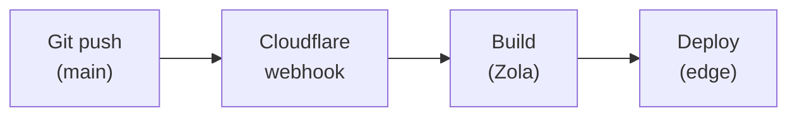

+++
title = "CI & Deploy"
description = "Cloudflare Pages projects, custom domains, headers, redirects, and the build webhook chain."
weight = 40
+++

How a git push becomes a deployed site. The "pipeline" view of the same
chain — content → build → CDN — lives in
[Pipelines](@/contributing/dev/pipelines.md); this page is the
Cloudflare-side view: projects, domains, headers.

## Sites configuration

| Site | Project name | Custom domain | Build command |
|------|--------------|---------------|---------------|
| www | wheelofheaven | www.wheelofheaven.world | See below |
| api | api-wheelofheaven | api.wheelofheaven.world | See below |
| assets | assets-wheelofheaven | assets.wheelofheaven.world | N/A (static) |
| docs | docs-wheelofheaven-world | docs.wheelofheaven.world | See below |

## Build configuration

### www.wheelofheaven.world

Since Cloudflare doesn't ship Zola pre-installed, we download it at
build time:

**Build command:**

```sh
curl -sL https://github.com/getzola/zola/releases/download/v0.22.0/zola-v0.22.0-x86_64-unknown-linux-gnu.tar.gz -o zola.tar.gz && tar xzf zola.tar.gz && ./zola build
```

**Build output directory:** `public`

**Environment variables:** none required (Zola reads `config.toml`).

### api.wheelofheaven.world

```sh
curl -sL <zola-url> -o zola.tar.gz && tar xzf zola.tar.gz && python3 scripts/prebuild.py && ./zola build
```

**Build output directory:** `public`

### docs.wheelofheaven.world

Same pattern, pinned to a more recent Zola:

```sh
curl -sL https://github.com/getzola/zola/releases/download/v0.22.1/zola-v0.22.1-x86_64-unknown-linux-gnu.tar.gz -o zola.tar.gz && tar xzf zola.tar.gz && ./zola build
```

**Build output directory:** `public`

### assets.wheelofheaven.world

**Build command:** none (static files only).
**Build output directory:** `/` (root).

## Deployment workflow



1. Push to `main` triggers a CF Pages webhook
2. Cloudflare clones the repository (with submodules)
3. Build command executes
4. Output deployed globally to the edge network

## Submodule support

Cloudflare Pages auto-initializes Git submodules. `.gitmodules` must use
HTTPS URLs for public repos (CF Pages authenticates via the GitHub app's
HTTPS credentials):

```ini
[submodule "themes/bifrost"]
    path = themes/bifrost
    url = https://github.com/wheelofheaven/bifrost.git
```

For private repos, use deploy keys or HTTPS with a token.

## Custom domains

### DNS configuration

For apex (`wheelofheaven.world`):

```
Type:    CNAME
Name:    @
Target:  wheelofheaven.pages.dev
Proxied: yes
```

For subdomain (`www.wheelofheaven.world`):

```
Type:    CNAME
Name:    www
Target:  wheelofheaven.pages.dev
Proxied: yes
```

### SSL/TLS

- Automatic certificate provisioning
- Full (strict) SSL mode
- HTTPS enforced

## Headers configuration

Custom headers via a `_headers` file in the output:

```
# static/_headers (api example)
/*
  Access-Control-Allow-Origin: *
  Access-Control-Allow-Methods: GET, HEAD, OPTIONS
  Content-Type: application/json; charset=utf-8

/v1/*
  Cache-Control: public, max-age=3600
```

## Redirects

Custom redirects via a `_redirects` file:

```
/old-path  /new-path  301
/legacy/*  /wiki/:splat  301
```

## Build caching

Cloudflare caches:

- Node modules (if `package.json` present)
- Build dependencies

The Zola binary download is quick (~5 seconds), so it's not normally a
bottleneck.

## Monitoring

### Build logs

Cloudflare dashboard → Pages project → Deployments → click a deployment
for the full log.

### Analytics

Web Analytics is enabled per project — Core Web Vitals tracking, no
client-side JavaScript required.

## Troubleshooting

### Build failures

#### "Command not found: zola"

Use the curl-download method in the build command.

#### "Submodule not found"

- Ensure submodule URLs are HTTPS
- Check `.gitmodules` is committed

#### "Out of memory"

Zola builds are lightweight; rarely an issue. Contact Cloudflare support
if persistent.

### Cache issues

#### Stale content after deploy

- Cloudflare purges cache on deploy automatically
- Browser cache may persist — hard-refresh
- Check `Cache-Control` headers

## Comparison: GitHub Pages vs Cloudflare Pages

| Feature | GitHub Pages | Cloudflare Pages |
|---------|--------------|------------------|
| Custom build | Jekyll only | Any static generator |
| Edge network | Limited | Global |
| Custom headers | No | Yes |
| Redirects | Limited | Yes |
| Analytics | No | Yes |
| Preview deploys | No | Yes |
| Submodules | Yes | Yes |
