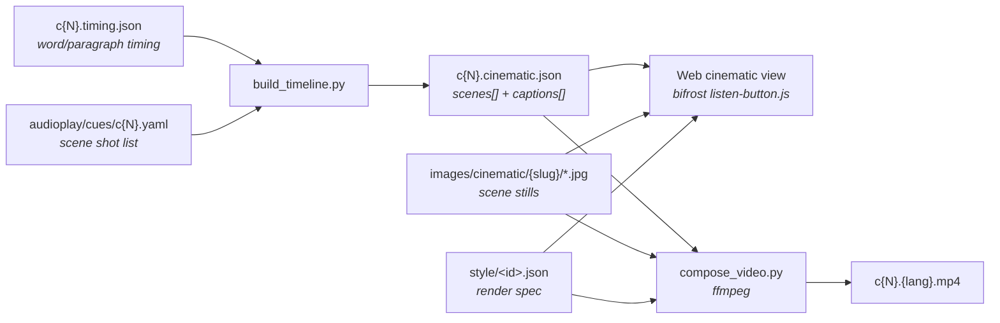

+++
title = "Cinematic Audiobook"
description = "The cinematic view + YouTube video export: one timeline model, two renderers (web + ffmpeg), built on top of the audio-play pipeline."
template = "page.html"
weight = 47
+++

The cinematic audiobook turns a prerecorded audio play into a film-like
experience: pre-rendered scene images play as a slideshow behind the current
sentence, rendered as a caption. It exists in **two renderers that share one
timeline model**, so they look the same:

- a **web cinematic view** — a fullscreen mode in the bifrost player, and
- an **offline ffmpeg compositor** — a deterministic, YouTube-ready MP4 per
  chapter per language.

It sits on top of the [Audio Play Pipeline](@/contributing/dev/audio-play-pipeline.md)
(which produces the audio + word timing) and the
[Audio Play Cue Sheets](@/contributing/dev/audio-play-cue-sheets.md) (which mark
which scene plays when). It adds **no new playback system** — the web view is a
second consumer of the prerecorded engine's existing clock.

## Architecture



The pipeline lives in `data-cinematics/audiobook/`. The key idea: **derive one
data model, render it two ways.** The render spec is the single source of truth
for typography, safe-area, fades, and Ken-Burns motion, so the video matches
the web view without screen-capture.

## The timeline model — `c{N}.cinematic.json`

`build_timeline.py` derives a per-chapter JSON that both renderers consume. It
is written next to the audio at
`assets.wheelofheaven.world/audio/{lang}/{slug}/c{N}.cinematic.json` and
fetched client-side like `timing.json`.

```jsonc
{
  "book": "the-book-which-tells-the-truth",
  "lang": "en", "chapter": 1, "duration_seconds": 780.737,
  "scenes": [
    { "scene": "elohim-vessel", "image": "elohim-vessel",
      "start": 179.04, "end": 270.29 }
  ],
  "captions": [
    { "text": "The Book Which Tells the Truth, by Raël.",
      "start": 1.0, "end": 3.39,
      "speaker": "AudioplayNarrator", "kind": "intro", "paragraph": 0,
      "words": [ { "w": "The", "start": 1.0, "end": 1.15 } ] }
  ]
}
```

- **`scenes[]`** — a continuous, gap-filled, non-overlapping track over the
  whole chapter. Cue paragraph numbers (which equal `timing.json` paragraph
  `n`) are converted to times; a scene runs until the next cue. Segments with
  no cue become `scene: "default"`, `image: null`. Adjacent identical scenes
  merge.
- **`captions[]`** — sentences split from the word stream (so each caption's
  `start`/`end` fall out of its first/last word). `words[]` is retained so
  word-level karaoke highlight can be added later without a rebuild.

## Phase 0 — building the timeline

`build_timeline.py` needs no API and no images. It is fast and idempotent.

```sh
cd data-cinematics/audiobook
mise run timeline                 # default book, EN, all chapters
python3 build_timeline.py --book <slug> --lang en --chapters 1
python3 build_timeline.py --book <slug> --all-langs
```

## Scene art

Scene stills are **language-neutral** (no baked-in text — captions are an
overlay), so one image per scene is reused across all nine languages. The
image-generation handoff is a per-book manifest:

```
data-library/{slug}/audioplay/scenes/scenes.yaml   # style bible + per-scene prompts
data-library/{slug}/audioplay/scenes/<scene>.jpg   # source-of-truth stills
  → assets.wheelofheaven.world/images/cinematic/{slug}/<scene>.jpg
```

`scenes.yaml` carries a per-book **style bible** (a shared prompt prefix/suffix
so the slideshow reads as one film) and one entry per `scene` id used in the
cue sheets. Images are generated externally (OpenAI image generation) and
synced to the CDN. Both renderers degrade gracefully when a still is missing:
a named scene falls back to the book-wide `default.jpg`, then to a gradient —
so the timeline can go live before the art is finished.

## The render spec — `style/<id>.json`

A single token set both renderers read (the web view mirrors the values in
SCSS). Blocks:

| Block | Controls |
|---|---|
| `output` | 1920×1080, H.264, CRF, `fps` (**60** — a slow zoom judders at 30) |
| `scene` | crossfade, Ken-Burns zoom, and `supersample` (default **4** — see below) |
| `caption` | typography, safe-area, speaker label, `offset_sec` nudge |
| `intro` | brand-card seconds, title-card seconds, backdrop, `jingle` |
| `outro` | seconds, backdrop, author, `credits[]` (roles + `{placeholders}`) |
| `endcard` | seconds, backdrop — the "up next" teaser |
| `thumbnail` | per-chapter YouTube thumbnail backdrop |
| `score` | the musical bed (file, gain, intro_gain, fades) |
| `watermark` | logomark + wordmark lockup size/padding |
| `overlay` | vignette + bottom scrim |

The **intro/outro/endcard/thumbnail/score blocks are export-only** — they shape
the MP4, not the web view (which is a live in-page mode). All of them degrade
gracefully: a missing block is simply skipped.

## Phase 2 — the web cinematic view

A `createCinematicView()` controller inside
`themes/bifrost/static/js/listen-button.js` (same module as the player), styled
by `sass/components/_cinematic.scss`. It is a pure consumer of the prerecorded
engine's existing callbacks:

- `onChapterChange(n)` → fetch that chapter's `cinematic.json`
- `onProgress(ratio, seconds, total)` → drive the scene slideshow, the current
  caption, and the seek bar off the same clock
- `onStart/onPause/onResume/onEnd` → reflect play state

Behaviour: two `.cinematic__bg` layers cross-fade with CSS Ken-Burns; a
caption layer shows the current sentence (speaker label on a **speaker
change**, never the intro); a persistent top-left brand watermark; an
auto-hiding play bar (revealed on pointer move / touch); **Space** toggles,
**Esc** exits. The toggle appears in the player bar only when a prerecorded
audio play exists (`body.woh-audio-available`).

## Phase 3 — the ffmpeg compositor

`compose_video.py` renders the same timeline to an MP4:

```sh
cd data-cinematics/audiobook
mise run setup            # one-time: Pillow venv
mise run compose-preview  # 30s smoke test of chapter 1
mise run compose          # all EN chapters → ./out/
python3 compose_video.py --book <slug> --lang en --chapters 1 --preview 25
```

### The video shape (export only)

An exported chapter is more than the slideshow — it's a self-contained,
upload-ready film:

```
brand card (logomark + space jingle)
  → title card (book + "CHAPTER N OF M · title", over the hero)
    → meta-narration (the intro narrator, over the hero key art)
      → the chapter (scene slideshow, 60fps Ken-Burns)
        → outro credits (subtitle, author, site, subscribe CTA, AI/CC0)
          → end card ("▶ NEXT · CHAPTER N+1 · title", over the *next*
            chapter's thumbnail — skipped on the final chapter)
```

The intro cards are prepended and the audio is delayed behind them (via
`adelay`), so narration starts exactly with the chapter. The outro + end card
are appended into the same `xfade` chain; the score bed carries across the whole
thing and fades out at the very end. Titles resolve from
`data-library/{slug}/_meta.json` + the audio manifest, and `CHAPTER N OF M` is
localized per language.

### Per-chapter pipeline

1. Each scene becomes a Ken-Burns `zoompan` clip, computed at **`supersample`×**
   the output size (default 4×) then scaled down — so the slow zoom moves in
   sub-pixel steps and glides instead of juddering. Very short scene slivers are
   coalesced in `build_timeline` so nothing flashes.
2. An `xfade` chain (intro cards → scenes → outro → end card) keeps the video
   **sync-locked** to the audio — each scene's transition offset is its absolute
   `start` (shifted by the intro length), trimmed to length. Scene cuts land on
   `scene.start` and captions never drift.
3. `vignette`, then the caption overlay, then the watermark overlay (gated to
   the chapter body only — off during the intro/outro/end card, which carry
   their own branding).
4. Audio: voice + ambient + **score bed** + **brand jingle** mixed with `amix`;
   voice/ambient delayed behind the intro, jingle under the brand card, score
   from `t=0` with an intro-louder ramp and a tail fade. Encoded H.264 per the
   render spec with `+faststart`.

Captions and every card are **pre-rendered with Pillow**, not ffmpeg text
filters — so no `libass`/`drawtext` is required (the project's ffmpeg is a
minimal build). Captions become a transparent qtrle track; **speaker labels
carry a circular character portrait** (Yahweh / Raël / Narrator, cropped from
`images/wiki/`); the watermark and cards rasterize the real bifrost **logomark +
wordmark** SVGs via `resvg` so the brand typeface is exact.

### Thumbnails

Each render also writes a **1280×720 YouTube thumbnail** (`c{N}.{lang}.thumb.jpg`)
— the chapter's own key art (`thumb-c{N}`) + the book title + `CHAPTER N OF M` +
logomark. The same per-chapter key art is what the *previous* chapter's end card
teases, so "up next" always shows the real next thumbnail. Thumbnails fall back
`thumb-c{N}` → book hero → `default.jpg`.

> The output MP4 is finalized (moov atom + faststart) only at the very end of
> the encode. A file that's mid-render is unplayable — wait for the run to
> finish before opening it. A 60fps chapter render takes roughly twice as long
> as 30fps.

## Voicing names correctly

The audio is synthesized on ElevenLabs' **multilingual** model, which does
**not** honor `<phoneme>` SSML — so phoneme-tagged names (Raël, Yahweh, Elohim)
were emitted with zero duration and never spoken. The pipeline instead applies
the lexicon's per-language **fallback respellings** (`Rah-EL`, `YAH-way`,
`el-oh-HEEM`) so the voice says them, and then **relabels the timing back to
the original spelling** so captions still read "Yahweh", not "YAH-way". See the
[Audio Play Pipeline](@/contributing/dev/audio-play-pipeline.md) for the
lexicon and `generate_audio.py` details. Keep `use_ssml_phoneme: false` in
`voices.yaml` while on a multilingual model.

## Operating it

| Need | Command (from `data-cinematics/audiobook/`) |
|------|---------------------------------------------|
| Build timelines (EN) | `mise run timeline` |
| Build timelines (all langs) | `mise run timeline-all` |
| Set up the compositor venv | `mise run setup` |
| 30s preview render | `mise run compose-preview` |
| Render all EN chapters | `mise run compose` |
| Render all languages | `mise run compose-all-langs` |

**Dependencies:** `ffmpeg` (with `libx264, aac, zoompan, xfade, vignette,
qtrle`), a Pillow venv, and `resvg` (`brew install resvg`) for the watermark.
Caption font is Space Grotesk (matches the web `--font-family-lead`).

## Deployment & caveats

`cinematic.json` files deploy with the audio to the assets CDN (Cloudflare
Pages) and inherit the `/audio/*.json` revalidating cache rule. Two things to
know — see the [assets CDN](@/architecture/sites/assets.md) docs:

- **Cloudflare Pages serves files up to 25 MiB.** Chapter `.mp3` files can
  exceed that and **404** on the CDN — harmless, because the player uses
  `.opus` (~7 MB), which is well under the limit. The large `.mp3` are only
  needed locally (to transcode to opus); committing them to the CDN repo bloats
  every deploy and is best avoided.
- **Large pushes deploy slowly.** A multi-hundred-MB audio change on the large
  assets repo can take a long time (or stall) on Pages. Prefer deploying opus +
  JSON and keeping heavy intermediates out of the repo.

Rendered MP4s + thumbnails (`out/`) are build artifacts — gitignored. Where
they're published (per-language YouTube channels + locale platforms), the
curated titles/descriptions, and the channel branding all live in a separate
repo: see [Video Channels & Publishing](@/contributing/dev/video-channels.md).

## File map

```
data-cinematics/audiobook/
  build_timeline.py     # Phase 0 — derive cinematic.json
  compose_video.py      # Phase 3 — render MP4s + thumbnails
  generate_score.py     # make the musical bed / brand jingle (ElevenLabs)
  style/<id>.json       # shared render spec
  brand/                # logomark.svg + wordmark.svg (mirror bifrost)
  score/                # woh-underscore.opus (bed) + brand-sting.opus (jingle)
  out/                  # rendered MP4s + c{N}.{lang}.thumb.jpg (gitignored)
data-library/{slug}/audioplay/
  cues/c{N}.yaml        # scene shot list
  scenes/scenes.yaml    # image-gen manifest + style bible
  scenes/<scene>.jpg    # source stills (incl. intro-hero, thumb-c{N})
assets.wheelofheaven.world/
  audio/{lang}/{slug}/c{N}.cinematic.json
  images/cinematic/{slug}/<scene>.jpg
  images/wiki/<character>.webp        # portraits used in speaker labels
themes/bifrost/
  static/js/listen-button.js        # web cinematic view controller
  sass/components/_cinematic.scss
```
