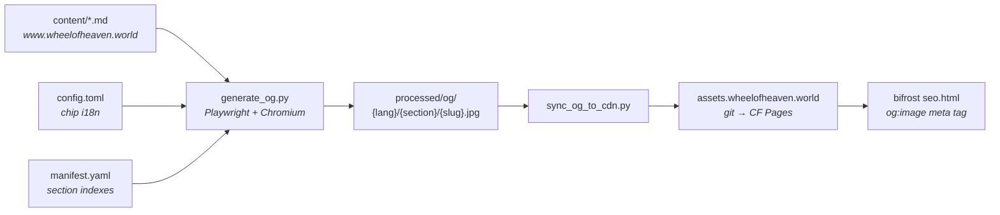

+++
title = "Open Graph Image Pipeline"
description = "How per-page social-card JPEGs are rendered, synced, and served — inputs, outputs, scripts, guardrails, and the operational loop."
weight = 35
+++

Every published page on the reading site advertises a 1200×630 social-card
JPEG in its `<meta property="og:image">` tag. These cards are rendered
ahead of time by the OG pipeline in
[`data-images/og/`](https://github.com/wheelofheaven/data-images/tree/main/og)
and served from `https://assets.wheelofheaven.world/images/og/…`.
This page covers the whole loop — what feeds it, what it produces, when
and by whom it gets run, and the guardrails that keep it honest.

The closely-related general image processing chain (figure shortcodes,
AVIF/WebP/JPG conversion) lives one section over in
[Pipelines → Image pipeline](@/contributing/dev/pipelines.md#image-pipeline);
this page is specifically for the per-page OG card renderer.

## End-to-end picture



Three repos, three responsibilities:

| Repo | Role |
|---|---|
| [`www.wheelofheaven.world`](https://github.com/wheelofheaven/www.wheelofheaven.world) | Source of truth for what should have a card (every non-draft `content/*.md`) and what each card should say (`title`, `summary`, `claim_type`, chip i18n) |
| [`data-images`](https://github.com/wheelofheaven/data-images) | Renderer — Playwright headless Chromium against Tera-flavored Jinja2 templates that match the Bifrost design system |
| [`assets.wheelofheaven.world`](https://github.com/wheelofheaven/assets.wheelofheaven.world) | Static CDN — every push to `main` triggers a Cloudflare Pages deploy that publishes the JPEGs under `/images/og/` |

## Inputs

### 1. Page content (auto-walked)

The generator walks
`../../www.wheelofheaven.world/content/{lang}/{section}/{slug}.md` and
parses the TOML frontmatter from each non-draft file. One OG entry is
emitted per `(lang, section, slug)` tuple.

Path-resolution rules:

| Source path | Becomes |
|---|---|
| `content/wiki/elohim.md` | `("en", "wiki", "elohim")` |
| `content/de/wiki/elohim.md` | `("de", "wiki", "elohim")` |
| `content/_index.md` | `("en", "default", "index")` (homepage) |
| `content/wiki/_index.md` | `("en", "wiki", "index")` (section index) |
| `content/about.md` | `("en", "section", "about")` (top-level page) |
| `content/wiki/foo/_index.md` | _skipped_ — nested sub-section |
| `content/i18n/*.md` | _skipped_ — translation data, not pages |

Frontmatter fields the renderer reads (all optional unless noted):

| Field | Used for |
|---|---|
| `title` _(required)_ | The big headline on the card |
| `description` / `extra.summary` | The body paragraph under the title |
| `extra.claim_type` | Color of the claim pill (`direct`, `inferred`, `speculative`) |
| `extra.category` | Category chip on certain templates |
| `extra.author`, `extra.publication_year`, `extra.original_title` | Library book metadata |
| `extra.event_date`, `extra.symbol`, `extra.zodiac_sign`, `extra.date_range` | Timeline/news metadata |
| `template` | Selects which OG template to render against (see "Templates" below) |

### 2. Chip i18n

Section-chip labels on the card (`Wiki`, `Library`, `Timeline`, …) come
from `www.wheelofheaven.world/config.toml`'s `[translations]` and
`[languages.{lang}.translations]` blocks. The renderer reads keys
`navbarWiki`, `navbarTimeline`, `navbarLibrary`, `navbarArticles`,
`navbarNews`, `navbarSources` — adding a new language to the main site
automatically picks up the chip text once those keys are translated.

### 3. Manifest overrides

`data-images/og/manifest.yaml` carries handcrafted entries that win over
the same `(lang, section, slug)` key from the auto-walk. Used for:

- Section indexes that need a specific composition
- Sample/demo cards (`sample: true`) used to preview design changes
- Special pages where the auto-derived fields aren't enough

### 4. EN → non-EN cascade

A library book's `author`, `publication_year`, or `original_title`
doesn't change by language — editors only set it on the English file.
The generator fills these fields on non-EN entries from the matching EN
entry's frontmatter before rendering. The cascading fields are listed
in `_CASCADE_FIELDS` in `generate_og.py`.

### 5. Brand assets

Wordmark SVG, logomark SVG, background image, and vendored fonts are
loaded from the same www repo's `static/` and
`themes/bifrost/static/fonts/vendor/` directories. Missing brand assets
log a warning but the render proceeds (with blanks where they would go).

## Outputs

```
data-images/og/processed/og/
├── en/
│   ├── wiki/elohim.jpg
│   ├── wiki/elohim.jpg.hash    ← SHA256 of the input fields
│   ├── library/genesis-woh.jpg
│   ├── timeline/age-of-aquarius.jpg
│   └── default/index.jpg       ← homepage
├── de/
│   └── …
├── fr/ es/ ru/ ja/ zh/ zh-Hant/ ko/ he/
└── …
```

Each card is **JPEG quality 88**, **1200×630**, typically ~100–125 KB.
At full saturation (~1,500 pages × 10 languages) the tree is ~165 MB.
The Hebrew (`he`) variant renders right-to-left in Frank Ruhl Libre;
all other languages share the Latin-script composition.

### Naming

```
processed/og/{lang}/{section}/{slug}.jpg
```

The `{slug}` is the markdown **filename stem** — not the frontmatter
`slug` field. So `content/library/genesis-woh.md` becomes
`processed/og/en/library/genesis-woh.jpg` regardless of any `slug =`
override in the file's frontmatter. This is intentional — it lets the
generator decide output paths without parsing every file's
front matter twice. If you rename a markdown file, the old OG card
becomes orphaned and the sync script's prune step will remove it on
the next run.

### Hash sidecars

Every JPEG has a `.hash` sidecar containing the SHA256 of the fields
that affect rendered output (`title`, `summary`, `section_label`,
`claim_type`, `lang`, template fields …). On re-run, entries whose
hash matches the sidecar are skipped. A full re-render of 1,500 pages
takes ~70 minutes; an incremental run after a few title edits takes
seconds.

Pass `--force` to bypass sidecars and re-render everything.

## Templates

`data-images/og/templates/` holds one Jinja2 template per page type:

| Template | Used for | Accent color |
|---|---|---|
| `wiki.html.j2` | wiki entries | yellow |
| `article.html.j2` | articles / explainers | pink |
| `library.html.j2` | library books | lavender |
| `timeline.html.j2` | timeline ages/events | mauve |
| `news.html.j2` | newsroom dispatches | cyan |
| `section.html.j2` | section indexes | mint |
| `default.html.j2` | homepage / fallback | blue |

All inherit from `_base.html.j2`, which provides the cosmic background,
glassmorphic chip, claim pill, and wordmark. Section accents come from
`.og--{section}` CSS classes in `_base.css`. The visual language
matches Bifrost so the cards feel native to the reading site.

## Scripts

### `generate_og.py`

Renders OG cards with Playwright headless Chromium against the templates.

```sh
cd data-images/og
./venv/bin/python scripts/generate_og.py        # everything, incremental
./venv/bin/python scripts/generate_og.py --force                 # re-render all
./venv/bin/python scripts/generate_og.py --lang en               # one language
./venv/bin/python scripts/generate_og.py --only wiki/elohim      # one slug, all langs
./venv/bin/python scripts/generate_og.py --only en/wiki/elohim   # one slug, one lang
./venv/bin/python scripts/generate_og.py --samples-only          # manifest samples only
./venv/bin/python scripts/generate_og.py --no-walk               # manifest only, no www repo
./venv/bin/python scripts/generate_og.py --dry-run               # plan, don't render
```

The default mode is **auto-walk**: scan
`www.wheelofheaven.world/content/`, merge with the manifest, render
everything that doesn't have a matching `.hash` sidecar.

### `sync_og_to_cdn.py`

Mirrors `processed/og/` into the assets repo, scoped to the active
languages so legacy PNGs and brand assets at the top of `images/og/`
stay put.

```sh
./venv/bin/python scripts/sync_og_to_cdn.py             # mirror, prompt before delete
./venv/bin/python scripts/sync_og_to_cdn.py --yes       # skip the delete prompt
./venv/bin/python scripts/sync_og_to_cdn.py --dry-run   # show plan, don't change anything
./venv/bin/python scripts/sync_og_to_cdn.py --no-prune  # never delete from destination
```

The script doesn't push — it stages the files in
`assets.wheelofheaven.world/images/og/` as a local change.
A separate `git add && git commit && git push` in that repo triggers
Cloudflare Pages, and the new images go live ~30 seconds later.

## Infrastructure

### Cloudflare Pages serving

`assets.wheelofheaven.world` is a Cloudflare Pages project that watches
the assets repo's `main` branch. On push it does an effectively no-op
build (`echo "Static assets — no build step required"`) and publishes
the entire repo tree at the edge.

Cache headers on `/images/og/*` (set in the assets repo's `_headers`):

```
Cache-Control: public, max-age=86400, immutable, must-revalidate
```

The 24-hour `must-revalidate` override sits below the broader
`/images/*` immutable rule so re-renders propagate within a day without
needing hashed filenames or a manual purge. Twitter/X and Telegram
cache more aggressively than Cache-Control suggests — see
[Failure modes](#failure-modes) below.

### Site consumption

The Bifrost theme composes the per-page OG URL once in
`themes/bifrost/templates/partials/seo.html`. Order of precedence:

1. `page.extra.image` — explicit per-page override
2. `page.extra.header_image` — same, secondary alias
3. **`{cdn_url}/images/og/{lang}/{section}/{slug}.jpg`** — the generated card
4. `section.extra.image` — section-level override
5. `brand/wheel-of-heaven.jpg` — brand fallback

The composed URL is reused for `og:image`, `twitter:image`, the
JSON-LD `ImageObject`, and the `<link rel="preload">` hint, so a single
404 isn't isolated to one social network — it cascades through every
consumer.

## How-tos

### Routine — after editing page titles or summaries

```sh
cd data-images/og
./venv/bin/python scripts/generate_og.py            # incremental
./venv/bin/python scripts/sync_og_to_cdn.py --yes   # stage in assets repo
cd ../../assets.wheelofheaven.world
git add images/og
git commit -m "Sync OG images"
git push                                            # Cloudflare rebuilds in ~30s
```

The hash-skip means re-running is cheap — if you forgot whether you ran
the pipeline yesterday, just run it again. Unchanged entries skip in
milliseconds.

### One-shot — preview a single card without re-rendering everything

```sh
./venv/bin/python scripts/generate_og.py --only wiki/elohim --force
open processed/og/en/wiki/elohim.jpg
```

### One-shot — pick up a new language

1. Add the language code to `LANGUAGES` in `generate_og.py` and
   `sync_og_to_cdn.py`.
2. Translate the `navbar*` keys in `www.wheelofheaven.world/config.toml`.
3. Render: `./venv/bin/python scripts/generate_og.py --lang {lang} --force`
4. Sync and push.

### Manual override — bespoke card for a single page

Set `extra.image` (or `extra.header_image`) in the page's frontmatter
to a path served from the assets repo. The renderer skips the
generated card entirely for that page; the `seo.html` precedence
chain picks the override at template-eval time.

### Design change — re-render all cards

A template or `_base.css` change in `data-images/og/templates/` will
typically not invalidate hash sidecars (those track *input* fields,
not the template). Force a full re-render:

```sh
./venv/bin/python scripts/generate_og.py --force
```

Plan for ~70 minutes wall-clock and ~30 MB of repo growth.

## Who runs this, and when

The pipeline is **author-triggered, not CI-triggered**. Whoever
authors a content change is responsible for re-running and pushing the
OG sync as part of that change. Two reasons it isn't automated yet:

1. Rendering 35 cards (one new content slug × 10 languages, with
   updates) takes ~30 seconds locally but ~3 minutes in CI — and
   needs Playwright, Chromium, a checked-out www repo, and write
   access to the assets repo. The setup-to-payoff ratio hasn't paid
   off yet.
2. The `--force` flag exists for design changes that the hash check
   can't detect, and a human deciding to flip that is currently a
   feature, not a bug.

Future automation is on the table — see [Future work](#future-work).

## Guardrails

### Fail loud on missing inputs

`generate_og.py` exits non-zero with a clear message when:

- `www.wheelofheaven.world/config.toml` isn't where it's expected
- `www.wheelofheaven.world/content/` isn't where it's expected
- The auto-walk produces zero entries (catches subtler breakage —
  wrong subdir, content moved, glob too narrow)

Manifest-only mode (`--no-walk`) keeps the previous lenient behavior:
warn on missing config, fall back to English chip labels, render the
manifest. That path exists for running `data-images` standalone in CI
without a checked-out www repo.

Background — these guardrails were added after the 2026-05 incident
documented under [Failure modes](#failure-modes).

### Hash-skip protects against unintended re-renders

Each JPEG carries a `.hash` sidecar. Running `generate_og.py` without
`--force` is safe — entries whose input fields haven't changed skip
without touching disk. This makes the operational loop forgiving:
running the pipeline "just to be sure" is fast and idempotent.

### Sync script is scoped to managed paths

`sync_og_to_cdn.py` only mirrors `{lang}/{section}/{slug}.jpg` under
the active languages. Anything else at the top of the assets repo's
`images/og/` (brand assets, legacy PNGs, the timeline-hero video) is
left untouched. Prune deletes are scoped to the same managed subtree.

### Cache-Control + Cloudflare Pages immutable build

Each push to the assets repo creates an immutable deployment with its
own URL; the apex domain is just a pointer. Rolling back is a
two-click operation in the CF dashboard ("Pages → Project →
Deployments → Rollback to this deploy").

## AI / Claude-specific guidance

Editors using Claude Code touch this pipeline mostly when adding new
content. A few rules keep an LLM-assisted edit safe:

- **Run the pipeline after content edits in `www.wheelofheaven.world`.**
  Adding a page without re-running `generate_og.py` means the page
  ships with a 404 OG URL. The fail-loud check catches a *broken*
  pipeline, not a *forgotten* one. There is no CI gate for this yet,
  so it relies on the editor (or their agent) doing the sync as part
  of the change.
- **Don't synthesize OG image paths from training memory.** The
  filename is derived from the markdown filename stem, not the
  frontmatter `slug` field, and the URL is composed at render-time by
  `seo.html`. If you need to know what URL a page will advertise,
  read `seo.html` — don't guess.
- **Don't bypass `--no-walk` to "fix" missing-content errors.** That
  flag is for manifest-only CI, not for routing around a missing
  clone of the www repo. If the auto-walk fails, the right move is
  to clone the missing repo at the expected sibling path.
- **Don't commit `processed/og/` to git in `data-images`.** The folder
  is git-ignored on purpose — the sync script is what publishes those
  files. Committing them to `data-images` would duplicate them
  across two repos and the `.hash` sidecars (which are committed)
  would silently desync.
- **Memory written about specific OG filenames decays fast.** A memory
  that says `/library/genesis-woh.jpg` exists is a claim about the
  state of the CDN at the time the memory was written. Before
  recommending an OG URL to a user, fetch it and confirm 200.

## Failure modes

### The 2026-05 silent-render incident

**Symptom:** A user shared a freshly-published page link in Telegram
and the unfurl had no artwork. The page's `<meta property="og:image">`
pointed at an `assets.wheelofheaven.world` URL that returned 404.

**Root cause:** The www repo had been renamed
`www.wheelofheaven.io` → `www.wheelofheaven.world`, but the OG
generator still hardcoded the old path. `walk_content()` warned
that the dir didn't exist and returned an empty list. The script
then rendered only the manifest's 17 entries and exited 0 — every
run since the rename had been a silent partial success.

**Fix:** The path-rename plus
[fail-loud guardrails](#fail-loud-on-missing-inputs) shipped in
`data-images@e72a27f`. The pipeline now refuses to silently degrade
into manifest-only mode when auto-walk was requested.

**Lessons:**

- Auto-walkers that return `[]` on missing inputs are almost always
  wrong by default; the right default is to abort. The fail-loud
  flag (or an explicit `--no-walk`) lets the caller opt in to the
  permissive behavior when they actually want it.
- A "rendered N, skipped M" success line is a poor health signal if
  N can be misleadingly low without anyone noticing. Future work
  (see below) should add a sanity floor — e.g. "less than 80% of
  expected entries rendered or skipped" should warn loudly.

### Twitter/X cache won't refresh

X caches OG cards for ~7 days per (bot, URL). After re-rendering you
can poke their crawler at
[cards-dev.twitter.com/validator](https://cards-dev.twitter.com/validator),
but the public unfurl on existing posts may not refresh until the
TTL expires. Telegram is similar — use `@WebpageBot` on Telegram and
send it the URL; it responds "Link preview was updated successfully"
and the next paste of the link gets the fresh card.

### Cloudflare Pages didn't pick up the push

Check `assets.wheelofheaven.world` → Pages dashboard → Deployments for
a recent build. If the build is queued or failed, no images move. If
the build succeeded but the URL still 404s, give the edge ~60 seconds
to propagate, then check `cache-status` header (`MISS` = origin was
queried and returned 404; `HIT` = a 404 got cached — request with
`?nocache=1` to bypass).

### Brand SVG missing warnings

```
WARNING:root:Brand SVG missing: .../static/brand/wordmark.svg
```

The render proceeds with blanks where the wordmark would go. Usually
means the www repo isn't on `main`, or the brand assets were moved.
Cards rendered during the warning window need a forced re-render
after the assets are restored.

### Hebrew renders broken

Hebrew (`he`) uses a separate font (Frank Ruhl Libre) and `dir="rtl"`
in the OG template. If only Hebrew cards look wrong, suspect
`templates/_base.html.j2` lost its RTL handling — see
`data-images@1707e98` for the original wiring.

## Future work

Possible improvements, in rough order of payoff:

- **CI check on the www repo that validates `og:image` URLs.** After
  `zola build`, walk `public/**/*.html`, extract each
  `<meta property="og:image">`, and HEAD the URL against the assets
  CDN. Fail the build on any 404. Catches every cause — script not
  run, sync not pushed, slug typo, CDN config drift — not just
  pipeline path errors.
- **Sanity-floor on render count.** Compare `rendered + skipped` to
  the previous run's total; warn if it drops more than 20%. Would
  have caught the 2026-05 incident on day one.
- **Pipeline-as-CI.** Run `generate_og.py` + `sync_og_to_cdn.py` in
  a GitHub Action on push to `data-content` or
  `www.wheelofheaven.world`, with a service account that can push to
  `assets.wheelofheaven.world`. Removes the manual sync step from
  every content change.

## See also

- [`data-images/og/README.md`](https://github.com/wheelofheaven/data-images/blob/main/og/README.md)
  — operational reference, kept in sync with the pipeline itself
- [Pipelines](@/contributing/dev/pipelines.md) — the broader image
  processing chain
- [`assets.wheelofheaven.world`](@/architecture/sites/assets.md) —
  the CDN side of the story
- [Bifrost theme — seo.html](@/contributing/dev/bifrost-theme.md) —
  where the OG URL gets composed at render time
