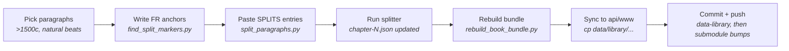

+++
title = "Paragraph Split Tooling"
description = "How to split long source-text paragraphs into smaller pieces across all 9 languages — the SPLITS dict, the FR-anchor heuristic, and the operational loop."
template = "page.html"
weight = 40
+++

Three scripts in
[`data-library/scripts/`](https://github.com/wheelofheaven/data-library/tree/main/scripts)
let you take long paragraphs in a library book (typically over ~1500
source-language characters) and break them into smaller pieces at
natural sentence boundaries — across **all** translated languages at
once, with paragraph IDs (`c{ch}p{n}`) staying aligned across the
language set. This page covers when to use the tooling, the marker
convention it expects, and the end-to-end operational loop.

The tooling was built during the 2026-05 editorial pass that split 35
paragraphs across TBWTT, ETTMTTP, and LWTE into 83 pieces. See
[Editorial Passes](@/contributing/content/editorial-passes.md) for the
broader editorial context.

## When to use this

Reach for it when a library book has paragraphs that are too long for
comfortable reading or audiobook playback. Symptoms:

- A paragraph spans many distinct thoughts and would benefit from being
  split into multiple beats.
- Audiobook playback of a single paragraph runs long enough that
  per-paragraph highlight loses its anchor in the reader's attention.
- A long monologue (e.g., Yahweh in TBWTT chs. 5–7) has clear
  topical pivots that could each anchor a paragraph.

The 2026-05 threshold was **1500 source-language characters**. Below
that, splitting tends to fragment a coherent thought; above it,
splitting almost always improves the reading flow.

This is editorial work, not a routine pipeline pass. Decide whether to
split paragraph-by-paragraph, with a human picking the break points.
The tooling automates *applying* the breaks across all languages once
you've chosen them, not finding them.

## The three scripts

| Script | What it does |
|---|---|
| [`split_paragraphs.py`](https://github.com/wheelofheaven/data-library/blob/main/scripts/split_paragraphs.py) | Reads a declarative `SPLITS` dict of per-language sentence markers, splits the matching paragraphs in `chapter-N.json` in place, renumbers `n` + `refId`. Idempotent — skips entries whose splits have already been applied. |
| [`find_split_markers.py`](https://github.com/wheelofheaven/data-library/blob/main/scripts/find_split_markers.py) | Helper for generating `SPLITS` entries. Given an FR anchor phrase per split, finds the corresponding sentence in each translation by relative position. Output is pasteable straight into `SPLITS`. |
| [`rebuild_book_bundle.py`](https://github.com/wheelofheaven/data-library/blob/main/scripts/rebuild_book_bundle.py) | After splits land, regenerates the bundled `{slug}.json` and updates `_meta.json` paragraph counts from the per-chapter files. Skips the bundle for split-files-only books (no `{slug}.json` at the data-library root). |

## The `SPLITS` dict

The single source of truth lives at the top of `split_paragraphs.py`:

```python
SPLITS = {
    ('the-book-which-tells-the-truth', 5, 3): [
        # split 1
        {
            'fr': "ne servant plus à rien.",
            'en': "no longer serving any purpose.",
            'de': "zu nichts mehr dienen.",
            'es': "no sirviendo ya para nada.",
            'ru': "более ни на что не служа.",
            'ja': "何の役にも立たず、崩れ落ちるでしょう。",
            'ko': "아무 데도 쓸모없이 무너질 것입니다.",
            'zh': "不再有任何用处。",
            'zh-Hant': "不再有任何用處。",
        },
    ],
    ...
}
```

The key is `(book_slug, chapter_n, paragraph_n)` — pointing at the
paragraph to split. The value is a list of marker dicts, one per
intended split point. A list of N marker dicts produces N+1 pieces.

Each marker dict must have an entry for **every language present in the
paragraph's `i18n`**. The marker for a language is an exact substring of
that language's text — the splitter cuts immediately *after* the
marker, so the marker is typically the last sentence (or last few
words) of the piece you want to keep.

### Uniqueness requirement

A marker must occur **exactly once** in its target language's text. The
splitter validates this and refuses to run if any marker appears 0 or
2+ times. Two consequences:

- For very short markers (e.g. `"À chacun son mérite."`), check the
  full paragraph for duplicates before committing the marker.
- For markers that contain ambiguous phrases like "the boss" or "the
  continent," lengthen the marker until it's distinctive.

### Empty-language behavior

If a language's text is the empty string `""` (as happens for LWTE's
DE/ES/RU/JA/KO/ZH/zh-Hant — the book is only partially translated),
the marker should also be `""`. `split_text("", "")` cleanly returns
`("", "")`, so each empty language produces N+1 empty pieces. This
preserves cross-language paragraph ID alignment so the interlinear
feature doesn't break — translations slot into the already-split
structure once they land.

## Generating markers — the FR-anchor heuristic

Hand-writing 9-language marker dicts for dozens of paragraphs is tedious
and error-prone. `find_split_markers.py` automates the per-language
matching given an FR anchor phrase per split:

```python
# At the top of find_split_markers.py
FR_ANCHORS = {
    ('the-book-which-tells-the-truth', 5, 3): [
        "ne servant plus à rien",  # FR anchor for split 1
    ],
    ('the-book-which-tells-the-truth', 5, 50): [
        "30 millions de «parasanges»",  # FR anchor for split 1
        "26 000 ans avant d'arriver",   # FR anchor for split 2
    ],
}
```

For each FR anchor the script:

1. Finds the FR sentence containing the anchor (back to previous
   terminator, forward to next).
2. Computes the relative position of that sentence's end in the FR
   text (e.g. 43%).
3. For each target language, picks the sentence whose terminator-end is
   closest to the same relative position in the target text.

Output is a complete `SPLITS` entry, ready to paste:

```sh
$ python3 data-library/scripts/find_split_markers.py
('the-book-which-tells-the-truth', 5, 3): [
    {
        'fr': "...ne servant plus à rien.",
        'en': "...no longer serving any purpose.",
        ...
    },
],
```

### The JA/KO/ZH drift caveat

The relative-position heuristic assumes translations preserve roughly
the same sentence structure as FR. For most prose this holds. For
JA/KO/ZH it doesn't always — JA in particular tends to compress
multiple FR sentences into one or split FR sentences differently, so
the sentence at the "same relative position" can be one beat off from
the FR semantic break.

**Concrete example.** In TBWTT ch5 p53, the FR splits at "...une panique
meurtrière et dangereuse." (end of the "humans must show they want us"
beat). The JA equivalent ends with a sentence that *also* covers "we
must teach them who we are" — a half-thought further along. JA piece 1
is one logical sentence longer than FR piece 1.

This is acceptable because **each language is read independently** from
its own chapter file. Cross-language paragraph IDs stay aligned (both
FR and JA have a `p55`, `p56`, `p57`, ...), but the *content* boundary
at each ID can drift by a sentence in JA/KO/ZH. The interlinear feature
keeps working; the audiobook for each language reads a coherent piece.

When alignment really matters (rare — usually only when you want a
specific quote at the same `c{ch}p{n}` across all languages), override
the heuristic by hand-writing the marker for the affected language.

### Sentence terminators

The terminator set the heuristic uses:

```python
TERMINATORS = '.!?:。！？：…'
```

`;` is intentionally **not** a terminator — many languages use `;` as
a soft pause within a longer sentence, not a sentence end. If a split
must land at a semicolon (e.g. TBWTT ch5 p3 → ETTMTTP ch3 p191's
3-piece guided meditation), hand-write the marker including the
trailing `;`.

## End-to-end loop



### 1. Pick the paragraphs

```sh
python3 -c "
import json, glob
THRESH = 1500
for cf in sorted(glob.glob('data-library/$BOOK/chapter-*.json')):
    ch = json.load(open(cf))
    for p in ch['paragraphs']:
        if len(p.get('text', '')) > THRESH:
            print(f\"{cf}: p{p['n']} {len(p['text'])}c\")
"
```

Read each candidate paragraph. Identify the natural break points
(sentence-end where a topic shift or beat boundary lives).

### 2. Write FR anchors

Edit `FR_ANCHORS` in `find_split_markers.py`:

```python
FR_ANCHORS = {
    ('my-book-slug', 3, 42): [
        "first split anchor — a distinctive phrase from FR",
        "second split anchor — etc",
    ],
}
```

Each anchor must appear **exactly once** in the FR text. The sentence
containing it becomes the marker.

### 3. Generate and paste

```sh
python3 data-library/scripts/find_split_markers.py
```

Copy the output into the `SPLITS` dict in `split_paragraphs.py`. Spot-
check the JA/KO/ZH entries against the source paragraph — if the
heuristic landed on a clearly wrong sentence (e.g. picked the next
sentence over), hand-fix that language's marker.

### 4. Run the splitter

```sh
python3 data-library/scripts/split_paragraphs.py
```

Output:

```
my-book-slug ch3 p42: 1 paragraph → 3 pieces
    piece 1: 712c FR / 680c EN
    piece 2: 540c FR / 510c EN
    piece 3: 290c FR / 275c EN
wrote /Users/.../data-library/my-book-slug/chapter-3.json (143 paragraphs total)
```

The splitter is **idempotent** — re-running skips entries whose splits
have already been applied. Safe to leave entries in `SPLITS` as
historical record.

### 5. Rebuild bundle + meta

```sh
python3 data-library/scripts/rebuild_book_bundle.py my-book-slug
```

This updates `_meta.json` paragraph counts and (if a combined
`{slug}.json` exists at the data-library root) regenerates that bundle
from the per-chapter files.

### 6. Sync to api/www

The `data/library/` submodule in
[`api.wheelofheaven.world`](https://github.com/wheelofheaven/api.wheelofheaven.world)
and
[`www.wheelofheaven.world`](https://github.com/wheelofheaven/www.wheelofheaven.world)
is a clone of `data-library`. After committing in `data-library` and
pushing, refresh each submodule clone:

```sh
cd api.wheelofheaven.world/data/library
git stash push -m "discard local cp duplicates"
git pull --ff-only
git stash drop

cd www.wheelofheaven.world/data/library
git stash push -u -m "discard local cp duplicates"
git pull --ff-only
git stash drop
```

Then commit the submodule bump in each parent repo:

```sh
cd api.wheelofheaven.world && git add data/library && git commit -m "Bump data-library: paragraph splits"
cd www.wheelofheaven.world && git add data/library && git commit -m "Bump data-library: paragraph splits"
```

In `www`, take care to stage **only** `data/library`. Other modified
files (`config.toml`, `data/icons.json`, etc.) often contain unrelated
local WIP.

## Conventions and edge cases

### Quoted-speech paragraphs that open with `«`

Long Yahweh monologues in TBWTT and ETTMTTP often open with `«` and
let the speech run across multiple paragraphs without ever closing
the `«`. When splitting such a paragraph:

- **Piece 1** keeps the opening `«`.
- **Subsequent pieces** start with a capital letter, no opening `«`.

This matches the existing convention for multi-paragraph speech in
TBWTT ch5+ (see e.g. p57, p58 in the original ch5).

### Bible-quote-with-citation paragraphs

Many TBWTT ch2–4 paragraphs are quoted Bible verses followed by an
inline citation (e.g. `«...» (Genèse, II-1)`). These are typically
*already* their own paragraph — no split needed.

When a long commentary paragraph *embeds* a short bracketed quote
fragment as illustration (e.g. ch3 p163), the convention is to keep
the illustrative fragment **inline** in the commentary piece, not
extract it as a separate quote paragraph.

### Renumbering vs. letter suffixes

When a paragraph is split, the splitter **renumbers all subsequent
paragraphs sequentially** — original `p3` becomes `p3`/`p4`/`p5`, and
the original `p4` shifts to `p6`. The `refId` field is updated
correspondingly (`TBWTT-1:6` etc.).

This is the right default when paragraph numbers haven't yet been
referenced externally. If a book has stable external refs to specific
paragraphs (e.g. by URL or scholarly citation), renumbering breaks
those refs — in that case use the splitter as a starting point and
hand-edit to preserve refs (e.g. via letter suffixes like `p3a`,
`p3b`).

## Related

- [Editorial Passes](@/contributing/content/editorial-passes.md) — the
  broader 2026-05 editorial context this tooling was built for.
- [Library Book Format](@/reference/library-book-format.md) — the
  paragraph-level JSON schema the splitter operates on.
- [data-library Source of Truth](@/architecture/data-library-source-of-truth.md)
  — why these edits live in `data-library/` rather than going back
  through `ingest/`, and how cross-language paragraph ID alignment
  feeds the future audiobook pipeline.
