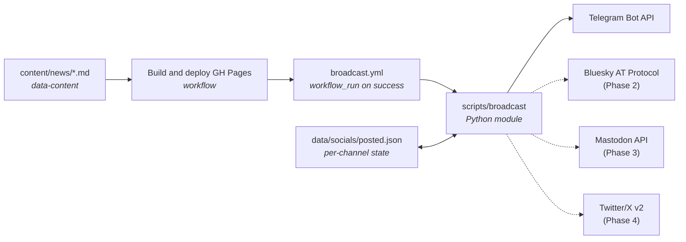

+++
title = "Social Broadcast Pipeline"
description = "How newly published Wheel of Heaven content auto-posts to Telegram and (eventually) Bluesky, Mastodon, Twitter — frontmatter contract, state model, CI trigger, guardrails."
weight = 40
+++

When a Newsroom Dispatch or Article lands on `main` and ships to
production, the social-broadcast pipeline reads the freshly built
content tree, figures out which pages haven't been announced yet, and
posts them to the project's social channels. Phase 1 supports
**Telegram**; later phases add **Bluesky**, **Mastodon**, **Discord**,
and **Twitter/X** in that order.

The pipeline is **deploy-triggered, not push-triggered**: a post only
fires after GitHub Pages has confirmed the page is live, so unfurls
work on the first paste.

## End-to-end picture



Three repos participate:

| Repo | Role |
|---|---|
| [`data-content`](https://github.com/wheelofheaven/data-content) | Source of truth — frontmatter declares eligibility (`broadcast = true`) and optional per-platform overrides (`[social]`). |
| [`www.wheelofheaven.world`](https://github.com/wheelofheaven/www.wheelofheaven.world) | Hosts the broadcaster (`scripts/broadcast/`), the workflow, the state file, and the GitHub secrets. |
| Each platform | Receives the post via its public API. |

## What gets broadcast

Eligibility is **opt-in per page**, with sensible defaults per section.

| Section | Default | Override field |
|---|---|---|
| `/news/` (Newsroom Dispatches) | `broadcast = true` | `broadcast = false` to suppress |
| `/articles/` (Explainers) | `broadcast = true` | `broadcast = false` to suppress |
| `/wiki/` (Wiki entries) | `broadcast = false` | `broadcast = true` to opt in |
| `/library/`, `/timeline/`, `/resources/` | `broadcast = false` | `broadcast = true` to opt in |
| Translations (`{lang}/...`) | Always `false` | English source already covered |
| Drafts (`draft = true`) | Always `false` | — |

The boolean can also be a list to scope by platform:

```toml
[extra]
broadcast = ["telegram", "bluesky"]   # only these channels
# or
broadcast = false                     # don't post anywhere
# or (default for /news/ and /articles/)
broadcast = true                      # all enabled channels
```

The `[social]` block holds optional per-platform copy overrides:

```toml
[social]
telegram = """
🛰️ <b>Custom Telegram lede</b>

Multi-paragraph long-form copy is fine here — Telegram permits ~1024
characters in image captions and ~4096 in plain text.
"""
twitter = "Custom 280-char Twitter lede..."
bluesky = "Custom 300-char Bluesky lede..."
# Unset platforms fall back to the mechanical default.
```

## The mechanical default (no `[social]` override)

The broadcaster derives copy from frontmatter using a per-platform
template. The default Telegram template is:

```
🌀 {title}

{summary}

→ {permalink}
```

`{summary}` falls back to `description` if `extra.summary` isn't set.
On platforms with stricter length limits (Twitter, Bluesky), the summary
is truncated at a sentence boundary and tail-padded with the permalink.

The OG image (already auto-generated by the
[OG Image Pipeline](@/contributing/dev/og-image-pipeline.md)) is
attached natively where the platform supports media uploads — see
per-platform notes below.

## State model

Every successful POST writes one entry to a tracked JSON file:

```
www.wheelofheaven.world/data/socials/posted.json
```

```json
{
  "version": 1,
  "entries": {
    "news/pursue-release-02-spheres-and-transmedium": {
      "title": "PURSUE Release 02: Spheres, Transmedium Cases, and the First Color Video",
      "permalink": "https://www.wheelofheaven.world/news/pursue-release-02-spheres-and-transmedium/",
      "first_eligible_at": "2026-05-22T15:45:26Z",
      "channels": {
        "telegram": {
          "post_id": "-100123456789/42",
          "url": "https://t.me/wheelofheaven/42",
          "posted_at": "2026-05-22T15:50:01Z"
        },
        "bluesky":  null,
        "mastodon": null,
        "twitter":  null
      }
    }
  }
}
```

Read it as: *"For each page key, here is the timestamp it first became
eligible, and here is what happened on each channel — `null` means
not yet posted, an object means posted with this ID."*

The broadcaster's main loop is one line of pseudocode:

```python
for page in discover_eligible(content_root):
    for channel in enabled_channels:
        if state.get(page, channel) is None:
            result = channel.post(render(page, channel))
            state.set(page, channel, result)
```

Partial-success is normal: if Telegram succeeds but Bluesky 5xx's, the
next run retries Bluesky alone. There is no orphaning, no
double-posting, no manual reconciliation.

## Trigger — when the broadcaster fires

```yaml
# .github/workflows/broadcast.yml (excerpt)
on:
  workflow_run:
    workflows: ["Build and deploy GH Pages"]
    types: [completed]
    branches: [main]
```

The job only runs if the deploy succeeded:

```yaml
if: ${{ github.event.workflow_run.conclusion == 'success' }}
```

This guarantees:

1. **The URL is live** before any post tries to unfurl it.
2. **A failed build never broadcasts** content that wasn't shipped.
3. **Tag pushes and PR branches don't broadcast** (only `main` deploys).

After a successful run, the workflow commits any `posted.json` changes
back to `main` with `[skip ci]` so the deploy workflow doesn't loop.

## Scripts

### `scripts/broadcast/`

```
scripts/broadcast/
├── __init__.py
├── __main__.py             # CLI entry — python -m broadcast
├── discover.py             # Walk content, parse frontmatter, eligibility filter
├── state.py                # Read/write data/socials/posted.json
├── render.py               # Build per-platform copy from frontmatter + templates
├── telegram.py             # Telegram Bot API adapter
└── templates/
    └── telegram.txt        # {title}/{summary}/{permalink} template
```

### CLI

```sh
# Default — discover new, post to all enabled channels:
python -m scripts.broadcast

# Dry-run — print rendered posts to stdout, change nothing:
python -m scripts.broadcast --dry-run

# Limit to one platform:
python -m scripts.broadcast --platforms telegram

# Limit to one slug (debug / one-shot):
python -m scripts.broadcast --only news/pursue-release-02-spheres-and-transmedium

# Combine — print exactly what would go out for one slug:
python -m scripts.broadcast --only news/foo --platforms telegram --dry-run
```

Exit codes:

| Code | Meaning |
|---|---|
| 0 | Nothing to do, or every attempted post succeeded |
| 1 | At least one platform was attempted and **every** attempt failed (the rest of the run might have partial successes — see logs) |
| 2 | Configuration error (missing secret for a channel that has pending posts, malformed frontmatter, etc.) |

## Inputs

### 1. Content frontmatter

The broadcaster reads top-level `title` / `description` / `date` and
`extra.summary` / `extra.broadcast` / `[social]` — see the
[Frontmatter Reference](@/reference/frontmatter.md#social-broadcast)
for the full schema.

### 2. State file

`data/socials/posted.json` is the only persistent state. On a fresh
clone, this file's `entries` table is the authoritative answer to
"what's been posted where." Editors can hand-edit it to suppress an
unwanted post (set the channel value to a synthetic `{post_id:
"manual_skip"}` object), or to re-broadcast (delete the channel entry,
push, watch the next deploy fire it).

### 3. Secrets

Configured as **Repository secrets** on
`wheelofheaven/www.wheelofheaven.world`:

| Secret | Used by | Required for Phase |
|---|---|---|
| `TELEGRAM_BOT_TOKEN` | `telegram.py` | 1 |
| `TELEGRAM_CHAT_ID` | `telegram.py` | 1 |
| `BLUESKY_HANDLE` | (phase 2) | 2 |
| `BLUESKY_APP_PASSWORD` | (phase 2) | 2 |
| `MASTODON_INSTANCE` | (phase 3) | 3 |
| `MASTODON_ACCESS_TOKEN` | (phase 3) | 3 |
| `DISCORD_WEBHOOK_URL` | (phase 3) | 3 |
| `TWITTER_BEARER_TOKEN`, plus OAuth 2.0 PKCE refresh-token | (phase 4) | 4 |

A channel is **enabled** when its required secrets are present. Missing
secrets disable the channel silently for the broadcaster (no error), but
fail the workflow loudly if a page is eligible for that channel and has
no post for it yet (`exit 2`).

## Outputs

### `data/socials/posted.json`

The committed state file (see [State model](#state-model)).

### `data/socials/log.jsonl`

Append-only audit log. Every action — attempted post, success, failure —
gets one JSON line:

```jsonl
{"ts":"2026-05-22T15:50:01Z","slug":"news/pursue-release-02-...","ch":"telegram","status":"ok","post_id":"..."}
{"ts":"2026-05-22T15:50:02Z","slug":"news/pursue-release-02-...","ch":"bluesky","status":"err","err":"403 invalid_token"}
```

### GitHub Actions step summary

Every workflow run writes a markdown summary listing what was posted,
to which channel, with links to each post. Visible in the Actions tab.

## Per-platform notes

### Telegram (Phase 1)

- **API:** `https://api.telegram.org/bot{TOKEN}/sendPhoto` if the OG
  image is live, else `sendMessage`. The broadcaster HEAD-probes the
  per-page OG URL on
  `assets.wheelofheaven.world` first; if it 404s (the OG pipeline
  hasn't been run yet for this slug), it falls back to text + link
  unfurl instead of handing Telegram a dead URL and tripping
  `400 failed to get HTTP URL content`.
- **Parse mode:** `HTML` (subset — `<b>`, `<i>`, `<a>`, `<code>`).
- **Caption limit:** 1024 chars (with photo) / 4096 chars (text-only).
  The default template fits comfortably under 1024.
- **Auth:** Bot token from
  [@BotFather](https://t.me/BotFather). Bot must be **added as
  administrator** to the target channel with "Post Messages" permission.
- **Chat ID format:** `@channelusername` for public channels, or
  numeric `-100…` for private channels. Resolve numeric IDs with
  [@username\_to\_id\_bot](https://t.me/username_to_id_bot).
- **Result:** post_id is `{chat_id}/{message_id}`; the public URL is
  `https://t.me/{channelusername}/{message_id}` for public channels.

### Bluesky (Phase 2, not implemented yet)

- **API:** `app.bsky.feed.post` via the AT Protocol XRPC endpoint.
- **Length:** 300 graphemes (not chars — emoji/CJK count differently).
- **Auth:** App password generated in the Bluesky web UI under
  Settings → App Passwords.
- **Link card:** Constructed as an `app.bsky.embed.external` record
  with the OG image uploaded to the user's blob store first
  (`com.atproto.repo.uploadBlob`).

### Mastodon (Phase 3, not implemented yet)

- **API:** `POST /api/v1/statuses`.
- **Length:** 500 chars default (instance-configurable).
- **Auth:** OAuth 2 access token, scope `write:statuses write:media`.
- **CW mapping:** `claim_type = "speculative"` maps to a content
  warning of `"Speculative reading"` — useful editorial signal that
  doubles as Mastodon's etiquette norm.

### Discord (Phase 3, not implemented yet)

- **API:** Webhook URL — POST JSON, no auth headers.
- **Embed:** Native `embed` payload with title/description/url/image —
  no length issues, rich preview without unfurl quirks.

### Twitter / X (Phase 4, not implemented yet)

- **API:** v2 `POST /2/tweets`, with media upload via v1.1
  `POST /1.1/media/upload.json` (the v2 media endpoint is still
  developer-preview).
- **Length:** 280 chars; URL counts as 23.
- **Auth:** OAuth 2.0 PKCE with refresh token. The refresh token must
  be stored as a GitHub secret and rotated after every use — see
  the implementation notes when Phase 4 ships.
- **Cost:** Basic tier ($200/mo) is required for media upload at any
  meaningful volume. Phase 4 will document the cost decision in this
  section.

## Guardrails

### Idempotent state

Re-running the broadcaster is always safe. Anything already in
`posted.json` is skipped; only `null` channel slots are attempted. A
stuck channel (5xx loop) will retry on every subsequent deploy until
either the channel recovers or an editor manually skips it.

### Dry-run on PR

Coming in Phase 1.1 — a separate workflow that triggers on PRs touching
`content/news/` or `content/articles/` runs the broadcaster with
`--dry-run` and posts the rendered output as a PR comment, so editors
can review the social copy before merging.

### Fail-loud on configuration drift

If a page is eligible for `telegram` and `TELEGRAM_BOT_TOKEN` isn't
set, the workflow exits non-zero with a clear error. Silent skips on
eligible-but-unconfigured channels would let posts go undetected for
days — the same shape as the
[2026-05 OG silent-render incident](@/contributing/dev/og-image-pipeline.md#the-2026-05-silent-render-incident).

### Backfill protection

On first deploy after the pipeline ships, every existing
broadcast-eligible page is pre-marked as `manual_skip` in
`posted.json`. Without this, the inaugural run would broadcast the
entire backlog — every dispatch and explainer ever published — within
seconds.

Editors who want to retroactively broadcast a specific historical
page can delete its channel entry from `posted.json` and push; the next
deploy will fire it.

### `[skip ci]` on state commits

The workflow's state-commit step appends `[skip ci]` to the commit
message. This prevents:

1. The deploy workflow from re-firing (would be no-op but wastes minutes).
2. The broadcast workflow from re-firing (would find nothing to do
   but adds noise).

### Quiet hours (optional)

A page may set `[social].not_before` to an ISO 8601 timestamp. The
broadcaster compares against `datetime.utcnow()` and skips the page on
runs before that time. Useful for "schedule this dispatch to merge at
3 AM but broadcast at 9 AM local."

```toml
[social]
not_before = "2026-05-22T09:00:00Z"
```

## How-tos

### Routine — broadcast a new dispatch

1. Author the dispatch as usual (see
   [Newsroom Dispatch](@/contributing/content/newsroom-dispatch.md)).
2. Commit, push, merge.
3. The deploy workflow runs (~3–4 min).
4. The broadcast workflow runs (~30 s) and posts to every enabled
   channel.
5. The workflow commits the updated `posted.json` back to `main`.

No manual step. If something fails, the workflow page has the logs and
the GitHub Actions summary lists what posted vs. what failed.

### Suppress broadcast for a sensitive piece

```toml
[extra]
broadcast = false
```

Commit the page with this flag set. It will publish to the site but
never to social channels.

### Schedule a delayed broadcast

```toml
[social]
not_before = "2026-05-22T13:00:00Z"
```

The page is broadcast on the first deploy that runs after the timestamp.

### Re-broadcast (recover from a deleted/wrong post)

Edit `data/socials/posted.json`:

```diff
   "channels": {
-    "telegram": { "post_id": "...", "posted_at": "..." },
+    "telegram": null,
     "bluesky": null
   }
```

Commit, push. The next broadcast picks it up.

### Add a new channel later

1. Implement `scripts/broadcast/{channel}.py` following `telegram.py`.
2. Register it in `__main__.py`'s `CHANNELS` registry.
3. Add the channel's secrets to the workflow's `env:`.
4. Add per-platform notes in the section above.
5. Add the channel as `null` to every entry in `posted.json` (or
   leave it — missing keys are treated as `null`).
6. Document the auth flow under
   [Per-platform notes](#per-platform-notes).

### Local dry-run

```sh
cd www.wheelofheaven.world
python -m scripts.broadcast --dry-run
```

Prints every page that would be broadcast and the rendered copy for
each enabled channel. Doesn't read/write state.

To dry-run a specific slug:

```sh
python -m scripts.broadcast --only news/pursue-release-02-spheres-and-transmedium --dry-run
```

## AI / Claude-specific guidance

- **Don't post on `main` push.** The workflow runs on `workflow_run:
  Build and deploy GH Pages -> completed -> success`. A new content
  commit merges, the deploy runs, the broadcaster fires. If you find
  yourself editing the workflow trigger to `on: push`, you are almost
  certainly making a mistake — `on: push` races the deploy and posts
  links that 404.
- **Don't broadcast historical content silently.** When adding a new
  channel, the `posted.json` migration step must pre-seed every
  existing eligible page as `manual_skip` for the new channel.
  Otherwise the first run after the migration fires every backlogged
  post.
- **Don't read secrets into Python defaults.** Secrets are passed via
  `env:` from the workflow into `os.environ`. Channels that find
  their secret missing should disable themselves quietly (returning
  `disabled` from `is_enabled()`); the `eligible-but-no-secret` case
  is the loud one and is checked separately.
- **Don't commit `posted.json` from a local dry-run.** The state file
  changes only in CI. A local push that includes hand-edited
  `posted.json` content (other than the deliberate re-broadcast
  pattern above) is almost certainly accidental — `git diff` it before
  committing.
- **Memory written about specific post IDs decays fast.** Telegram
  message IDs are channel-scoped; if you recall a post_id, verify
  against the current `posted.json` rather than assuming.

## Failure modes

### Channel secret rotated, posts start failing

**Symptom:** Every broadcast attempt to one channel exits 1 with
`401`/`403`. Posts to other channels still succeed.

**Diagnosis:** Token expired, app password revoked, or bot was kicked
from the channel.

**Fix:** Mint a new credential, update the GitHub Actions secret,
re-run the workflow manually (Actions tab → Re-run failed jobs). The
state file's per-channel `null` entries automatically retry.

### Telegram bot not added to the channel

**Symptom:** `400 Bad Request: chat not found` or `403 Forbidden: bot
is not a member of the channel chat`.

**Fix:** Add the bot as an administrator on the target channel with
"Post Messages" permission. Test with a manual `curl`:

```sh
curl "https://api.telegram.org/bot$TELEGRAM_BOT_TOKEN/getChat?chat_id=$TELEGRAM_CHAT_ID"
```

### State file conflict (two deploys in flight)

**Symptom:** Two deploys land within ~30 seconds of each other; the
second broadcast workflow tries to commit `posted.json` and pushes to
a stale base, hitting `non-fast-forward`.

**Fix:** The workflow's commit step retries with `git pull --rebase`
once before failing. If both retries fail, the next deploy will pick
up both entries and post them in one batch. No data is lost; at worst
a post is delayed by one deploy cycle.

### OG asset 404 race — text-only post instead of card

**Symptom:** Broadcast workflow succeeds, the Telegram post lands, but
the post is text-only (no image card) even though the dispatch has
been published.

**Cause:** The
[OG Image Pipeline](@/contributing/dev/og-image-pipeline.md) is
author-triggered, not CI-triggered. If the editor merged the dispatch
without first generating + syncing its OG card, the per-page JPEG at
`assets.wheelofheaven.world/images/og/en/{section}/{slug}.jpg` returns
404 at broadcast time. The broadcaster's HEAD probe sees this and falls
back to `sendMessage` (text + link unfurl) rather than tripping
Telegram's `400 failed to get HTTP URL content` on a dead photo URL.

**Why the fallback exists:** A text post is much better than a failed
post, and the unfurl preview will still pull the OG card if/when it's
generated later — but only if Telegram is told to refresh its preview
cache for that URL (see next entry).

**Fix going forward:** Run the OG pipeline before merging the dispatch:

```sh
cd data-images/og
./venv/bin/python scripts/generate_og.py --only en/news/{slug} --force
./venv/bin/python scripts/sync_og_to_cdn.py --yes
cd ../../assets.wheelofheaven.world
git add images/og && git commit -m "Sync OG: news/{slug}" && git push
```

**Recovery for a post that already went out text-only:**

1. Generate + push the OG card (steps above).
2. After CF Pages publishes the asset (~30 s), send
   `https://t.me/WebpageBot` the page URL — it refreshes Telegram's
   preview cache. The next paste of the link gets the fresh card. The
   already-posted message itself does **not** retroactively gain the
   image; only future link previews do.

**Hit on:** 2026-05-22, inaugural Release 02 broadcast. Shipped the
HEAD probe + fallback in `scripts/broadcast/__main__.py` the same day.

### Cache hit on the page = post fires before unfurl works

**Symptom:** A new dispatch posts to Telegram with what *looks* like a
real OG card, but the card is the brand fallback rather than the
page's per-slug card.

**Cause:** Telegram fetched the link while Cloudflare still held a
stale preview for the URL (e.g. the page had been requested before
its OG card finished propagating).

**Fix:** Send `https://t.me/WebpageBot` the page URL — it refreshes
Telegram's preview cache. The next paste of the link gets the fresh
card. The already-posted message keeps the stale preview.

### Posted but Pages 500'd on the dispatch URL

**Symptom:** Broadcast workflow succeeded against a URL that, when a
human pastes it, returns a 500 from Cloudflare. The Telegram post is
already out.

**Diagnosis:** Likely CF Pages content-hash blob poisoning — a
known external-platform quirk. The broadcaster doesn't probe the page
URL itself (only the OG image URL), so it can post a link that
unfurls into a 500.

**Fix:** See
[Hosting and Caching → CF Pages content-hash blob poisoning](@/architecture/hosting-and-caching.md#cf-pages-content-hash-blob-poisoning)
for the canonical write-up. Make a tiny content change to the
dispatch source, push, and the URL flips to 200 on the next deploy.
The already-posted message stays valid (the unfurl will refresh on
the next paste).

### Posted but Pages 404'd anyway

**Symptom:** Broadcast workflow ran successfully — Pages deploy was
green — but a few minutes later the URL is 404.

**Diagnosis:** Pages takes 1–10 minutes after the workflow exits to
fully propagate. The broadcaster fires the moment the workflow says
"success" but Cloudflare edge might still be cold.

**Fix:** Today, none — wait. Future work (see below) might add an HTTP
HEAD probe loop that delays the broadcast until the URL returns 200.

## Future work

In rough order of payoff:

- **PR dry-run preview comments.** A separate workflow on PRs that
  touches `content/news/` or `content/articles/` should run the
  broadcaster with `--dry-run` and post the rendered copy as a PR
  comment. Editorial review of the social copy before merge.
- **Bluesky adapter (Phase 2).** Open API, project-aligned audience.
- **Mastodon and Discord adapters (Phase 3).**
- **Twitter/X adapter (Phase 4).** Last because most fragile and most
  expensive.
- **HTTP HEAD probe loop on the page URL.** Wait up to ~10 minutes
  after deploy-success for the page to return 200 before firing. Today
  the workflow fires the moment `workflow_run` says success, which is
  occasionally a minute before Cloudflare propagates.
- **Cross-post analytics.** Pull post engagement back into a
  `data/socials/analytics.json` table — see which dispatches resonate.
  Cheap on Telegram (`getMessage` returns view count) and Bluesky
  (`getPostThread`), harder on Twitter.
- **Editorial composer UI.** A small Cloudflare Worker that lets the
  editor preview and edit per-platform copy from the browser before
  merging — for cases where the mechanical default and the `[social]`
  override both feel wrong.

## See also

- [Frontmatter Reference — Social broadcast fields](@/reference/frontmatter.md#social-broadcast)
- [OG Image Pipeline](@/contributing/dev/og-image-pipeline.md) — the
  artwork side of every post
- [CI & Deploy](@/contributing/dev/ci-deploy.md) — where the trigger
  workflow lives
- [Newsroom Dispatch](@/contributing/content/newsroom-dispatch.md) —
  the canonical broadcast-eligible content type
